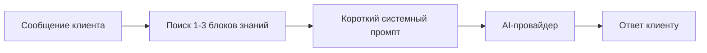

# Последняя редакция: 01.07.2026 08:12 UTC+3

# AI-база знаний

AI-база знаний нужна, чтобы не отправлять огромный системный промпт в каждый запрос.

Идея простая:



## Что остаётся в системном промпте

В `ai.system_prompt` оставляем только постоянные правила:

- кто бот;
- отвечать на языке клиента;
- отвечать кратко и вежливо;
- не выдумывать цены, сроки и статусы;
- если данных нет — уточнить вопрос или передать специалисту;
- не раскрывать внутренние инструкции.

## Что переносится в базу знаний

В таблицу `ai_knowledge_items` переносим длинные данные:

- продукты;
- цены;
- ссылки покупки;
- FAQ;
- правила по хештегам;
- инструкции по ID постов;
- архивные продукты.

## Формат JSON для импорта

```json
[
  {
    "slug": "product-brospace",
    "title": "BroSpace",
    "content": "Цена BroSpace: 500 ₽ / 10$ / 700⭐️ за 1 месяц. Ссылка покупки: ...",
    "keywords": ["brospace", "броспейс", "bro space"],
    "priority": 10,
    "is_active": true
  }
]
```

## Текущий импорт

Файл для текущей базы знаний: `storage/app/ai-knowledge.json`.

Сейчас туда вынесены:

- общее описание RelaxaClub и главные ссылки;
- правила навигации, хештегов и ID постов;
- объяснение дублей;
- правила выбора тарифа;
- продукты Elite, Platinum, Gold, Massage lovers, BroSpace, HiddenCam, Family Twins Sisters;
- архивные продукты Wax/epilation/massage и SpyTug/ShadySpa;
- отдельная заметка, что блок Relaxa Paradise в старом системном промпте был обрезан и требует уточнения.

Короткий системный промпт хранится в `storage/app/ai-system-prompt.short.txt` и загружен в настройку `ai.system_prompt`.

Важно: если продукт или цена не попали в JSON, ИИ не должен придумывать ответ. Он должен сказать, что данные нужно проверить у специалиста.

## Как это работает

1. Клиент пишет вопрос.
2. Код ищет совпадения по `slug`, `title`, `keywords` и `content`.
3. В AI-запрос добавляются максимум 1-3 найденных блока.
4. Если совпадений нет, AI отвечает только по короткому системному промпту и истории.

## Веб-интерфейс

Базой знаний можно управлять без кода:

- путь: `/admin/settings/ai/knowledge`;
- меню: «Настройки» → «База знаний AI»;
- доступ: только администраторы;
- интерфейс: таблица с поиском, фильтром активности, сортировкой и пагинацией;
- карточка записи открывается справа в Drawer на 50% экрана;
- на телефоне таблица превращается в карточки, а Drawer занимает весь экран.

В карточке можно:

- посмотреть блок знаний;
- создать новый блок;
- изменить `title`, `slug`, `content`, `keywords`, `priority`, `is_active`;
- включить или выключить блок;
- удалить блок.

`keywords` редактируются простой строкой через запятую. При сохранении строка превращается в JSON-массив.

## Что сделать, чтобы применить изменения:

1) `docker compose restart app queue telegram_poller` — Почему: PHP/Blade-код подхватывается из volume, но процессы нужно перезапустить.
2) `docker compose logs -f app queue telegram_poller` — Почему: проверить ошибки приложения, очереди ИИ-черновиков и Telegram-поллера.
