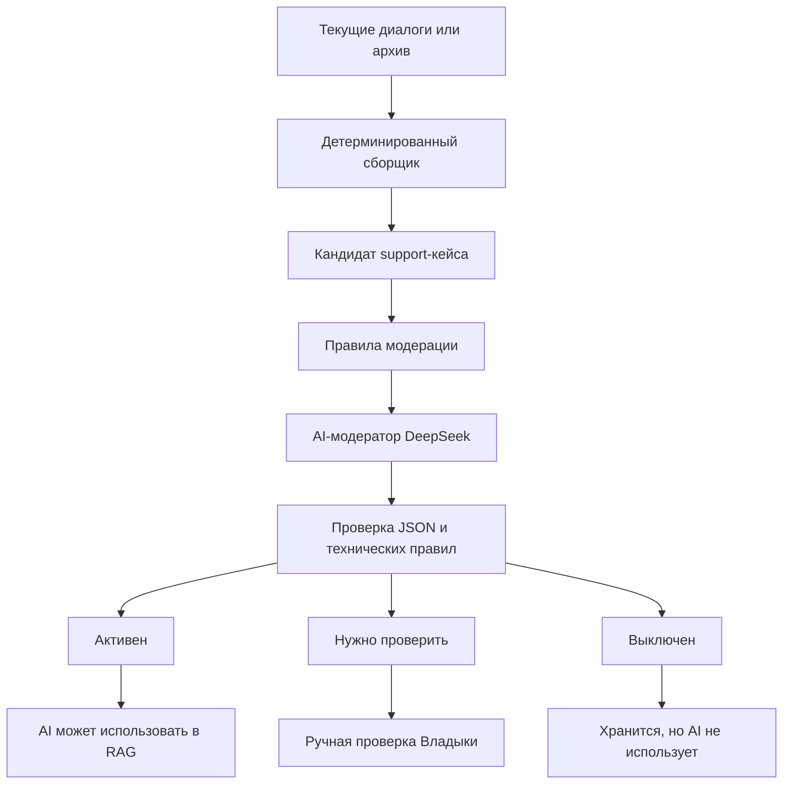

# Последняя редакция: 03.07.2026 05:06 UTC+3

# Спецификация AI-модерации support-кейсов

Эта спецификация описывает, как система должна превращать реальные support-диалоги в качественные кейсы для AI-базы.

Главный принцип: **AI-ответчик использует только записи со статусом `Активен`**. Всё сомнительное сначала попадает на ручную проверку.

## Зачем это нужно

Support-кейсы помогают AI отвечать лучше, потому что дают примеры старых похожих обращений.

Но плохой кейс опасен:

- может смешать разных клиентов;
- может содержать старую цену или неправильную ссылку;
- может включить AI-ответ вместо ответа оператора;
- может научить модель отвечать грубо, неточно или не по теме.

Поэтому база пополняется не напрямую, а через пайплайн качества.



## Термины

- **Сообщение** — одна запись из текущей переписки или архива.
- **Кандидат кейса** — собранная кодом пара блоков `Клиент` и `Оператор` до AI-модерации.
- **Support-кейс** — сохранённая запись, которую можно просматривать в админке.
- **AI-модератор** — отдельный внутренний запрос к AI-провайдеру, который оценивает качество кейса.
- **AI-ответчик** — модель, которая отвечает клиентам. Она не должна видеть кейсы со статусом `Нужно проверить` или `Выключен`.

## Источники данных

### Текущие диалоги

Берём из рабочей базы:

- `bot_users` — граница клиента/диалога;
- `messages` — входящие и исходящие сообщения;
- связи Telegram topic / Web-админки — чтобы понимать, кто и куда отвечал.

Группировка всегда идёт **внутри одного клиента/диалога**, а не по общей ленте сообщений.

### Архив

Архив обрабатывается отдельным режимом. Пользователь указывает папку, система читает Telegram HTML export и применяет те же правила качества.

Архивный импорт не должен смешиваться с пополнением из текущих диалогов.

## Правила группировки

### Клиентский блок

В один блок `client_block` объединяются подряд идущие сообщения клиента, если они относятся к одному смысловому вопросу.

Пример:

```text
Сколько стоит Elite?
А что туда входит?
Можно ссылку на оплату?
```

Это один клиентский блок, а не три отдельных кейса.

### Операторский блок

В один блок `operator_block` объединяются подряд идущие ответы оператора.

Пример:

```text
Elite стоит 2000 ₽ за месяц.
В тариф входят такие каналы: ...
Ссылка на оплату: ...
```

Это один операторский блок.

### Граница кейса

Новый кейс начинается, когда после ответа оператора появляется новый независимый вопрос клиента.

Код должен сначала собрать кандидатов детерминированно. AI-модератор не должен получать хаотичную общую ленту.

## Что нельзя включать в полезный кейс

Кандидат должен быть отправлен в `Нужно проверить` или `Выключен`, если внутри есть:

- `🤖 Ответ ИИ`;
- контактная карточка `КОНТАКТНАЯ ИНФОРМАЦИЯ`;
- команды `/start`, `/close`, `/language`, `/autoAi`;
- системные сообщения Telegram;
- пустой или слишком короткий ответ оператора;
- несколько разных клиентов в одном блоке;
- явные признаки, что клиент и оператор перепутаны;
- устаревшая цена или ссылка без подтверждения;
- грубый, токсичный или непрофессиональный ответ;
- приватные технические инструкции;
- бессмысленный текст без вопроса и ответа.

## Статусы

| Статус | Используется AI | Когда ставить |
| --- | --- | --- |
| `Активен` | Да | Чистый кейс: понятный вопрос, полезный ответ, нет мусора и сомнений |
| `Нужно проверить` | Нет | Есть сомнения, возможный дубль, длинная склейка, неполный ответ, риск устаревших данных |
| `Выключен` | Нет | Явный мусор, системный текст, нет ценности для будущих ответов |

Физическое удаление делает только пользователь вручную. AI-модератор не удаляет записи сам.

## Дубли

Дубли проверяются двумя способами:

1. Технически — через нормализованные отпечатки:
   - `source_hash`;
   - hash нормализованного текста;
   - hash диапазона сообщений;
   - source type + bot user + message id range.
2. Через AI-модератора — он может отметить, что кейс похож на уже существующий.

В интерфейсе нужно показывать:

- `Дубль?`;
- номер группы дублей;
- список похожих кейсов;
- причину, почему запись похожа на дубль.

AI-модератор может предложить дубль-группу, но не удаляет запись.

## JSON-ответ AI-модератора

AI-модератор должен вернуть строгий JSON.

```json
{
  "status": "review",
  "quality_score": 0.72,
  "reason": "Ответ полезный, но цена требует проверки.",
  "risks": ["possible_outdated_price"],
  "duplicate_group_key": null,
  "recommended_action": "review"
}
```

### Допустимые значения

`status`:

- `active` — сохранить как `Активен`;
- `review` — сохранить как `Нужно проверить`;
- `disabled` — сохранить как `Выключен`.

`quality_score`:

- `0.90–1.00` — очень хороший кейс;
- `0.70–0.89` — потенциально полезный, но может требовать проверки;
- `0.00–0.69` — слабый или опасный кейс.

`recommended_action`:

- `activate` — можно активировать;
- `review` — оставить на ручную проверку;
- `disable` — выключить как бесполезный или рискованный кейс;
- `delete` — только рекомендация удалить; код сам физически не удаляет запись.

Если JSON битый, пустой или не проходит валидацию — система ставит `Нужно проверить`.

## Prompt для AI-модератора

Prompt должен прямо требовать JSON и включать слово `json`.

Минимальная структура:

```text
Ты AI-модератор support-кейсов. Верни только валидный json.
Оцени, можно ли использовать кейс как пример для AI-ответчика.
AI-ответчик имеет право использовать только статус active.
Если есть сомнения — ставь review.
Если это мусор — ставь disabled.
Не удаляй записи. Только верни оценку.

Верни json строго по схеме: ...
```

## Текущая реализация PR-5

Команда AI-модерации:

1) `php artisan ai:support-moderate --limit=50` — Почему: проверить до 50 кейсов со статусом `Нужно проверить` через настроенного AI-модератора.
2) В UI нажать `Пополнить базу AI` — Почему: собрать только новые текущие диалоги, показать предварительный расчёт и отправить новые кандидаты на AI-модерацию.
3) В UI нажать `Из архива` — Почему: указать отдельную папку архива, собрать только новые архивные кейсы и отправить их на AI-модерацию.

Что делает код:

- CLI берёт записи со статусом `Нужно проверить`;
- UI-режим `Пополнить базу AI` модерирует только новые source hash, которые были созданы в этом запуске;
- UI-режим `Из архива` сохраняет путь архива в `ai.support_archive_path` и тоже модерирует только новые source hash текущего запуска;
- отправляет в модель вопрос, ответ, keywords и source metadata;
- требует строгий JSON через `response_format = {"type":"json_object"}`;
- валидирует статус, score, риски и группу дублей;
- `active` включает `is_active=true`, остальные статусы выключают кейс для AI;
- при ошибке модели или битом JSON оставляет кейс в `Нужно проверить`.

Важно: рекомендация `delete` не удаляет запись автоматически. Физическое удаление остаётся ручным действием в Drawer.

## Настройки DeepSeek

Для DeepSeek используем отдельный режим модерации, не смешанный с обычными ответами клиентам.

Рекомендации:

- `temperature = 0`;
- `stream = false`;
- `response_format = {"type":"json_object"}`;
- разумный `max_tokens`, чтобы JSON не обрезался;
- retry только для технических ошибок;
- при пустом ответе — `Нужно проверить`.

Факт из официальной документации DeepSeek: для JSON Output нужно задать `response_format`, попросить JSON в prompt и не ставить слишком маленький `max_tokens`, иначе JSON может обрезаться. Также возможен пустой ответ, поэтому нужен fallback.

Ссылки:

- [DeepSeek JSON Output](https://api-docs.deepseek.com/guides/json_mode)
- [DeepSeek Chat Completion API](https://api-docs.deepseek.com/api/create-chat-completion)

## Пополнение базы AI

Кнопка называется **`Пополнить базу AI`**.

Она работает только с новыми текущими диалогами:

- старые support-кейсы не перетираются;
- используется checkpoint/watermark;
- запуск идёт через background job;
- в модальном окне описывается, что будет сделано;
- показывается статистика запуска.

Важно: это не fine-tune. Модель не дообучается весами. Система пополняет RAG-базу качественными примерами.

## Пополнение из архива

Для архива нужна отдельная настройка:

- путь к папке архива;
- отдельная кнопка `Пополнить из архива`;
- такое же модальное подтверждение;
- те же правила качества и дубли;
- отдельная статистика запуска.

## Контроль качества RAG

Перед массовым использованием нужен evaluation-набор:

- контрольные вопросы;
- ожидаемые направления ответа;
- проверка, какие кейсы нашёл retrieval;
- лог выбранных кейсов;
- ручная проверка плохих результатов.

Практики RAG evaluation обычно смотрят на:

- релевантность ответа;
- factual consistency / faithfulness;
- precision найденного контекста;
- recall полезного контекста.

Ссылки:

- [Ragas metrics](https://docs.ragas.io/en/stable/concepts/metrics/available_metrics/)
- [Ragas context precision](https://docs.ragas.io/en/stable/concepts/metrics/available_metrics/context_precision/)
- [DeepEval RAG evaluation](https://docs.confident-ai.com/guides/guides-rag-evaluation)

## Критерии приёмки PR-1

- Есть документ с правилами модерации.
- Описаны статусы и когда AI может использовать кейс.
- Описана группировка нескольких сообщений клиента и оператора.
- Описан JSON-формат ответа AI-модератора.
- Описаны дубли, архив, текущие диалоги и evaluation.
- Документ связан с `docs/ai-knowledge.md`.

## Что сделать, чтобы применить изменения:

1) `git diff --check` — Почему: проверить, что в документации нет пробелов в конце строк и битого diff.
2) `docker compose logs -f app queue telegram_poller` — Почему: если после следующих PR будет запуск фоновых задач AI, эти логи первыми покажут ошибки приложения, очереди и Telegram-поллера.


## Evaluation после модерации

После пополнения базы нужно периодически запускать проверку RAG:

1) `php artisan ai:support-evaluate` — Почему: убедиться, что AI увидит только релевантные активные кейсы и не получит выключенный мусор.

Evaluation-файл лежит в `resources/ai/support-evaluation.json`. Его можно расширять новыми вопросами, ожидаемыми маркерами и запрещёнными словами.
