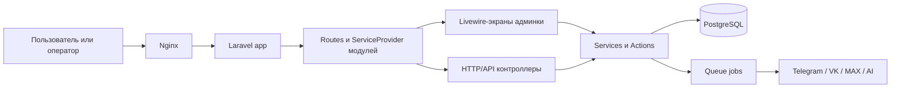
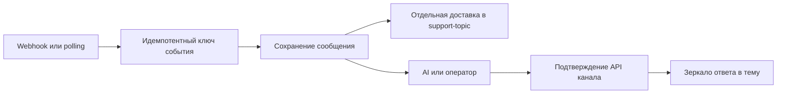
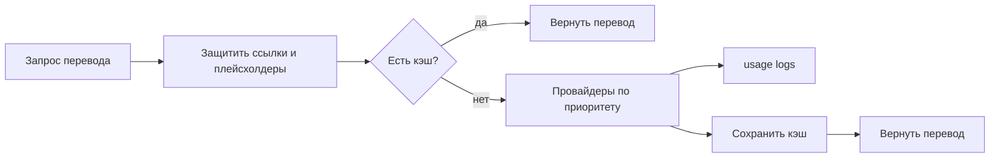
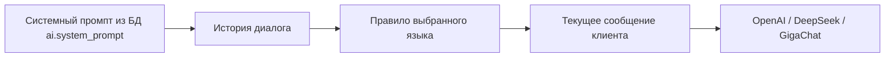
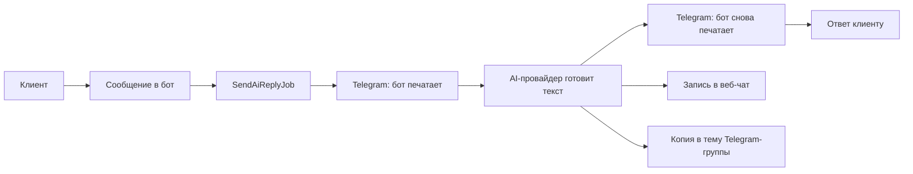
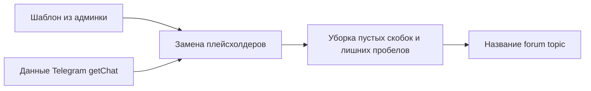

# Последняя редакция: 14.07.2026 00:10 UTC+3

# Архитектура проекта

Этот документ — короткая карта проекта: куда смотреть, если нужно понять, где живёт логика.

## Общая схема



## Надёжный путь сообщения



- Событие идентифицируется платформой, диалогом и ID источника.
- Telegram, VK и Max сначала сохраняют входящее сообщение, затем запускают зависимые действия.
- Ответ считается доставленным только после успешного ответа API канала.
- Зеркало никогда не отправляется в `General`: без `topic_id` сначала создаётся или восстанавливается тема.
- Технический выбор языка не зеркалируется и не показывается в истории оператора.

## Основные зоны

| Зона | Где лежит | За что отвечает |
| --- | --- | --- |
| Админка | `app/Modules/Admin`, `app/Livewire`, `resources/views` | вход, чаты, настройки, операторы |
| Telegram | `app/Modules/Telegram` | webhook и отправка сообщений Telegram |
| VK | `app/Modules/Vk` | webhook и отправка сообщений VK |
| MAX | `app/Modules/Max` | интеграция с MAX |
| AI | `app/Modules/Ai` | провайдеры AI и черновики ответов |
| Translation | `app/Modules/Translation` | машинный перевод, fallback провайдеров, кэш и usage-логи |
| External API | `app/Modules/External` | внешние источники и виджет |
| Files/API docs | `app/Modules/Api` | файлы, главная страница, Swagger |
| Настройки | `app/Services/Settings`, `App\Livewire\Settings` | хранение и редактирование параметров |

## Как добавляются маршруты

`routes/web.php` и `routes/api.php` почти пустые. Реальные маршруты подключаются из `ServiceProvider` модулей.

```mermaid
flowchart TD
    providers[bootstrap/providers.php] --> admin[AdminServiceProvider]
    providers --> ai[AiServiceProvider]
    providers --> api[ApiServiceProvider]
    providers --> external[ExternalServiceProvider]
    providers --> max[MaxServiceProvider]
    providers --> telegram[TelegramServiceProvider]
    providers --> vk[VkServiceProvider]

    admin --> adminRoutes[/admin/*]
    ai --> aiRoutes[AI routes]
    api --> docsRoutes[/ и /docs/*]
    external --> externalRoutes[/api external/widget]
    max --> maxRoutes[/api max]
    telegram --> tgRoutes[/api telegram]
    vk --> vkRoutes[/api vk]
```

## Как читать проект быстрее

1. Сначала смотри `bootstrap/providers.php` — там список модулей.
2. Потом открывай нужный `*ServiceProvider.php` — там видно, какие routes подключаются.
3. Для админки ищи Livewire-класс и одноимённый Blade-файл.
4. Для фоновой логики ищи `Jobs` и `Actions` внутри модуля.
5. Для связей по всему проекту используй Graphify.

## Как работает выбор языка Telegram-клиента

При `/start` Telegram-клиент сначала выбирает язык. До выбора языка AI-автоответ не запускается.
Повторный `/start` снова показывает выбор и позволяет сменить язык.

```mermaid
flowchart LR
    start[/start] --> selector[Кнопки выбора языка]
    selector --> save[Сохранить язык в bot_users]
    save --> greeting[Приветствие на выбранном языке]
    greeting --> message[Сообщение клиента]
    message --> contact[Карточка контакта с языком]
    message --> typing[Telegram показывает печатает]
    typing --> ai[AI-ответ на выбранном языке]
```

Где смотреть:

- `/admin/settings/language` — включение языков, порядок показа и настройки провайдеров перевода.
- `support.languages` в таблице `settings` — основной список языков.
- `config/support_languages.php` — fallback-список языков, если настройки ещё не заполнены.
- `app/Modules/Telegram/Services/SupportLanguageService.php` — сборка клавиатуры и чтение callback `select_language:*`.
- `bot_users.preferred_language_*` — выбранный язык клиента.
- `auto_reply_translations` — переводы приветствия и других служебных автоответов.

## Как работает машинный перевод

Машинный перевод не смешан с Laravel i18n. Для него есть отдельный модуль `App\Modules\Translation`.



Где используется:

- автоответы и приветствия;
- предпросмотр и отправка ответа оператора в веб-чате;
- AI-черновики в вебе и Telegram-помощнике.

Подробно: `docs/languages-and-translation.md`.

## Как AI выбирает язык ответа

AI получает сообщения в таком порядке:



Главное правило: если у Telegram-клиента выбран язык, AI отвечает строго на нём и не угадывает язык по истории или текущему тексту. Если выбранного языка нет, остаётся старый fallback — язык берётся по последнему понятному сообщению клиента.

Где смотреть:

- `app/Modules/Ai/Services/BaseAiProvider.php` — общий сборщик сообщений и языковое правило.
- `app/Modules/Ai/Services/ShouldAiReply.php` — запрет автоответа Telegram до выбора языка.
- `app/Modules/Ai/Jobs/SendAiReplyJob.php` — включает статус `typing` перед запросом к AI и ещё раз перед отправкой ответа клиенту.
- `app/Modules/Telegram/Actions/SendTypingAction.php` — отправляет `sendChatAction=typing` сразу в Telegram API, без отдельной queue job. Так пользователь видит «печатает», пока AI готовит ответ.
- `/admin/settings/ai` → «Системный промпт» — бизнес-правила ответа, хранятся в БД.

## Как AI получает базу знаний

Длинные данные не нужно держать в системном промпте. Для них есть таблица `ai_knowledge_items`.

`AiKnowledgeService` ищет по текущему вопросу клиента 1-3 подходящих блока и добавляет их в AI-запрос перед историей диалога. Так запрос получается короче: модель получает только нужные цены, ссылки или FAQ, а не весь каталог.

Админский CRUD для этих блоков доступен по маршруту `/admin/settings/ai/knowledge`. На desktop карточка блока открывается справа в Drawer на 50% ширины экрана, на мобильных — на весь экран.

Подробнее: `docs/ai-knowledge.md`.

## Как AI-ответ виден саппорту

Есть два режима:

- если подключён отдельный AI-бот Telegram (`telegram_ai.token`), автоответ ИИ пишет в тему саппорт-группы через него;
- если отдельный AI-бот не подключён, автоответ ИИ всё равно дублируется в тему саппорт-группы через основного бота с пометкой `🤖 Ответ ИИ:`.

Так оператор видит в основном рабочем инструменте, что именно получил клиент.




## Как формируется название Telegram-топика

Когда приходит новое обращение, `TopicCreateJob` создаёт форум-тему в Telegram-группе.
Название берётся из настройки `telegram.template_topic_name` на странице «Настройки → Основные».

Поддерживаемые части шаблона:

- `{first_name}` — имя пользователя из Telegram;
- `{last_name}` — фамилия, если Telegram её вернул;
- `{username}` — username без `@`, если он есть;
- `{platform}` — источник обращения, например `telegram`.

Если Telegram не вернул часть данных, например `{last_name}`, бот больше не ломает весь шаблон.
Пустая часть просто убирается, лишние пробелы схлопываются.

Пример: шаблон `{first_name} {last_name} ({username})` при пустой фамилии станет `Test (testuser)`.



## Что сделать, чтобы применить изменения:

1) `docker compose restart app queue telegram_poller` — Почему: PHP-код подхватывается из volume, но процессы приложения, очереди и poller нужно перезапустить.
2) `docker compose logs -f app queue telegram_poller` — Почему: проверить ошибки приложения, очереди и Telegram-поллера.


## Realtime Telegram pipeline

Актуальная схема Redis/Horizon/Reverb: [Realtime Telegram pipeline](realtime-telegram-pipeline.md).
