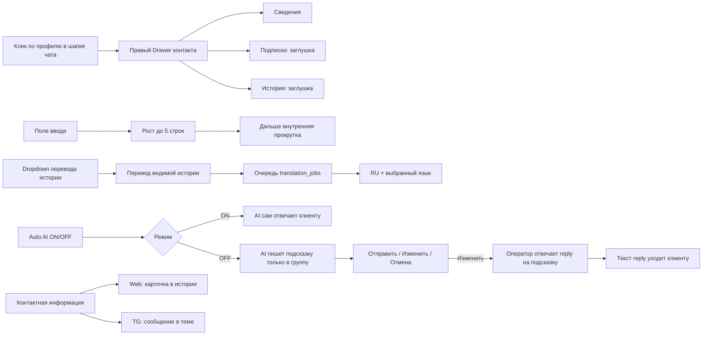
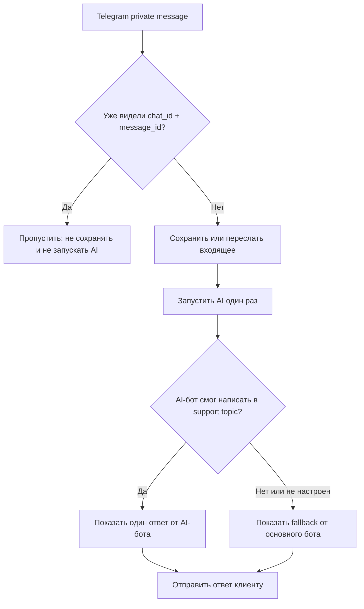
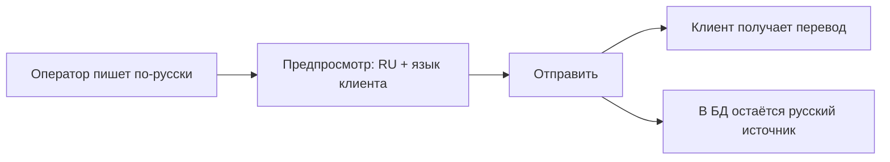
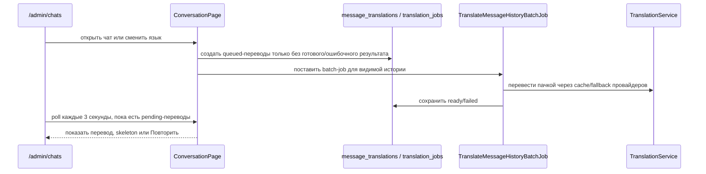

# Последняя редакция: 18.07.2026 05:07 UTC+3

# Веб-чат оператора

Этот экран — основной рабочий чат менеджера с клиентом.

## Надёжность ответа

- Русский ответ иностранному клиенту блокируется, пока перевод не готов.
- Сообщение получает подтверждение доставки только после успешного API-ответа Telegram, VK, Max или внешнего webhook.
- Зеркало «Ответ из админки» выполняется после клиентской доставки и только внутри темы клиента.
- Техническое сообщение выбора языка скрыто из истории и не создаёт перевод.
- Ошибка доставки остаётся видимой в `delivery_operations` и не маскируется сообщением в support-topic.

## Что изменилось




## Видимость bot-сообщений в support-topic

Все исходящие сообщения основного бота клиенту зеркалируются в Telegram support-topic с префиксом `🤖 Бот клиенту:`.

Что изменено для welcome:

- mirror отправляется plain-text без `parse_mode`, чтобы разметка перевода не ломала сообщение в группе;
- успешная доставка mirror пишет лог `telegram_outgoing_bot_mirror_delivered`;
- ошибка mirror пишет лог `telegram_outgoing_bot_mirror_failed` с кодом Telegram API;
- клиентская доставка всё равно фиксируется отдельно в `messages.to_id > 0`.

Если клиент видит welcome, а support-topic нет — проверять нужно именно эти логи и `topic_id` клиента.

## Auto AI ON/OFF

`Auto AI` — это быстрый переключатель режима `ai.auto_reply`.

- **ON** — AI сам отправляет ответ клиенту.
- **OFF** — AI готовит внутреннюю подсказку для оператора, клиент её не видит.

В веб-чате переключатель находится рядом с шестерёнкой. Он меняет режим сразу, без отдельной кнопки «Сохранить».

В Telegram support-группе режим можно менять только из темы **General**:

1. `/autoAi on` или `autoai on` — включить автоответы.
2. `/autoAi off` или `autoai off` — выключить автоответы.
3. `/autoAi status` или `autoai status` — показать текущий режим.

Команды принимает только администратор или создатель support-группы. Если команду написать в клиентской теме, бот ответит, что управление доступно только в General, и не отправит команду клиенту.

Важно: Telegram API для General может присылать сообщение **без** `message_thread_id`. Это нормально — такие сообщения тоже считаются General.

## Защита от дублей и закрытой Telegram-темы

Если Telegram повторно отдаёт один и тот же private update, бот обрабатывает его только один раз.

Проверка идёт по связке:

- платформа;
- `chat_id`;
- Telegram `message_id`;
- уже сохранённая входящая строка в `messages`.



Если support topic закрыт и Telegram возвращает `TOPIC_CLOSED`, это больше не блокирует клиента: запись AI сохраняется, ошибка логируется, а ответ уходит пользователю в личный чат.

Если отдельный AI-бот уже успешно написал ответ в support-topic, основной бот не повторяет тот же текст вторым сообщением. Повтор через основного бота остаётся только как fallback: если AI-бот не настроен или Telegram не принял сообщение.

## Внутренние AI-подсказки

Когда `Auto AI = OFF`, AI-сообщение начинается так:

```text
🤖 ИИ-черновик
```

Почему клиент не видит подсказку: она отправляется только в Telegram support-группу и нужную тему, а не в private chat клиента.

Важно: кнопки под AI-подсказкой принадлежат отдельному боту AI-помощника. В домашней Docker-схеме публичный webhook AI-бота может таймаутиться, поэтому для кнопок работает отдельный сервис `ai_telegram_poller`: он забирает только `callback_query` через Telegram `getUpdates` и передаёт их во внутренний `/api/ai-bot/webhook`.

Кнопки под подсказкой:

1. **✅ Отправить** — отправляет текст AI клиенту.
2. **✏️ Изменить** — показывает короткую инструкцию в Telegram.
3. **❌ Отменить** — отменяет черновик, клиент ничего не получает.

Как отредактировать в Telegram:

1. Нажать **✏️ Изменить**.
2. Написать свой текст через **reply** на AI-подсказку.
3. Бот отправит этот reply-текст клиенту и пометит AI-черновик принятым.

Почему так: Telegram Bot API не даёт боту надёжно вставить обычный текст прямо в поле ввода оператора. Reply — штатная и понятная привязка ответа к конкретному черновику.

Принятый оператором ответ считается проверенным примером для будущего fine-tuning.

## Быстрые автоответы

Над полем ввода показываются только обычные активные автоответы.

Служебные записи, например приветствие или текст бана, в быстрые чипы не попадают. Это нужно, чтобы оператор случайно не отправил клиенту системный текст.

AI-ответ строится с учётом выбранного языка клиента. Если язык не выбран, используется русский как безопасный fallback.

## Контактная информация в ленте

В Web-ленте выбранного диалога показывается виртуальная карточка после выбора языка:

```text
КОНТАКТНАЯ ИНФОРМАЦИЯ
Источник: telegram
ID: ...
Имя: ...
Пользователь: ...
Ссылка: ...
Выбранный язык: ...
Telegram language_code: ...
Телефон: ...
Регион: ...
Первое обращение: ...
Последняя активность: ...
```

Это виртуальная карточка: она не создаёт запись в таблице `messages`, поэтому история не засоряется дублями.

Telegram-карточка контакта и Web-карточка собираются через один форматтер, поэтому набор полей одинаковый.

Карточка отправляется после первого выбора языка. Так поле `Выбранный язык` уже заполнено, а если Telegram прислал `language_code` в callback, Telegram-карточка показывает и его.

Повторная смена языка больше не отправляет новую карточку в Telegram support-тему. Иначе один клиент мог много раз нажимать языки, а оператор видел пачку одинаковой «КОНТАКТНОЙ ИНФОРМАЦИИ».

Для нового Telegram-диалога порядок должен быть такой:

1. `/start` — входящая команда клиента.
2. `Выберите язык / Choose your language` — выбор языка.
3. `КОНТАКТНАЯ ИНФОРМАЦИЯ` — карточка клиента уже с выбранным языком.
4. Приветственное сообщение.

Повторный `/start` не отправляет второй selector, если selector уже был сохранён. Повторный callback того же языка не отправляет второй welcome, если welcome уже реально доставлен клиенту и в БД у него `to_id > 0`. Недоставленная старая строка с `to_id = 0` не блокирует новую отправку welcome. Любой callback выбора языка или страницы сразу получает **тихий** `answerCallbackQuery` без текста, поэтому Telegram не держит кнопку в состоянии бесконечной загрузки и не показывает всплывашку `Язык выбран`. Все обычные запросы к Telegram API идут с коротким timeout: если Telegram/сеть подвисли, job не зависает молча до `MaxAttemptsExceeded`, а быстро пишет ошибку в лог. Временная ошибка `5xx` переводит job в retry, поэтому welcome не теряется после первого сетевого сбоя. Быстрые повторные клики по языку закрываются тихим callback, но не ставят несколько одинаковых welcome-job подряд. Для диагностики следующий клик виден в логах по `source=telegram_language_flow`: так можно точно понять, был ли callback принят и поставлен ли welcome в очередь. Welcome в клиентский Telegram отправляется plain-text: битые теги переводчика не должны ломать доставку сообщения. `/lang` и `/language` всегда заново показывают selector для смены языка.

## Повторное обращение после закрытия

Если клиент снова пишет в private chat после закрытия диалога:

- диалог сразу становится открытым;
- Telegram-тема переоткрывается при пересылке сообщения в группу;
- AI снова может сгенерировать автоответ или внутреннюю подсказку по текущему режиму `Auto AI`.

## Поле ввода сообщения

- Поле больше не отправляет Livewire-запрос на каждый символ.
- Высота растёт автоматически от 1 до 5 строк.
- Если текста больше 5 строк, появляется прокрутка внутри поля.
- После фонового `wire:poll` поле заново пересчитывает высоту, поэтому длинный черновик не схлопывается.
- Если у клиента выбран язык, над полем появляется предпросмотр перевода: русский текст оператора и текст на языке клиента.
- Клиенту отправляется перевод, а русский источник сохраняется в `message_translations`.
- На мобильном над лентой есть переключатель `Оба / Русский / Клиент`, чтобы две языковые зоны не перегружали экран.
- `Enter` отправляет сообщение.
- `Shift+Enter` добавляет новую строку.

Зачем так: менеджер может писать длинный ответ без «прыжков» интерфейса.



Подробнее про переводческий слой: `docs/languages-and-translation.md`.

## Переключение диалогов и черновик

При выборе другого диалога нижняя панель пересобирается заново:

- поле ввода очищается;
- предпросмотр перевода очищается;
- выбранный файл сбрасывается;
- dropdown языка берётся из нового чата;
- если клиент недавно сменил язык, новый preferred_language_code важнее старого ручного выбора переводчика.

Зачем так: оператор не сможет случайно отправить текст, написанный для прошлого клиента, в новый диалог.

## Перевод всей истории диалога

В шапке чата рядом с меню действий есть компактный переводчик текущего диалога. Раньше он стоял рядом со скрепкой, но на мобильном сжимал поле ввода, поэтому управление перенесено наверх.

Как он выглядит:

- `Не выбран` — клиент ещё не выбрал язык, перевод истории не запускается;
- `RU` — русский слой для оператора;
- `Выбранный язык` — текст на языке клиента;
- в dropdown сверху показывается только код языка, без `ON`, потому что выбранный пункт уже означает активный перевод;
- dropdown показывает только включённые языки из **Настройки → Языки**;
- нижняя панель остаётся только для вложения, текста и отправки, чтобы мобильный UI не ломался.

Что важно:

- если клиент не выбрал язык, шапка показывает `Не выбран`, а не первый язык из списка;
- если у чата есть выбранный язык с датой выбора, переводчик истории включается автоматически;
- выбор языка хранится в самом текущем чате, а не как глобальный язык клиента;
- ручная смена языка не меняет `preferred_language_code` клиента;
- при открытии нерусского чата перевод последних видимых сообщений ставится в очередь автоматически;
- при прокрутке вверх догруженные старые сообщения тоже ставятся в очередь;
- для каждого сообщения есть отдельный статус: skeleton во время перевода, `Не удалось перевести` и кнопка `Повторить` при ошибке;
- исходящие сообщения показываются как две зоны: `RU` и `Выбранный язык`;
- для старых автоответов/AI без русского исходника зона `RU` берёт восстановленный `system_to_operator`, а не клиентский текст;
- AI-черновик тоже показывает `RU` и `Выбранный язык`; если русский слой ошибочно совпал с клиентским текстом, он восстанавливается переводом в русский.



Пачка ограничена безопасно: до 25 текстов и до 5000 символов за раз. Failed-перевод не ставится в очередь автоматически повторно: он ждёт ручной кнопки `Повторить`, чтобы оператор понимал, что именно перезапускается.

## Drawer контакта

Карточка клиента открывается справа, как Drawer в «База знаний AI».

Вкладки:

1. **Сведения** — реальные данные из `BotUser`.
2. **Подписки** — пока заглушка для будущей интеграции с PostEditBot и Toosly.
3. **История** — пока заглушка для будущих платежей и событий.

В сведениях показываются:

- источник и платформа;
- ID клиента;
- имя и username;
- ссылка на профиль, если её можно собрать из сохранённых данных;
- выбранный язык;
- первое обращение и последняя активность;
- статус диалога и блокировки;
- topic ID;
- честные заглушки для данных, которых пока нет в БД: `Telegram language_code`, телефон, регион.

Важно: Drawer не делает Telegram API-запрос при открытии, чтобы чат не тормозил.

## UX и доступность

- Drawer закрывается по крестику, `Esc` и клику по затемнению.
- Вкладки имеют роли `tablist`, `tab`, `tabpanel`.
- Переключение вкладок доступно стрелками влево/вправо.
- У интерактивных элементов есть `title` / `aria-label`.

## Защита от светлого блока после простоя

После долгого простоя Livewire может открыть своё системное окно ошибки `dialog#livewire-error`.
Внутри него пакет создаёт `iframe`, и браузер по умолчанию красит тело iframe в белый цвет.

Чтобы в тёмной админке не появлялся большой светлый прямоугольник:

- CSS красит сам `dialog`, его фон и `iframe` в тёмную палитру;
- JS ждёт появления `dialog#livewire-error` и добавляет тёмный фон внутрь iframe;
- обычная работа чата не меняется, правка влияет только на системное окно Livewire.

## Что сделать, чтобы применить изменения:

1) `docker compose build app queue scheduler telegram_poller ai_telegram_poller && docker compose up -d app queue scheduler telegram_poller ai_telegram_poller` — Почему: изменён backend-код Laravel и queue-job, контейнеры должны получить новый образ.
2) `docker compose restart nginx` — Почему: nginx должен заново увидеть пересозданный `app`.
3) `docker compose logs -f app queue scheduler telegram_poller ai_telegram_poller nginx` — Почему: проверить mirror welcome, очередь и ошибки Telegram API.

