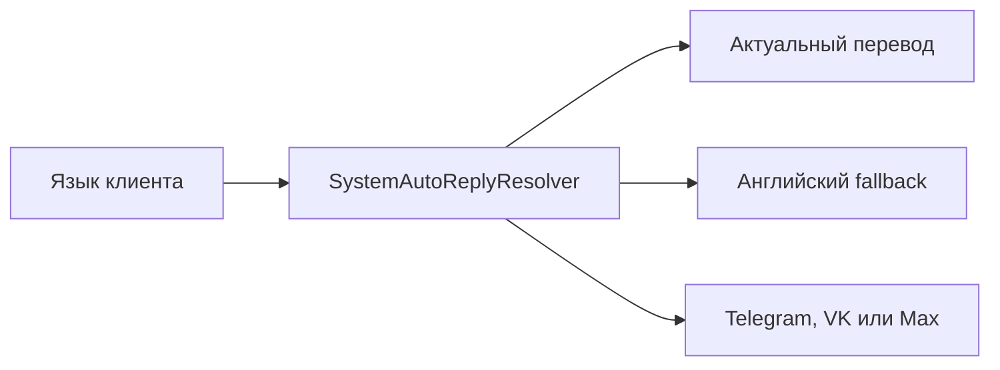
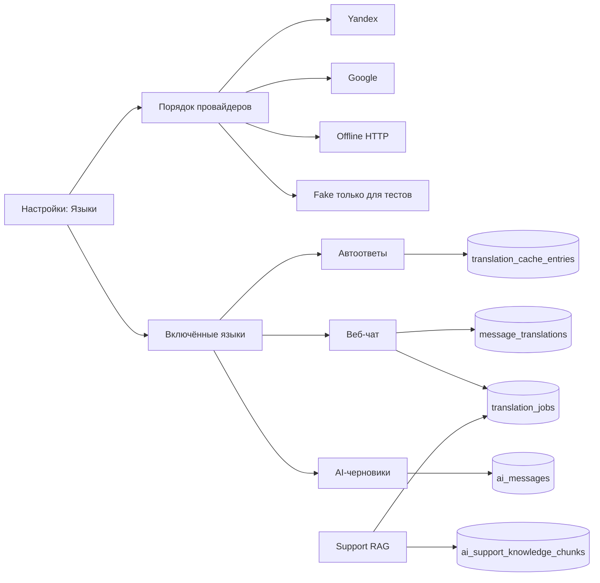
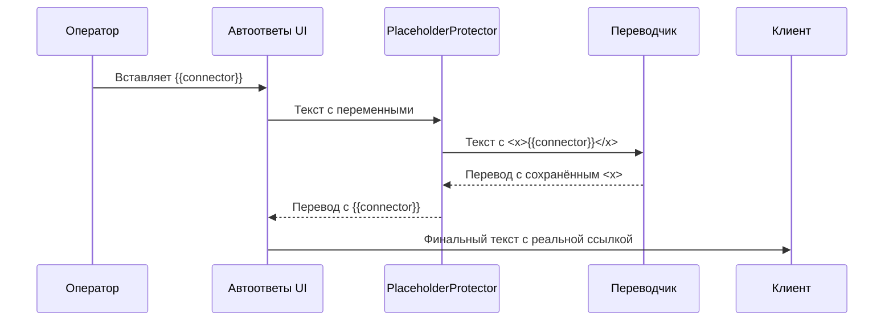
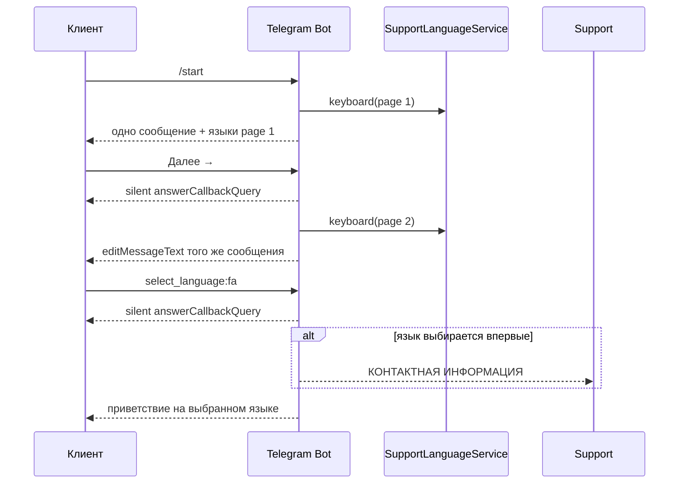
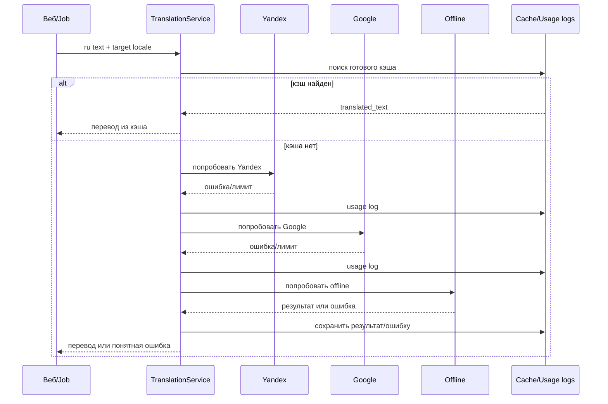

# Последняя редакция: 14.07.2026 07:22 UTC+3

# Языки и машинный перевод

Этот документ описывает, как устроены языки клиента, переводы автоответов, перевод текста оператора и AI-черновики.

## Переменные автоответов

Глобальные значения из вкладки «Переменные» записываются двойными скобками, например `{{connector}}` и `{{paybot}}`.

Данные текущего клиента записываются одинарными скобками:

| Переменная | Значение |
|---|---|
| `{id}` | Telegram/chat ID клиента |
| `{email}` | Email, если источник его передал |
| `{first_name}` | Имя клиента |
| `{last_name}` | Фамилия клиента или пустая строка |
| `{username}` | Username без `@` или пустая строка |
| `{platform}` | `telegram`, `vk`, `max` или другой источник |

Переменные защищены при машинном переводе и подставляются только перед реальной отправкой конкретному клиенту. В предпросмотре без выбранного клиента динамические значения остаются как есть с предупреждением.

## Общая идея

- **Языки интерфейса и шаблонов** живут отдельно от машинного перевода.
- **Машинный перевод** вынесен в общий слой `App\Modules\Translation`.
- Оператор пишет по-русски, система хранит русский источник и перевод на язык клиента.
- Ручные правки переводов не затираются без явного разрешения.

## Системные сообщения клиенту

Приветствие, закрытие обращения, запрос оценки, благодарность и уведомление о блокировке хранятся в «Автоответах». Для них используются стабильные системные триггеры `__system_*__`.

У каждого системного типа есть ровно один служебный шаблон с таким триггером. Старые правила, у которых был системный тип, но обычный триггер вроде `start`, автоматически переводятся в тип «Обычный автоответ». Их текст и переводы сохраняются. Поэтому старое правило больше не блокирует редактирование настоящего системного шаблона сообщением «Системный автоответ этого типа уже существует».

Порядок выбора текста:

1. русский источник для клиента с языком `ru`;
2. актуальный перевод выбранного языка;
3. актуальный английский перевод;
4. встроенный английский текст.

Устаревший, пустой или ошибочный перевод клиенту не отправляется. Если системный шаблон выключен, соответствующее сообщение не отправляется; выключенный запрос оценки не создаёт форму оценки.

Операторский ответ иностранному клиенту тоже не отправляется, пока перевод не получил статус `ready`. Это исключает случайную отправку русского исходника. Для AI при невозможности безопасного перевода используется только встроенный английский fallback.

Выбор языка имеет структурный тип `language_selector`. Поэтому его не переводят, не показывают в истории оператора и не зеркалируют в Telegram support-topic. Старые сообщения с прежним текстовым префиксом распознаются для совместимости.



Команда `php artisan auto-replies:translate-system` ставит недостающие и устаревшие переводы включённых языков в очередь. Ручные переводы без флага `--overwrite-manual` не перезаписываются.




## Переменные автоответов

На странице `/admin/settings/auto-replies` теперь две вкладки:

1. **Автоответы** — правила, текст источника и переводы.
2. **Переменные** — безопасные значения, которые нельзя отдавать переводчику как обычный текст.

Пример переменных:

```text
{{connector}} = https://t.me/relaxa_massage
{{paybot}} = https://t.me/Relaxaclub_pay_bot?start=utm-supportbot
```

Зачем это нужно: ссылки и технические значения хранятся один раз, вставляются в тексты как `{{ключ}}` и не ломаются при переводе.

### Как работает защита перевода

Перед отправкой текста в машинный перевод система временно заменяет переменные, ссылки и упоминания на XML-теги `<x>...</x>`.
После ответа переводчика система возвращает исходные значения обратно.

Это соответствует best practice DeepL:

- `tag_handling=xml`;
- `ignore_tags=x`;
- Mustache-переменные `{{...}}` не отдавать переводчику без pre/post-processing.



### Проверка перевода

В редакторе перевода есть кнопка **Проверить перевод**.
Она показывает текст так, как его увидит клиент: переменные уже подставлены реальными значениями.
Если переменная выключена или не найдена, оператор видит предупреждение.

### Перевод одного языка

Кнопка **Перевести этот язык** ставит в очередь только выбранный язык.
Остальные языки не трогаются.


## Служебная проверка Telegram-flow

Команда `telegram:support-flow-check` проверяет отдельный служебный диалог:

1. отправляет `/start` и ждёт selector языка;
2. отправляет `/lang` и проверяет принудительный повторный selector;
3. выбирает языки из `telegram.health_check_languages` или по умолчанию `pl`, `en`, `ar`;
4. ждёт, что welcome реально доставлен клиенту и сохранён в `messages.to_id > 0`;
5. пишет отчёт в support-topic этого служебного клиента.

Проверка запускается планировщиком один раз в сутки, в 00:00 по часовому поясу приложения (`Europe/Moscow`), через `routes/console.php`:

```php
Schedule::command('telegram:support-flow-check')
    ->daily()
    ->withoutOverlapping()
    ->runInBackground();
```

Чтобы включить live-проверку, нужно сохранить настройки:

- `telegram.health_check_enabled = true`;
- `telegram.health_check_chat_id = <chat_id служебного Telegram-диалога>`;
- `telegram.health_check_languages = ["pl", "en", "ar"]` при необходимости.

Важно: бот не может сам написать себе `/start` от лица пользователя через Telegram Bot API. Поэтому служебный `chat_id` должен принадлежать реальному тестовому диалогу, где пользователь уже открыл бота. Команда эмулирует входящие updates внутри приложения, а исходящие сообщения отправляет в реальный Telegram.

## Что сделать, чтобы применить изменения:

1) `docker compose up -d --build` — Почему: Laravel-код копируется в образ, а изменения нужны приложению, очереди и poller.
2) `docker compose exec -T app php artisan migrate --force` — Почему: убрать конфликт старых типов системных автоответов без удаления их текста и переводов.
3) `docker compose exec -T app php artisan auto-replies:translate-system` — Почему: поставить недостающие переводы включённых языков в очередь.
4) `docker compose exec -T app php artisan telegram:support-flow-check --chat-id=<служебный_chat_id> --languages=pl,en,ar` — Почему: проверить выбор языка и приветствия на выделенном canary.
5) `docker compose logs -f app queue scheduler telegram_poller ai_telegram_poller nginx` — Почему: проверить ошибки приложения, переводов и доставки.

## Раздел «Настройки → Языки»

Маршрут: `/admin/settings/language`.

Вкладки:

1. **Языки** — список языков, которые можно включить, показать при старте бота и отсортировать.
2. **Провайдеры перевода** — порядок fallback, облачные ключи, future offline endpoint, usage-статистика и тест перевода через выбранного провайдера.
3. **Очередь переводов** — отдельный URL `/admin/settings/language/translate_queue`, но визуально это третья вкладка того же раздела.

Формат языка:

```text
🇬🇧 English | en | Включён | Показывать при старте | Порядок: 2
```

Источник данных:

- настройка `support.languages`;
- fallback — `config/support_languages.php`;
- если в fallback добавили новый язык, он автоматически домерживается в текущую настройку без удаления существующих языков;
- новые fallback-языки добавляются выключенными, чтобы система не начала внезапно переводить автоответы на языки, которые оператор ещё не включил.

Пагинация списка языков:

- на одной странице показывается 14 языков;
- страница 1: `ru`, `en`, `zh`, `hi`, `es`, `ar`, `fr`, `pt`, `id`, `de`, `ja`, `tr`, `vi`, `ko`;
- страница 2: `fa`, `it`, `nl`, `pl`, `uk`, `uz`, `kk`, `az`, `ro`, `tg`.

Почему такой порядок: `ru` и `en` закреплены сверху, дальше идут языки с большим мировым охватом по числу пользователей и интернет-аудитории.

## UI выбора языка в Telegram, VK и Max

Во встроенных каналах выбор языка показывается inline-кнопками. До выбора заголовок английский, затем используется сохранённый язык клиента. Навигация не требует перевода: `◀`, `▶`, `1/2`.

Как устроено:

- страница 1: `ru`, `en`, `zh`, `hi`, `es`, `ar`, `fr`, `pt`, `id`, `de`, `ja`, `tr`, `vi`, `ko`;
- страница 2: `fa`, `it`, `nl`, `pl`, `uk`, `uz`, `kk`, `az`, `ro`, `tg`;
- кнопка языка отправляет callback `select_language:<code>` и выбирает язык;
- кнопки `Далее →` и `← Назад` отправляют callback `select_language_page:<page>`;
- на любой callback бот сразу отвечает **тихим** `answerCallbackQuery` без текста, чтобы Telegram убрал крутилку и не показывал всплывашку `Язык выбран`;
- при переключении страницы бот редактирует это же сообщение через `editMessageText`, а не отправляет второе сообщение;
- после выбора языка клавиатура этого selector-сообщения отключается, а клиенту отдельным сообщением уходит приветствие на выбранном языке;
- контактная карточка в support-тему отправляется только при первом завершении выбора языка; повторная смена языка не спамит операторов карточками;
- из одного selector-сообщения принимается только первое нажатие языка; для осознанной смены клиент открывает новый selector командой `/lang`;
- обычные Telegram-запросы `sendMessage`, `editMessageText`, `getUpdates` и загрузки файлов имеют явные timeout/connectTimeout, чтобы очередь не висела до убийства job.
- временная ошибка Telegram API `5xx` не считается успешной обработкой: job уходит в retry с короткой задержкой, чтобы welcome не терялся при сетевом сбое.
- повторная доставка callback и нажатие другой языковой кнопки в том же selector-сообщении не создают второе приветствие: атомарная защита строится по Telegram `message_id` selector-а;
- каждый шаг выбора языка пишет структурный лог `telegram_language_flow`: callback принят, повтор того же callback пропущен или welcome поставлен в очередь.
- welcome отправляется в Telegram как plain-text: служебные XML/HTML-теги переводчика (`<x ...>`) удаляются перед отправкой, чтобы Telegram не падал с `can't parse entities`.

Почему так лучше: у пользователя остаётся одно чистое сообщение выбора языка, Telegram-чат не засоряется двумя списками, а callback выбора языка остаётся прежним.



## Провайдеры перевода

Порядок по умолчанию:

```text
Yandex → Google → offline
```

Для Yandex исходный язык `auto` не отправляется как `sourceLanguageCode`.
Поле исходного языка просто пропускается, и Yandex сам определяет язык текста.
Это важно для Support RAG backfill, где старые кейсы могут быть на разных языках.

На вкладке **Провайдеры перевода** есть два разных управления:

- стрелки вверх/вниз меняют боевой fallback-порядок: если первый провайдер не сработал, система пробует следующий;
- радиокнопка **Проверка** выбирает только провайдера для кнопки **Проверить перевод**.

Пример: можно оставить боевой порядок `Google → Yandex → Offline`, выбрать радиокнопкой `Google` и увидеть в тесте результат с префиксом `[google]`. Тест идёт напрямую в выбранный провайдер и не берёт старый перевод из общего кэша, чтобы не показывать `[yandex]` при проверке Google.

Поля **Yandex API key** и **Google API key** показывают сохранённые значения из настроек. Это сделано специально: администратор сразу видит, какой ключ сейчас используется, и может заменить его прямо в этом же поле. Если поле при сохранении пустое, старый ключ не затирается — это защита от случайного удаления ключа браузером или Livewire-перерисовкой.

Перед ручной проверкой перевода страница передаёт текущие значения полей прямо в серверный метод и сохраняет непустые ключи. Поэтому сценарий `вставил Google key → нажал Проверить перевод через Google` работает без отдельного повторного сохранения. Для секретных ключей пустой stale-кэш не считается источником правды: если в БД уже лежит ключ, сервис настроек перечитает его из БД и не будет отдавать старое пустое значение.

Что происходит при ошибке:



Важно:

- если внешние переводчики выключены, Yandex/Google не получают клиентский текст;
- при частых ошибках провайдер временно отключается circuit breaker-ом;
- ссылки, `@username` и `{placeholders}` защищаются от перевода;
- `fake` нужен только для автотестов и локальной проверки.

## Автоответы

Маршрут: `/admin/settings/auto-replies`.

Добавлены типы:

- `Обычный автоответ`;
- `Приветственное сообщение`;
- `Завершение диалога`;
- `Бан`.

В карточке автоответа:

1. оператор пишет русский исходник;
2. нажимает **Перевести все языки**;
3. видит спиннер на кнопке, пока Livewire ставит jobs в очередь;
4. получает уведомление `Перевод поставлен в очередь: N языков.`;
5. переключает язык в выпадающем списке;
6. вручную правит перевод при необходимости.

Переводы хранятся в `auto_reply_translations`, а сама пакетная обработка идёт через очередь `TranslateAutoReplyJob`.

## Очередь переводов

Маршрут: `/admin/settings/language/translate_queue`.

Страница открывается как третья вкладка общего раздела **Языки**, рядом с вкладками **Языки** и **Провайдеры перевода**.

Страница показывает бизнес-задачи перевода из таблицы `translation_jobs`:

- когда задача поставлена;
- когда стартовала и завершилась;
- тип задачи;
- что переводится;
- направление `ru → язык`;
- провайдер;
- статус;
- попытки;
- число символов;
- короткую ошибку;
- ссылку на связанный объект.

Типы задач:

- `Автоответ` — пакетный перевод шаблонов автоответов;
- `История диалога` — перевод видимых сообщений в `/admin/chats`;
- `Support-кейс` — подготовка RU canonical для support RAG-кейсов.

Статусы:

- `В очереди` — задача создана и ждёт воркер;
- `Выполняется` — job взята очередью;
- `Готово` — перевод сохранён;
- `Ошибка` — провайдеры не смогли перевести или job упала;
- `Пропущено` — задача сознательно не выполнялась, например ручной перевод не перезаписывается.

`translation_jobs` — это мониторинг задач для оператора. `translation_usage_logs` остаётся техническим логом попыток провайдеров.

Для support-кейсов очередь заполняется из карточки кейса, кнопкой `Перевести все на RU` или командой `php artisan ai:support-canonicalize`. Ручные RU-правки со статусом `manual_edited` не перезаписываются без `--force`.

## Веб-чат оператора

Если у клиента выбран язык, поле ввода показывает предпросмотр:

- слева/сверху — русский текст оператора;
- справа/снизу — перевод на язык клиента;
- клиенту отправляется перевод;
- русский источник сохраняется для аудита.

Медиа не переводятся, но должны идти в той же хронологии, что и текст.

История диалога тоже переводится:

- язык текущего чата хранится в `bot_users.chat_translation_locale`;
- это не меняет глобальный `preferred_language_code` клиента;
- для `ru` переводчик показывает флаг, но jobs не создаёт;
- для нерусского языка `ConversationPage` создаёт записи `message_translations` со статусом `queued`;
- `TranslateMessageHistoryJob` переводит сообщение и обновляет `translation_jobs`;
- при переключении чата composer сбрасывается, чтобы черновик прошлого клиента нельзя было отправить в новый диалог;
- если `preferred_language_selected_at` новее ручного выбора, dropdown берёт свежий язык клиента;
- готовые переводы и кэш используются повторно, чтобы не тратить лимиты;
- ошибка хранится в `message_translations.error_message`, а в UI есть кнопка `Повторить` для одного сообщения.

Направления:

| Направление | Когда используется | Что видит оператор |
| --- | --- | --- |
| `operator_to_client` | оператор пишет по-русски, клиенту уходит перевод | русский источник + клиентская версия |
| `client_to_operator` | клиент пишет на своём языке | оригинал клиента + русский перевод |
| `system_to_operator` | старые исходящие/AI/автоответы без русского слоя | текст клиенту + восстановленный русский смысл |

## AI-черновики

AI генерирует базовый ответ на русском для оператора, затем система переводит его на язык клиента. Это правило одинаковое для веб-чата и Telegram support-topic: блок `🇷🇺 Для оператора` всегда остаётся русским, даже если клиент выбрал PL/EN/AR или другой язык.

Правило защищено двумя слоями: AI получает обязательный русский язык, а ответ провайдера дополнительно проверяется. Если провайдер всё равно вернул французский, английский или другой язык, текст переводится `auto → ru` до формирования операторского блока. При ошибке перевода иностранный текст оператору и клиенту не отправляется.

В вебе и Telegram-помощнике оператор видит две зоны:

```text
🇷🇺 Для оператора
Русский черновик

🌐 Клиенту на ENGLISH
Перевод, который увидит клиент
```

При принятии черновика клиенту уходит перевод, а русский текст остаётся в БД.

## Где смотреть код

| Часть | Файлы |
| --- | --- |
| Translation core | `app/Modules/Translation/*` |
| Настройки языков | `app/Livewire/Settings/LanguageSettingsPage.php`, `resources/views/livewire/settings/language-settings-page.blade.php` |
| Автоответы | `app/Livewire/Settings/AutoReplyFormPage.php`, `app/Jobs/TranslateAutoReplyJob.php` |
| Очередь переводов | `app/Livewire/Settings/TranslationQueuePage.php`, `app/Models/TranslationJob.php`, `database/migrations/2026_07_04_000000_create_translation_jobs_table.php` |
| Telegram приветствие и выбор языка | `app/Modules/Telegram/Services/SupportLanguageService.php`, `app/Modules/Telegram/Actions/SendLanguageSelectionMessage.php`, `app/Modules/Telegram/Actions/ShowLanguageSelectionPage.php`, `app/Modules/Telegram/Actions/SelectLanguage.php` |
| Чат-композер и перевод истории | `app/Livewire/Chat/ConversationPage.php`, `app/Jobs/TranslateMessageHistoryJob.php`, `database/migrations/2026_07_04_010000_extend_chat_history_translations.php` |
| AI-черновики | `app/Modules/Ai/Jobs/SendAiDraftJob.php`, `app/Modules/Ai/Jobs/SendAiReplyJob.php` |
| Support RU canonical | `app/Jobs/TranslateSupportCaseJob.php`, `app/Modules/Ai/Support/SupportCaseCanonicalizerService.php`, `app/Console/Commands/AiSupportCanonicalize.php` |

## Проверки

1) `docker compose run --rm -T -v ${PWD}:/var/www app php artisan test tests/Unit/Livewire/Chat/ConversationPageTest.php` — Почему: проверяет перевод истории, dropdown языка, retry и старые регрессии чата.
2) `docker compose run --rm -T -v ${PWD}:/var/www app php artisan test tests/Feature/Settings/TranslationQueuePageTest.php` — Почему: проверяет страницу очереди, где видны задачи истории и support-кейсов.
3) `docker compose run --rm -T -v ${PWD}:/var/www app php artisan test tests/Feature/Settings/AiKnowledgePageTest.php tests/Unit/Modules/Ai/Support/AiSupportRagTest.php` — Почему: проверяет RU canonical, защиту ручных правок, UI support-кейса и гибридный RAG.
4) `docker compose run --rm -T -v ${PWD}:/var/www app php artisan test tests/Unit/Modules/Telegram/Api/ParserMethodsTest.php tests/Unit/Jobs/SendMessage/AbstractSendMessageJobTest.php tests/Unit/Modules/Telegram/Actions/SendStartMessageTest.php tests/Unit/Modules/Telegram/Actions/AnswerCallbackQueryTest.php tests/Feature/Modules/Telegram/IncomingMessagePersistenceTest.php --filter="language|callback|full_start|post_query|get_query|attach_query|transient"` — Почему: проверяет Telegram UI выбора языка, тихий callback, timeout HTTP-клиента, retry временных ошибок, антидубль быстрых welcome-кликов, отправку welcome и отсутствие повторной контактной карточки.
5) Playwright открыть `/admin/chats`, `/admin/settings/ai/knowledge` и `/admin/settings/language/translate_queue` — Почему: убедиться, что Livewire UI реально кликается без 500.


## Что сделать, чтобы применить изменения:

1) `docker compose build app queue scheduler telegram_poller ai_telegram_poller && docker compose up -d app queue scheduler telegram_poller ai_telegram_poller` — Почему: PHP-код запечён в Docker-образ, поэтому после правок страницы/сервисов нужна пересборка контейнеров.
2) `docker compose restart nginx` — Почему: после пересоздания `app` nginx должен заново разрешить Docker DNS upstream `app:9000`.
3) `docker compose exec -T app sh -lc 'chown -R www-data:www-data storage bootstrap/cache && chmod -R ug+rwX storage bootstrap/cache'` — Почему: если файловый кэш Laravel был создан не от `www-data`, страница настроек может упасть с 500 при записи кэша.
4) `docker compose logs -f app queue scheduler telegram_poller ai_telegram_poller nginx` — Почему: проверить веб, очередь, poller-сервисы и отсутствие 502/ошибок PHP.
