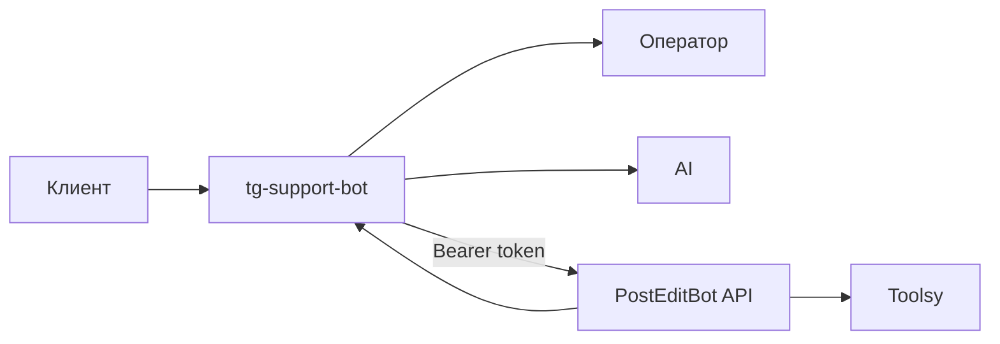
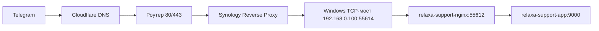

# Последняя редакция: 30.06.2026 22:23 UTC+3

# PostEditBot Bridge

PostEditBot Bridge связывает tg-support-bot с PostEditBot через API. Оператор видит карточку клиента, а AI получает контекст по подпискам и платежам.

## Что настроить Владыке

1. Telegram bot token для поддержки.
2. Telegram supergroup с включёнными topics.
3. Домен или порт админки поддержки.
4. AI-ключ: OpenAI, DeepSeek или GigaChat.
5. Bridge-token: одинаковый секрет в PostEditBot и tg-support-bot.
6. Операторов в настройках tg-support-bot.
7. Toolsy-интеграцию в PostEditBot.

## Как работает



## Настройки в tg-support-bot

Открой:

```text
/admin/settings/posteditbot-bridge
```

Заполни:

- `URL PostEditBot API`: например `http://post-edit-bot:55556`;
- `Bridge-token`: длинная случайная строка;
- `AI-режим`: лучше `hybrid`;
- `Кэш`: 60 секунд;
- `Timeout`: 5000 мс.

## Локальный Docker overlay

`docker-compose.relaxa.yml` не меняет upstream-файлы контейнеров напрямую. Он задаёт отдельные имена контейнеров, порты и подключает локальный nginx-конфиг:

```text
docker/relaxa/nginx-local.conf
```

Это нужно, потому что в upstream nginx лежит как `default.conf.template`, а для локального smoke нужен готовый HTTP-конфиг. Также overlay добавляет `host.docker.internal:host-gateway`, чтобы Laravel-контейнер мог обращаться к PostEditBot API на хосте.

## Внешний HTTPS через Synology

Для Telegram webhook нужен публичный HTTPS-адрес. Внешним reverse proxy управляет Synology DSM, а не Docker/Caddy.

Схема:



В `.env` нужно указать публичный адрес:

```text
APP_URL=https://care-support.relaxa.club
SUPPORT_PUBLIC_DOMAIN=care-support.relaxa.club
```

Synology Reverse Proxy:

```text
Источник: HTTPS care-support.relaxa.club 443
Назначение: HTTP 192.168.0.100 55614
```

Webhook Telegram:

```text
https://care-support.relaxa.club/api/telegram/bot
```

Если `getWebhookInfo` показывает `last_error_message: Connection timed out`, проблема не в токене и не в секретном ключе. Это сетевой маршрут: Telegram не может дойти до `care-support.relaxa.club`.

Для домашнего контура Synology/Windows можно использовать polling вместо webhook:

```text
relaxa-support-telegram-poll
```

В этом режиме `getWebhookInfo.url` должен быть пустым. Это нормально: контейнер сам забирает сообщения из Telegram через исходящий `getUpdates`, поэтому входящий webhook не нужен.

## Производительность веб-интерфейса

Для локального Docker поверх Windows bind mount включён отдельный performance overlay:

```text
docker/relaxa/php-fpm-performance.conf
docker/relaxa/php-performance.ini
```

Что он делает простыми словами:

- держит больше PHP-FPM worker-ов, чтобы Livewire-запросы не стояли в очереди;
- увеличивает OPcache и realpath cache;
- оставляет `opcache.validate_timestamps=1`, поэтому изменения кода всё ещё подхватываются после короткой задержки;
- после запуска нужно выполнять php artisan optimize, чтобы Laravel не перечитывал маршруты и конфиги с Windows-диска на каждый запрос;
- SESSION_DRIVER=file и SESSION_LOTTERY=0,100 убирают случайную чистку сессий из пользовательских HTTP-запросов.

## Что сделать, чтобы применить изменения:

1) `docker compose -f docker-compose.yml -f docker-compose.relaxa.yml up -d --build app nginx queue scheduler telegram_poll` — Почему: применить PHP-FPM/OPcache overlay, поднять веб-интерфейс, очередь и Telegram polling.
2) `docker compose -f docker-compose.yml -f docker-compose.relaxa.yml exec -T app npm ci && docker compose -f docker-compose.yml -f docker-compose.relaxa.yml exec -T app npm run build` — Почему: bind mount перекрывает ассеты из образа, админке нужен `public/build/manifest.json`.
3) `docker compose -f docker-compose.yml -f docker-compose.relaxa.yml exec -T app php artisan migrate --force` — Почему: создать таблицы tg-support-bot.
4) `docker compose -f docker-compose.yml -f docker-compose.relaxa.yml exec -T app php artisan optimize` — Почему: закешировать config/routes/views и убрать медленное чтение Laravel-метаданных с Windows-диска.
5) `docker compose -f docker-compose.yml -f docker-compose.relaxa.yml logs -f app queue scheduler telegram_poll nginx` — Почему: проверить ошибки Laravel, очереди, Telegram polling, планировщика и nginx.

## Обновление из upstream

1) `git status --short` — Почему: убедиться, что нет чужого WIP.
2) `git fetch upstream` — Почему: получить официальный код.
3) `git merge upstream/main` — Почему: подтянуть обновления без потери наших модулей.
4) `php artisan test` — Почему: проверить, что интеграция не сломалась.


