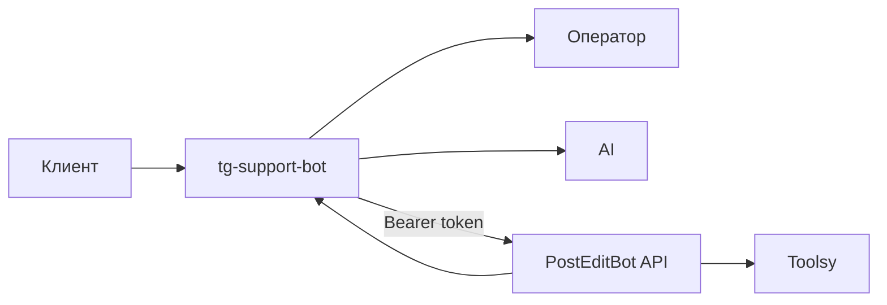

# Последняя редакция: 30.06.2026 18:41 UTC+3

# PostEditBot Bridge

PostEditBot Bridge связывает tg-support-bot с PostEditBot через API. Оператор видит карточку клиента, а AI получает контекст по подпискам и платежам.

## Что настроить Владыке

1. Telegram bot token для поддержки.
2. Telegram supergroup с включёнными topics.
3. Домен или порт админки поддержки.
4. AI-ключ: OpenAI, DeepSeek или GigaChat.
5. Bridge-token: одинаковый секрет в PostEditBot и tg-support-bot.
6. Операторов в настройках tg-support-bot.
7. Toolsy-интеграцию в PostEditBot.

## Как работает



## Настройки в tg-support-bot

Открой:

```text
/admin/settings/posteditbot-bridge
```

Заполни:

- `URL PostEditBot API`: например `http://post-edit-bot:55556`;
- `Bridge-token`: длинная случайная строка;
- `AI-режим`: лучше `hybrid`;
- `Кэш`: 60 секунд;
- `Timeout`: 5000 мс.

## Локальный Docker overlay

`docker-compose.relaxa.yml` не меняет upstream-файлы контейнеров напрямую. Он задаёт отдельные имена контейнеров, порты и подключает локальный nginx-конфиг:

```text
docker/relaxa/nginx-local.conf
```

Это нужно, потому что в upstream nginx лежит как `default.conf.template`, а для локального smoke нужен готовый HTTP-конфиг. Также overlay добавляет `host.docker.internal:host-gateway`, чтобы Laravel-контейнер мог обращаться к PostEditBot API на хосте.

## Что сделать, чтобы применить изменения:

1) `docker compose -f docker-compose.yml -f docker-compose.relaxa.yml up -d --build` — Почему: поднять поддержку с отдельными именами контейнеров и портами.
2) `docker compose -f docker-compose.yml -f docker-compose.relaxa.yml exec -T app npm ci && docker compose -f docker-compose.yml -f docker-compose.relaxa.yml exec -T app npm run build` — Почему: bind mount перекрывает ассеты из образа, админке нужен `public/build/manifest.json`.
3) `docker compose -f docker-compose.yml -f docker-compose.relaxa.yml exec -T app php artisan migrate --force` — Почему: создать таблицы tg-support-bot.
4) `docker compose -f docker-compose.yml -f docker-compose.relaxa.yml logs -f app queue scheduler nginx` — Почему: проверить ошибки Laravel, очереди, планировщика и nginx.

## Обновление из upstream

1) `git status --short` — Почему: убедиться, что нет чужого WIP.
2) `git fetch upstream` — Почему: получить официальный код.
3) `git merge upstream/main` — Почему: подтянуть обновления без потери наших модулей.
4) `php artisan test` — Почему: проверить, что интеграция не сломалась.


