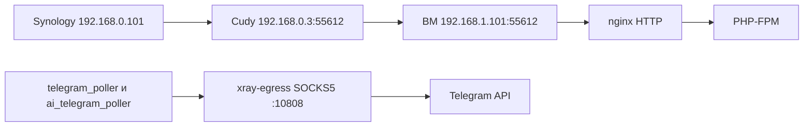

# Последняя редакция: 09.10.2026 UTC+3

# Деплой TG Support Bot на Ubuntu-ВМ

## Зачем отдельный режим

TGSUPBOT-91: перенос запуска с Windows-ПК на Ubuntu-ВМ в Proxmox.
На ВМ недоступен Packagist, поэтому код и PHP-зависимости собираются на ПК.
Скрипт `deploy-proxmox.ps1` передаёт готовый Docker-образ и файлы запуска.
ВМ: `karshiev@192.168.1.101`, каталог: `/opt/tg-support-bot`; запуск — только в согласованное окно.

## Схема трафика



HTTPS завершается на Synology; nginx на ВМ использует HTTP-шаблон.
Сеть `openclaw-proxy` и прокси создаёт другой Compose-проект.
`docker-compose.proxmox.yml` подключает отправляющие сервисы к этой сети и сохраняет сеть `pet`.

## Что должно быть в .env на ВМ

Файл `/opt/tg-support-bot/.env` готовится отдельно и не передаётся скриптом.
Несекретные настройки этого режима:

```dotenv
TELEGRAM_PROXY=socks5h://xray-egress:10808
TRUSTED_PROXIES=127.0.0.1,192.168.0.101
COMPOSE_PROJECT_NAME=tg-support-bot
COMPOSE_FILE=docker-compose.yml:docker-compose.proxmox.yml
```

Также нужны ключи `MAIN_DOMAIN`, `DB_DATABASE`, `DB_USERNAME` и остальные рабочие настройки приложения.
Compose на ВМ автоматически использует оба файла благодаря `COMPOSE_FILE`.

## Команды деплоя с Windows-ПК

Запускать из корня чистого checkout `main` через PowerShell 7:

```powershell
.\deploy-proxmox.ps1
.\deploy-proxmox.ps1 -SkipBuild
.\deploy-proxmox.ps1 -NoStart
```

Обычный запуск собирает образ; `-SkipBuild` берёт шесть уже готовых меток.
`-NoStart` передаёт файлы и создаёт контейнеры, затем завершает работу.
`-NoStart` разрешён только для первой подготовки ВМ: проверка до сборки отклоняет его, если стек уже работает.
Работающий стек обновляйте обычным запуском без `-NoStart`.
Для отдельного SSH-ключа используйте параметр `-SshKey` с локальным путём.
SSH-доступ должен работать без запроса пароля; ключ сервера заранее доверен.

Миграции — только после явного подтверждения Владыки и обсуждения отката:
```powershell
.\deploy-proxmox.ps1 -ApplyMigrations -ConfirmProductionChange
```

## Что делает скрипт по шагам

1. Проверяет файлы, настройки ВМ и чистоту checkout перед сборкой.
2. Собирает один образ и создаёт метки для шести PHP-сервисов.
3. Запоминает ID каждого локального образа.
4. Сохраняет прежние образы ВМ в метках отката, если они существуют.
5. Передаёт tar, сверяет SHA256 и ID загруженных образов, удаляет tar.
6. Передаёт Compose и шаблон nginx; берёт домен только из `.env` ВМ.
7. Загружает pgdb, redis, nginx; только при `-NoStart` создаёт контейнеры без запуска.
8. Запускает сервисы и проверяет наличие `vendor/autoload.php`.
9. При разрешённых миграциях создаёт непустой дамп в `backups/`, затем мигрирует.
10. Очищает кэши Laravel и перезапускает семь сервисов, включая reverb.
11. Показывает статус контейнеров и проверяет здоровье обоих поллеров.

## Контроль после деплоя

На ВМ, после `cd /opt/tg-support-bot`:
```bash
docker compose ps
docker compose logs -f app nginx queue scheduler telegram_poller ai_telegram_poller
docker compose exec -T telegram_poller php artisan telegram:poller-health main --max-age=90
docker compose exec -T ai_telegram_poller php artisan telegram:poller-health ai --max-age=90
```

Ошибка проверки останавливает скрипт; автоматического отката нет.
После перезапуска скрипт ждёт здоровья каждого поллера до 90 секунд: до 18 попыток с паузой 5 секунд.

## Откат релиза

После согласования на ВМ верните сохранённые метки и пересоздайте сервисы:
```bash
cd /opt/tg-support-bot
for svc in app queue reverb scheduler telegram_poller ai_telegram_poller; do
    docker image inspect "tg-support-bot-rollback-${svc}:previous" >/dev/null || exit 1
done
for svc in app queue reverb scheduler telegram_poller ai_telegram_poller; do
    docker tag "tg-support-bot-rollback-${svc}:previous" "tg-support-bot-${svc}:latest" || exit 1
done
docker compose up -d --no-build --force-recreate
```

Метки сохраняют только предыдущие образы; при первом деплое их может не быть.
Они не возвращают Compose, nginx, `.env` или БД. Старые файлы сохраните отдельно.
После миграций возврат БД из дампа требует отдельного разрешения и плана.

## Состояние после переезда 09.10.2026

- Старый стек на ПК остановлен, автозапуск контейнеров выключен; тома и образы сохранены для отката.
- Дамп базы и холодные архивы трёх томов лежат на ПК в `backups/migration-20261009/` вместе с `SHA256SUMS`.
- Откат на ПК после запуска бота на ВМ возможен только обратным переносом данных: штатная остановка на ВМ, архивы, распаковка в новые тома на ПК.

## Известные ограничения

- Общий прокси — единая точка отказа для доступа к Telegram.
- Образ собирается на ПК; ВМ не должна пытаться собирать его через Packagist.
- `cache:clear` очищает кэш-базу Redis вместе со смещениями поллеров; возможна повторная обработка updates.
- Скрипт не переносит данные PostgreSQL, Redis и файловые volumes со старого ПК.
- Повторный деплой перезаписывает метки отката; историю релизов они не хранят.

## Что сделать, чтобы применить изменения:

1) Подготовить `.env`, SSH-доступ, данные и сеть прокси на ВМ — Почему: скрипт их не переносит и не создаёт.
2) `.\deploy-proxmox.ps1` — Почему: собрать и передать релиз, обновить конфигурацию и запустить сервисы.
3) Миграции запускать только после подтверждения Владыки — Почему: они меняют боевую БД; скрипт сначала создаёт дамп.
4) Выполнить команды контроля выше — Почему: проверить контейнеры и связь обоих ботов с Telegram.
