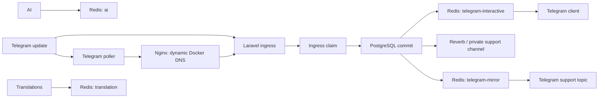

# Последняя редакция: 14.07.2026 03:57 UTC+3

# Realtime Telegram pipeline



Клиентская доставка, realtime-админка и support mirror независимы. Ошибка support-группы не отменяет подтверждённую доставку клиенту.

## Очереди и идемпотентность

- `telegram-interactive` — callback, меню и клиентские сообщения; два выделенных процесса Horizon.
- `telegram-mirror` — копии в support-topic; отдельный процесс и retry.
- `ai`, `translation`, `default` — фоновые задачи, не отнимают интерактивные workers.
- `delivery_operations.operation_key` имеет уникальный индекс и хранит состояния `pending`, `processing`, `delivered`, `retrying`, `failed`.
- `messages.source_event_key` защищает входящие события от повторной записи, а `bot_users.identity_key` — от создания второго диалога той же платформы.
- Ingress-операция Telegram становится `delivered` только после сохранения и постановки зависимых задач; после исключения она переходит в `retrying`.
- Удалённая или отсутствующая forum-тема восстанавливается до отправки. Запрос без `message_thread_id` в группу не выполняется.
- Постоянная ошибка клиентской доставки прерывает цепочку: ложное зеркало и статус «доставлено» не создаются.
- Redis использует AOF, `noeviction`, пароль из env и постоянный Docker volume.

## Диагностика задержек

Каждый Telegram update получает `trace_id`. В логах фиксируются получение update, очередь, начало job, Telegram API, commit, WebSocket и mirror.

Автоматический Telegram-flow canary использует только отдельный тестовый аккаунт. Нельзя указывать личный или клиентский `chat_id`: проверка отправляет реальные selector и welcome-сообщения.

```powershell
docker compose exec -T app php artisan telegram:pipeline-latency-probe --samples=30 --slo=100
docker compose exec -T queue php artisan horizon:status
docker compose logs -f app queue telegram_poller reverb
```

## Reverb и fallback

Админка подписывается на приватный канал `private-support`, дедуплицирует события по `message_id` и вызывает точечную синхронизацию Livewire. Polling оставлен как страховка раз в 30 секунд. Nginx проксирует `/app/*` и `/apps/*` в закрытый сервис Reverb.

Проверка 11.07.2026: прямой handshake через Docker nginx вернул `101`, а публичный WSS через Synology — `500`. Тот же локальный запрос без заголовков `Upgrade`/`Connection` воспроизводит `500`, поэтому внешний reverse proxy сейчас не передаёт WebSocket upgrade. До включения WebSocket в правиле Synology админка остаётся на безопасном polling fallback 30 секунд.

В Synology для правила `care-support.relaxa.club → Docker nginx` нужно включить WebSocket и передавать:

```text
Upgrade: $http_upgrade
Connection: upgrade
```

## Ingress

`TELEGRAM_INGRESS_MODE=polling|webhook` задаёт единственный активный режим. Polling хранит offset в Redis и не делает лишнюю паузу после пустого long-poll. Webhook и `getUpdates` одновременно для одного токена запрещены.

Nginx использует Docker resolver `127.0.0.11` и динамические upstream для `app` и `reverb`. После пересоздания PHP-FPM новый IP подхватывается без ручного рестарта nginx. Если внутренний webhook временно недоступен, offset не меняется, но перед повтором выдерживается пауза: это сохраняет событие без бесконечного цикла и разрастания логов.

## Backup и rollback

1. `docker compose stop queue` — Почему: остановить Horizon без новых Redis jobs.
2. Вернуть `QUEUE_CONNECTION=database` в локальном `.env` — Почему: восстановить прежний transport.
3. `docker compose up -d --build app queue telegram_poller` — Почему: пересоздать процессы с прежним transport.
4. `docker compose logs -f app queue telegram_poller` — Почему: проверить pending/failed jobs и ошибки.

Redis volume нельзя удалять до аудита незавершённых jobs.

## Что сделать, чтобы применить изменения:

1. `docker compose up -d --build` — Почему: изменены Dockerfile, Compose, PHP/JS-зависимости и сервисы.
2. `docker compose exec -T app php artisan migrate --force` — Почему: создать устойчивый журнал операций доставки.
3. `docker compose exec -T queue php artisan horizon:status` — Почему: подтвердить работу выделенных очередей.
4. `docker compose exec -T app php artisan telegram:pipeline-latency-probe --samples=30 --slo=100` — Почему: проверить SLO интерактивной очереди.
5. `docker compose logs -f app queue telegram_poller ai_telegram_poller nginx reverb` — Почему: проверить доставку, динамический upstream и отсутствие 502.
