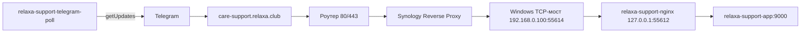

# Последняя редакция: 30.06.2026 22:23 UTC+3

# Reverse proxy для tg-support-bot через Synology

Внешним reverse proxy управляет Synology DSM. Caddy в Docker больше не используется.

Для приёма сообщений Telegram в локальной домашней схеме используется `telegram_poll`.
Это исходящий long polling из Docker к Telegram. Он не зависит от входящих запросов Telegram через роутер/Synology.

## Рабочая схема



## Что настроено

Cloudflare DNS:

```text
care-support.relaxa.club A <внешний IP>
```

Роутер:

```text
80  -> 192.168.0.101:80
443 -> 192.168.0.101:443
```

Где `192.168.0.101` — Synology.

Synology Reverse Proxy:

```text
Источник:
HTTPS care-support.relaxa.club 443

Назначение:
HTTP 192.168.0.100 55614
```

Где `192.168.0.100` — Windows-машина с Docker.

Сертификат Synology:

```text
relaxa.club
SAN: care-support.relaxa.club, relaxa.club
```

Сертификат назначен на сервис `care-support.relaxa.club`.

## Windows Docker Desktop и LAN-доступ

На этой Windows-машине Docker отдаёт приложение на `127.0.0.1:55612`, но LAN-IP `192.168.0.100:55612` не принимает соединения.

Поэтому используется локальный TCP-мост:

```text
192.168.0.100:55614 -> 127.0.0.1:55612
```

Скрипт:

```text
docker/relaxa/windows-tcp-proxy.ps1
```

Проверка на Windows:

```powershell
curl.exe -I http://192.168.0.100:55614/
```

Ожидаемо:

```text
HTTP/1.1 200 OK
```

## Проверка публичного домена

```powershell
curl.exe -I https://care-support.relaxa.club/
```

Ожидаемо:

```text
HTTP/1.1 200 OK
```

## Если Telegram пишет `Connection timed out`

Проверить по порядку:

1. `https://care-support.relaxa.club` открывается из внешней сети.
2. Роутер отправляет `80/443` на Synology `192.168.0.101`.
3. Synology Reverse Proxy отправляет `care-support.relaxa.club` на `HTTP 192.168.0.100:55614`.
4. TCP-мост на Windows слушает `192.168.0.100:55614`.
5. `http://192.168.0.100:55614` возвращает `200 OK`.

Если сеть работает, но `getWebhookInfo` всё ещё показывает старый `Connection timed out`:

1. Перерегистрировать webhook с очисткой зависших pending updates.
2. Отправить боту обычное сообщение, например `тест`.
3. Проверить, что появились записи в `bot_users` и `messages`.

Важно: `/start` — служебная команда. Она может отправить приветствие, но не является надёжной проверкой появления обращения в админке. Для проверки диалога отправляйте обычный текст.

В обработке `/start` нельзя делать синхронные Telegram API-вызовы внутри webhook. Такие действия должны уходить в очередь, иначе Telegram может не дождаться `200 OK` и показать `Connection timed out`.

## Режим polling для домашнего контура

Если реальные сообщения пользователя не доходят через webhook, но исходящие сообщения из бота работают, используется контейнер:

```text
relaxa-support-telegram-poll
```

Он делает `deleteWebhook` без удаления pending updates и затем забирает сообщения через `getUpdates`.

Проверка:

```powershell
docker compose -f docker-compose.yml -f docker-compose.relaxa.yml ps telegram_poll
docker compose -f docker-compose.yml -f docker-compose.relaxa.yml logs -f telegram_poll
```

Ожидаемо в Telegram:

```text
getWebhookInfo.url = ""
```

Это нормально: когда включён polling, webhook должен быть выключен.

## Что сделать, чтобы применить изменения:

1) `docker compose -f docker-compose.yml -f docker-compose.relaxa.yml up -d --build` — Почему: поднять app, queue, scheduler, telegram_poll и внутренний nginx без Caddy.
2) `powershell.exe -NoProfile -ExecutionPolicy Bypass -File .\docker\relaxa\windows-tcp-proxy.ps1 -ListenAddress 192.168.0.100 -ListenPort 55614 -TargetAddress 127.0.0.1 -TargetPort 55612` — Почему: открыть Synology доступ к Docker Desktop через LAN-порт 55614.
3) `docker compose -f docker-compose.yml -f docker-compose.relaxa.yml logs -f app queue scheduler telegram_poll nginx` — Почему: проверить ошибки Laravel, очереди, polling, планировщика и nginx.
