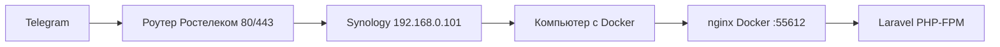
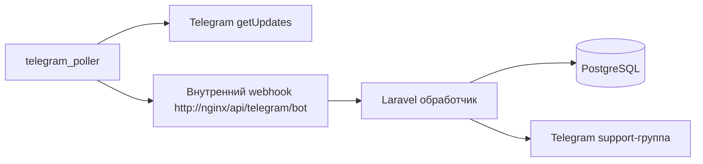

# Последняя редакция: 01.07.2026 09:46 UTC+3

# Windows Docker-запуск relaxaclub

Этот режим нужен, когда проект запускается на Windows через Docker Desktop/WSL.

Официальный `start.sh` рассчитан на чистый Linux-сервер: он проверяет публичный IP, ставит certbot, выпускает SSL и генерирует nginx-конфиг под HTTPS. В Windows Docker это часто ломается из-за VPN, WSL-сети и отсутствия certbot.

Для Windows Docker добавлен отдельный скрипт:

```powershell
.\start-relaxaclub-windows-docker.ps1
```

Он делает безопасный запуск без удаления данных:

1. читает `.env`;
2. создаёт `docker/nginx/default.conf` для HTTP внутри Docker;
3. собирает и запускает контейнеры;
4. ставит PHP-зависимости по `composer.lock`;
5. применяет миграции;
6. чистит кэши Laravel;
7. перезапускает `app`, `nginx`, `queue`, `scheduler`.

APP_KEY не меняется, если он уже задан. Если нужно принудительно заменить ключ:

```powershell
.\start-relaxaclub-windows-docker.ps1 -RegenerateAppKey
```


## Telegram webhook через Synology reverse proxy

Для текущей домашней схемы публичный трафик идёт так:



В Synology reverse proxy правило для `care-support.relaxa.club` должно вести на компьютер с Docker:

- источник: `HTTPS`, host `care-support.relaxa.club`, порт `443`;
- назначение: `HTTP`, host/IP компьютера с Docker, порт `55612`.

Telegram webhook должен быть:

```text
https://care-support.relaxa.club/api/telegram/bot
```

После сетевых изменений webhook нужно переустановить:

```bash
docker compose exec app php artisan telegram:set-webhook
```

Команда ставит `max_connections=5`, чтобы Telegram не открывал слишком много параллельных webhook-запросов для домашнего reverse proxy и небольшого PHP-FPM пула.


## Telegram poller для домашней сети

Если Telegram-серверы не могут стабильно достучаться до домашнего reverse proxy, используется сервис `telegram_poller`.

Он работает иначе:



При старте poller вызывает `deleteWebhook` без удаления накопленных updates, а затем забирает сообщения через `getUpdates`. Это обходит проблему входящих подключений Telegram к домашнему роутеру/Synology.

Проверка poller:

```bash
docker compose logs -f telegram_poller queue app
```

Если сообщение пришло в Telegram, но не видно в админке, сначала смотреть:

1. `docker compose logs -f telegram_poller` — забираются ли updates из Telegram.
2. `docker compose logs -f queue` — создался ли топик и отправилось ли сообщение в группу.
3. `docker compose exec app php artisan tinker --execute="echo \App\Models\Message::count();"` — появились ли сообщения в БД.

## PHP-FPM для админки и webhook

В Docker добавлен файл `docker/php-fpm/zz-relaxa-pool.conf`.

Он увеличивает пул PHP-FPM:

- `pm.max_children = 20` — больше одновременных PHP-запросов;
- `pm.start_servers = 4` — быстрее стартовая обработка;
- `pm.max_requests = 500` — периодически обновляет процессы.

Это нужно, чтобы Livewire-запросы админки не забивали все PHP-процессы и Telegram не получал `Connection timed out`.

## PHP GD для аватарок

В Docker-образ добавлено PHP-расширение `gd` и системные библиотеки для PNG/JPEG.

Зачем это нужно:

- Laravel-тесты создают временные картинки аватарок через `UploadedFile::fake()->image()`;
- без GD тесты падают с ошибкой `GD extension is not installed`;
- админка получает корректную поддержку операций с изображениями.

## Что сделать, чтобы применить изменения:

1) `docker compose build app queue scheduler telegram_poller && docker compose up -d app queue scheduler nginx telegram_poller` — Почему: изменён Dockerfile и PHP-FPM конфиг, нужен новый образ с PHP GD и перезапуск сервисов.
2) `docker compose exec app php artisan migrate --force` — Почему: гарантировать наличие таблиц Laravel queue (`jobs`, `failed_jobs`).
3) `docker compose exec app php artisan telegram:set-webhook` — Почему: переустановить webhook Telegram с безопасным `max_connections=5`.
4) `docker compose exec app php artisan test` — Почему: проверить, что тесты аватарок и остальной код проходят в новом образе.
5) `docker compose logs -f app nginx queue scheduler telegram_poller` — Почему: проверить ошибки приложения, nginx, очереди и планировщика.

## Тёмная тема админки

В админке есть переключатель темы рядом со ссылкой «Документация» внизу бокового меню.

Выбор сохраняется в браузере через `localStorage`, поэтому после обновления страницы тема остаётся прежней. Если выбора ещё нет, интерфейс берёт системную тему браузера.

Палитра тёмной темы:

- фон: slate `#0F172A`;
- карточки: `#111827`;
- поля: `#1F2937`;
- границы: `#334155`;
- основной текст: `#E5E7EB`;
- вторичный текст: `#94A3B8`.

Отдельно вынесены цвета чата:

- входящие сообщения: тёмная карточка `#182235` вместо белой плашки;
- поле ввода и быстрые ответы: `#172033`, чтобы не слепили внизу экрана;
- мягкие акценты: синий, зелёный и красный имеют приглушённые фоны для тёмного режима;
- вложения и медиа-карточки используют общие токены, а не фиксированный светлый серый.

Цвета выбраны не абсолютно чёрными, чтобы снизить усталость глаз на больших экранах. Главное правило: фон страницы самый тёмный, карточки чуть светлее, активные элементы заметные, но без «кислотного» свечения.

Дополнительно для тёмной темы перекрываются жёстко заданные светлые фоны из официальных шаблонов: шапки таблиц, иконки интеграций, AI-карточки, уведомления и ссылки «Подробнее в документации». Это нужно, чтобы при переходе по разделам не появлялись белые пятна.

## Что сделать, чтобы применить изменения:

1) `npm run build` — Почему: пересобрать CSS/JS ассеты после изменения цветов и Blade-разметки.
2) `docker compose restart app nginx` — Почему: обновить Laravel/nginx-процессы, если страница открыта из Docker.
3) `docker compose logs -f app nginx queue scheduler` — Почему: проверить ошибки после применения темы.


