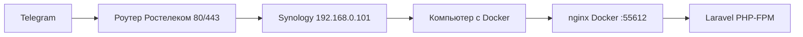
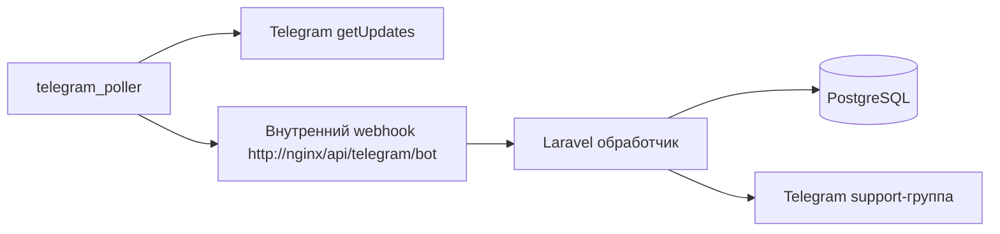
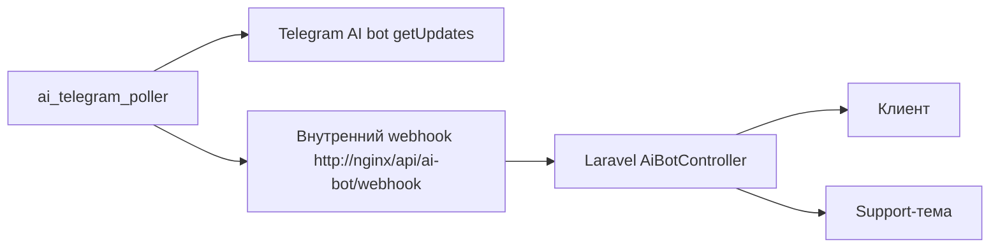
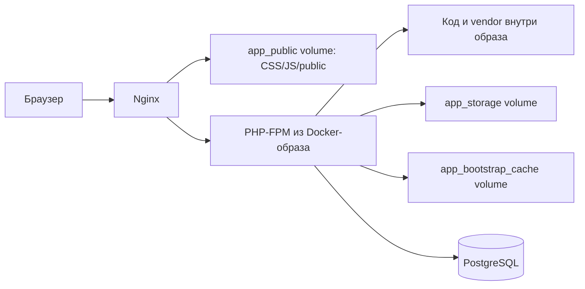

# Последняя редакция: 19.07.2026 02:03 UTC+3

# Windows Docker-запуск relaxaclub

Этот режим нужен, когда проект запускается на Windows через Docker Desktop/WSL.

Официальный `start.sh` рассчитан на чистый Linux-сервер: он проверяет публичный IP, ставит certbot, выпускает SSL и генерирует nginx-конфиг под HTTPS. В Windows Docker это часто ломается из-за VPN, WSL-сети и отсутствия certbot.

Для Windows Docker добавлен отдельный скрипт:

```powershell
.\start-relaxaclub-windows-docker.ps1
```

Он делает безопасный запуск без удаления данных:

1. читает `.env`;
2. создаёт `docker/nginx/default.conf` для HTTP внутри Docker;
3. собирает и запускает контейнеры;
4. ставит PHP-зависимости по `composer.lock`;
5. по умолчанию пропускает миграции;
6. чистит кэши Laravel;
7. перезапускает `app`, `nginx`, `queue`, `scheduler`.

APP_KEY не меняется, если он уже задан. Если нужно принудительно заменить ключ:

```powershell
.\start-relaxaclub-windows-docker.ps1 -RegenerateAppKey -ConfirmProductionChange
```

Миграции разрешены только отдельным production-флагом. Перед `migrate --force` скрипт сам создаёт и проверяет дамп в `backups/`:

```powershell
.\start-relaxaclub-windows-docker.ps1 -ApplyMigrations -ConfirmProductionChange
```

Эту команду можно выполнять только после сообщения Владыке о подключённой БД, ожидаемых изменениях и способе отката, а также после его явного подтверждения.


## Telegram webhook через Synology reverse proxy

Для текущей домашней схемы публичный трафик идёт так:



В Synology reverse proxy правило для `care-support.relaxa.club` должно вести на компьютер с Docker:

- источник: `HTTPS`, host `care-support.relaxa.club`, порт `443`;
- назначение: `HTTP`, host/IP компьютера с Docker, порт `55612`.

Telegram webhook должен быть:

```text
https://care-support.relaxa.club/api/telegram/bot
```

После сетевых изменений webhook нужно переустановить:

```bash
docker compose exec app php artisan telegram:set-webhook
```

Команда ставит `max_connections=5`, чтобы Telegram не открывал слишком много параллельных webhook-запросов для домашнего reverse proxy и небольшого PHP-FPM пула.


## Устойчивость Telegram poller к сетевым сбоям

Основной `telegram_poller` не должен завершаться из-за временного timeout/TLS-сбоя Telegram API.

Что важно:

- `deleteWebhook` выполняется с retry и не печатает токен в лог;
- перед polling выполняется `getMe`, поэтому отозванный или неверный токен определяется до `deleteWebhook`;
- `getUpdates` ловит транспортные ошибки и продолжает цикл;
- внутренний webhook при transport error не двигает offset, чтобы update не потерялся;
- успешный `getUpdates` обновляет heartbeat в Redis, а Docker помечает poller `unhealthy`, если heartbeat старше 90 секунд;
- постоянные `401/404` повторяются раз в минуту, а одинаковая запись в лог — не чаще раза в пять минут;
- в `docker-compose.yml` основной poller запускается с `--timeout=10`, а не `25`, чтобы кнопки и `/start` не ждали длинный цикл.

## Telegram poller для домашней сети

Если Telegram-серверы не могут стабильно достучаться до домашнего reverse proxy, используется сервис `telegram_poller`.

Он работает иначе:



При старте poller вызывает `deleteWebhook` без удаления накопленных updates, а затем забирает сообщения через `getUpdates`. Это обходит проблему входящих подключений Telegram к домашнему роутеру/Synology.

Отдельный AI-бот теперь тоже работает через polling, потому что публичный webhook `/api/ai-bot/webhook` в домашней сети может получать `Connection timed out`. Для этого добавлен сервис `ai_telegram_poller`.



Это не конфликтует с polling основного Telegram-бота: основной `telegram_poller` читает клиентские сообщения основного бота, а `ai_telegram_poller` читает только `callback_query` от AI-бота.

Проверка poller:

```bash
docker compose logs -f telegram_poller ai_telegram_poller queue app
docker compose exec -T telegram_poller php artisan telegram:poller-health main --max-age=90
docker compose exec -T ai_telegram_poller php artisan telegram:poller-health ai --max-age=90
```

Если сообщение пришло в Telegram, но не видно в админке, сначала смотреть:

1. `docker compose logs -f telegram_poller` — забираются ли updates из Telegram.
2. `docker compose logs -f queue` — создался ли топик и отправилось ли сообщение в группу.
3. `docker compose exec app php artisan tinker --execute="echo \App\Models\Message::count();"` — появились ли сообщения в БД.

## Быстрый фронт на Windows Docker

Админка работает через Livewire: каждое действие ждёт быстрый ответ Laravel. На Windows нельзя монтировать весь проект в PHP-контейнер как `.:/var/www`: PHP начинает читать классы, `vendor`, Blade-шаблоны и кеши через медленный Windows bind mount. Из-за этого обычный переход по настройкам занимал 2–7 секунд.

Теперь `docker-compose.yml` работает иначе:



Что это значит простыми словами:

- PHP-код и зависимости берутся из Docker-образа — это быстро.
- `public/build` отдаётся из общего Docker-volume `app_public`, поэтому HTML, CSS и JS всегда совпадают. При старте `app` ассеты копируются туда из свежего Docker-образа.
- `storage` и `bootstrap/cache` вынесены в Docker-volume, чтобы runtime-данные не пропадали.

После восстановления PostgreSQL Redis может несколько минут хранить прежние
значения настроек. `SettingsService` ограничивает жизнь такого кэша пятью
минутами, после чего настройки автоматически перечитываются из PostgreSQL.
Если восстановленные настройки нужны немедленно, безопасно очистите только
Laravel cache командой `docker compose exec -T app php artisan cache:clear`;
не используйте `redis-cli FLUSHALL` или `FLUSHDB`, потому что в Redis также
находятся очереди и смещения Telegram-поллеров.
- После изменения кода, Blade, CSS/JS или зависимостей нужно пересобрать контейнеры.

Контрольный замер после правки:

```text
/admin/login: примерно 0.20 с вместо 3.6–5 с
/build/assets/*.css и *.js: примерно 0.004 с
```

## PHP-FPM для админки и webhook

В Docker добавлен файл `docker/php-fpm/zz-relaxa-pool.conf`.

Он увеличивает пул PHP-FPM:

- `pm.max_children = 20` — больше одновременных PHP-запросов;
- `pm.start_servers = 4` — быстрее стартовая обработка;
- `pm.max_requests = 500` — периодически обновляет процессы.

Это нужно, чтобы Livewire-запросы админки не забивали все PHP-процессы и Telegram не получал `Connection timed out`.

## PHP GD для аватарок

В Docker-образ добавлено PHP-расширение `gd` и системные библиотеки для PNG/JPEG.

Зачем это нужно:

- Laravel-тесты создают временные картинки аватарок через `UploadedFile::fake()->image()`;
- без GD тесты падают с ошибкой `GD extension is not installed`;
- админка получает корректную поддержку операций с изображениями.

## Что сделать, чтобы применить изменения:

1) `docker compose up -d --build` — Почему: изменены `Dockerfile` и `docker-compose.yml`, нужно пересобрать образ, обновить `app_public` и пересоздать сервисы.
2) `.\start-relaxaclub-windows-docker.ps1 -ApplyMigrations -ConfirmProductionChange` — Почему: только после явного разрешения создать свежий dump и применить миграции; по умолчанию миграции запрещены.
3) `docker compose exec app php artisan telegram:set-webhook` — Почему: переустановить webhook Telegram с безопасным `max_connections=5`.
4) `docker compose logs -f app nginx queue scheduler telegram_poller` — Почему: проверить ошибки приложения, nginx, очереди и планировщика.

## Тёмная тема админки

В админке есть переключатель темы рядом со ссылкой «Документация» внизу бокового меню.

Выбор сохраняется в двух местах: `localStorage` для мгновенного переключения в браузере и cookie `tg_support_admin_theme` для первого серверного HTML-ответа. Поэтому при переходе в настройки сервер сразу отдаёт `<html data-theme="dark">`, а ранний inline-скрипт в `<head>` только синхронизирует состояние до загрузки CSS. Если выбора ещё нет, интерфейс берёт системную тему браузера.

Палитра тёмной темы:

- фон: slate `#0F172A`;
- карточки: `#111827`;
- поля: `#1F2937`;
- границы: `#334155`;
- основной текст: `#E5E7EB`;
- вторичный текст: `#94A3B8`.

Отдельно вынесены цвета чата:

- входящие сообщения: тёмная карточка `#182235` вместо белой плашки;
- поле ввода и быстрые ответы: `#172033`, чтобы не слепили внизу экрана;
- мягкие акценты: синий, зелёный и красный имеют приглушённые фоны для тёмного режима;
- вложения и медиа-карточки используют общие токены, а не фиксированный светлый серый.

Цвета выбраны не абсолютно чёрными, чтобы снизить усталость глаз на больших экранах. Главное правило: фон страницы самый тёмный, карточки чуть светлее, активные элементы заметные, но без «кислотного» свечения.

Дополнительно для тёмной темы перекрываются жёстко заданные светлые фоны из официальных шаблонов: шапки таблиц, иконки интеграций, AI-карточки, уведомления и ссылки «Подробнее в документации». Это нужно, чтобы при переходе по разделам не появлялись белые пятна.

## Что сделать, чтобы применить изменения:

1) `npm run build` — Почему: пересобрать CSS/JS ассеты после изменения цветов и Blade-разметки.
2) `docker compose up -d --build` — Почему: код и Blade-шаблоны находятся внутри Docker-образа, простой restart не подтянет новую архитектуру темы.
3) `docker compose logs -f app nginx queue scheduler` — Почему: проверить ошибки после применения темы.


## Redis, Horizon и Reverb

Инструкция применения и rollback: [Realtime Telegram pipeline](realtime-telegram-pipeline.md).
