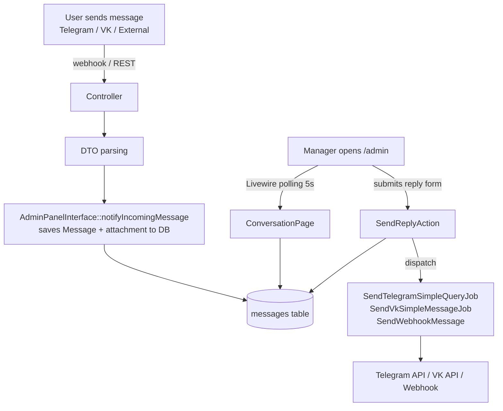

# Admin Panel Domain

> **Purpose:** Define business rules, key concepts, and invariants for the Admin module (`app/Modules/Admin/`). This module implements the `admin_panel` mode of the `ManagerInterfaceContract`.
> **Context:** Read this file before modifying anything inside `app/Modules/Admin/`, Filament resources, Livewire pages, or the `SendReplyAction`.
> **Version:** 1.0

---

## 1. What is this domain?

The Admin Panel domain provides an alternative manager interface for the support team. Instead of working through a Telegram supergroup with forum topics, managers can use the `/admin` web panel (built with Filament 3) to view conversations and send replies.

**This domain owns:** `ConversationResource`, `BotUserResource`, `ExternalSourceResource`, `ConversationPage` (Livewire), `SendReplyAction`, `AdminPanelInterface`.

**This domain does not own:** message routing logic (see `domain/messaging.md`), user banning (see `domain/bot-users.md`), external source registration (see `domain/external-sources.md`).

---

## 2. Key Concepts

| Concept | Description |
|---|---|
| `ManagerInterfaceContract` | Interface that decouples manager UI from business logic. Implementations: `TelegramGroupInterface`, `AdminPanelInterface` |
| `AdminPanelInterface` | Implementation of `ManagerInterfaceContract` for `admin_panel` mode. Both methods are no-ops — messages arrive via DB, UI updates via Livewire polling |
| `ConversationResource` | Filament resource showing all `BotUser` records as conversations. Replaces the Telegram forum topic list |
| `ViewConversation` | Filament `ViewRecord` page. Shows message history for one `BotUser`. Conditionally shows reply form |
| `ConversationPage` | Standalone Livewire page for viewing a conversation. Separate from `ViewConversation` |
| `SendReplyAction` | Static action that dispatches the correct queue job (Telegram, VK, or Webhook) based on `botUser->platform` |
| Livewire Polling | `ConversationPage` and `ViewConversation` refresh message list every 5 seconds via Livewire polling |
| `MANAGER_INTERFACE` | `.env` config key. Values: `telegram_group` (default) or `admin_panel` |

---

## 3. Business Rules

**BR-001** — The `/admin` panel is accessible only to authenticated users from the `users` table (Laravel Filament auth). Unauthenticated requests are redirected to `/admin/login`.
_Enforced in:_ `app/Modules/Admin/AdminPanelProvider.php`

**BR-002** — In `telegram_group` mode, the reply form in `ConversationPage` and `ViewConversation` must be hidden. Read-only view of messages is available in both modes.
_Enforced in:_ `ConversationPage::shouldShowReplyForm()`, `ViewConversation::shouldShowReplyForm()` — both return `config('app.manager_interface') === 'admin_panel'`

**BR-003** — `SendReplyAction::execute()` must determine the user's platform from `botUser->platform` and dispatch the correct job via queue. Never send synchronously.
- `telegram` → `SendTelegramSimpleQueryJob`
- `vk` → `SendVkSimpleMessageJob`
- other (external) → `SendWebhookMessage` (only if `webhook_url` is set)

_Enforced in:_ `app/Modules/Admin/Actions/SendReplyAction.php`

**BR-004** — Livewire polling interval is 5 seconds (`getPollingInterval(): '5s'`). Do not change without load analysis — each open browser tab generates a DB query every 5 seconds.
_Enforced in:_ `ConversationPage::getPollingInterval()`, `ViewConversation::getPollingInterval()`

**BR-005** — Every reply sent via `SendReplyAction` must be persisted to the `messages` table as `message_type = 'outgoing'` before dispatching the queue job.
_Enforced in:_ `SendReplyAction::execute()` — `Message::create([..., 'message_type' => 'outgoing', ...])`

**BR-006** — In `admin_panel` mode, `AdminPanelInterface::notifyIncomingMessage()` saves the incoming message (and optional attachment) directly to the `messages` table. No Telegram group forwarding is performed. Livewire polling picks up new messages automatically.
_Enforced in:_ `AdminPanelInterface::notifyIncomingMessage()` — creates `Message` + `MessageAttachment` records

**BR-007** — In `admin_panel` mode, `AdminPanelInterface::createConversation()` is a no-op. No Telegram forum topic is created. The conversation is visible in `ConversationResource` automatically once the `BotUser` record exists.
_Enforced in:_ `AdminPanelInterface::createConversation()` — empty body

---

## 4. Architecture Flow (admin_panel mode)



---

## 5. DI Binding

`AppServiceProvider` binds `ManagerInterfaceContract` based on `config('app.manager_interface')`:

```php
$this->app->bind(
    ManagerInterfaceContract::class,
    config('app.manager_interface') === 'admin_panel'
        ? AdminPanelInterface::class
        : TelegramGroupInterface::class,
);
```

The binding is resolved at container boot time. Switching modes requires a container restart (restart `app` service).

---

## 6. Mode Switching Rules

- Switching mode does **not** require `php artisan migrate`
- Switching mode does **not** modify any DB records
- `BotUser.topic_id` is preserved after switching to `admin_panel` — it is simply ignored in this mode
- History in `/admin` is available in both modes (all messages in `messages` table)
- To switch: change `MANAGER_INTERFACE` in `.env`, then `docker compose restart app`

---

## 7. Forbidden Behaviors

- ❌ Calling `SendReplyAction::execute()` synchronously from a Livewire component without `Queue::fake()` in tests
- ❌ Sending messages directly from Livewire components — must go through `SendReplyAction`
- ❌ Displaying the reply form when `config('app.manager_interface') !== 'admin_panel'`
- ❌ Changing the Livewire polling interval without load analysis
- ❌ Saving manager replies without recording them to the `messages` table first
- ❌ Making `AdminPanelInterface` dispatch `TopicCreateJob` — this is `telegram_group` mode only

---

## Checklist

- [ ] `BR-001` through `BR-007` read and understood
- [ ] `shouldShowReplyForm()` returns `false` in `telegram_group` mode
- [ ] `SendReplyAction` uses queue jobs, not synchronous API calls
- [ ] New Filament resources have feature tests in `tests/Feature/Admin/`
- [ ] Polling interval not changed without load analysis
- [ ] DI binding tested in `tests/Feature/Admin/ManagerInterfaceCompatibilityTest.php`
