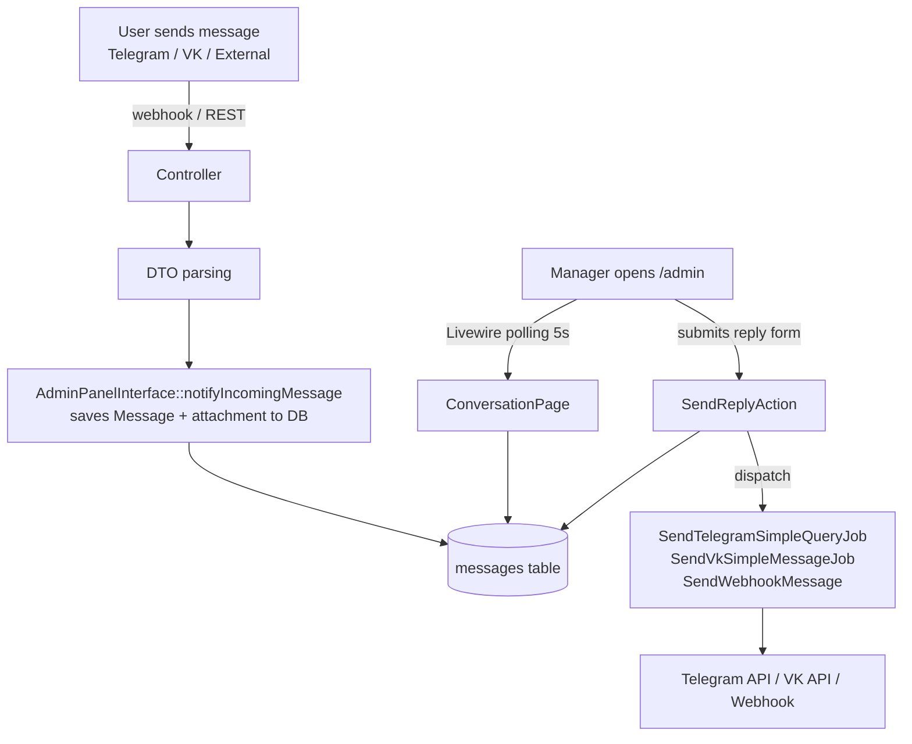

# Admin Panel Domain

> **Purpose:** Define business rules, key concepts, and invariants for the Admin module (`app/Modules/Admin/`). This module implements the `admin_panel` mode of the `ManagerInterfaceContract`.
> **Context:** Read this file before modifying anything inside `app/Modules/Admin/`, Filament resources, Livewire pages, or the `SendReplyAction`.
> **Version:** 1.2

---

## 1. What is this domain?

The Admin Panel domain provides an alternative manager interface for the support team. Instead of working through a Telegram supergroup with forum topics, managers can use the `/admin` web panel (built with Filament 3) to view conversations and send replies.

**This domain owns:** `ConversationResource`, `BotUserResource`, `ExternalSourceResource`, `FeedbackResource`, `ConversationPage` (Livewire, Filament-hosted), `GeneralSettingsPage` (custom Livewire full-page component at `/admin/settings/general`), admin design system (`resources/views/components/admin/`, `resources/views/layouts/admin-settings.blade.php`), `SendReplyAction`, `AdminPanelInterface`.

> **Stage 1 transition note:** The admin is in the process of being redesigned. Filament resources (Chats, Users, External Sources, Feedback) remain on default Filament chrome. `GeneralSettingsPage` is the first screen rebuilt as a fully custom Livewire/Blade component outside Filament's chrome. During this coexistence period the two UIs deliberately have different styling — this is expected until the migration completes.

**This domain does not own:** message routing logic (see `domain/messaging.md`), user banning (see `domain/bot-users.md`), external source registration (see `domain/external-sources.md`).

---

## 2. Key Concepts

| Concept | Description |
|---|---|
| `ManagerInterfaceContract` | Interface that decouples manager UI from business logic. Implementations: `TelegramGroupInterface`, `AdminPanelInterface` |
| `AdminPanelInterface` | Implementation of `ManagerInterfaceContract` for `admin_panel` mode. Both methods are no-ops — messages arrive via DB, UI updates via Livewire polling |
| `ConversationResource` | Filament resource showing all `BotUser` records as conversations. Replaces the Telegram forum topic list |
| `ViewConversation` | Filament `ViewRecord` page. Shows message history for one `BotUser`. Conditionally shows reply form |
| `ConversationPage` | Standalone Livewire page for viewing a conversation. Separate from `ViewConversation` |
| `SendReplyAction` | Static action that dispatches the correct queue job (Telegram, VK, or Webhook) based on `botUser->platform` |
| Livewire Polling | `ConversationPage` and `ViewConversation` refresh message list every 5 seconds via Livewire polling |
| `MANAGER_INTERFACE` | Config key. Values: `telegram_group` (default) or `admin_panel`. Readable from `.env` OR from the `settings` DB table via `SettingsService` (DB row overrides env) |
| `GeneralSettingsPage` | Custom Livewire full-page component at `/admin/settings/general` — edits bot name, description, and `MANAGER_INTERFACE`. Requires authenticated user (Filament `Authenticate` middleware redirects guests to `/admin/login`). Saves via `SettingsService`. Shows restart notice when `MANAGER_INTERFACE` changes |
| Admin Design System | Tailwind v4 tokens in `resources/css/app.css @theme` (accent, sidebar, input, text colours; Inter font). Shared Blade components: `<x-admin.sidebar>`, `<x-admin.nav-item>`, `<x-admin.card>`, `<x-admin.form-field>`, `<x-admin.button-primary>`, `<x-admin.button-secondary>`, `<x-admin.toggle>` |
| `admin-settings` layout | Full-page layout at `resources/views/layouts/admin-settings.blade.php` — dark sidebar (280px) + main content area. Used by all custom Livewire settings screens |

---

## 3. Business Rules

**BR-001** — The `/admin` panel is accessible only to authenticated users from the `users` table (Laravel Filament auth). Unauthenticated requests are redirected to `/admin/login`.
_Enforced in:_ `app/Modules/Admin/AdminPanelProvider.php`

**BR-002** — In `telegram_group` mode, the reply form in `ConversationPage` and `ViewConversation` must be hidden. Read-only view of messages is available in both modes.
_Enforced in:_ `ConversationPage::shouldShowReplyForm()`, `ViewConversation::shouldShowReplyForm()` — both return `config('app.manager_interface') === 'admin_panel'`

**BR-003** — `SendReplyAction::execute()` must determine the user's platform from `botUser->platform` and dispatch the correct job via queue. Never send synchronously.
- `telegram` → `SendTelegramSimpleQueryJob`
- `vk` → `SendVkSimpleMessageJob`
- other (external) → `SendWebhookMessage` (only if `webhook_url` is set)

_Enforced in:_ `app/Modules/Admin/Actions/SendReplyAction.php`

**BR-004** — Livewire polling interval is 5 seconds (`getPollingInterval(): '5s'`). Do not change without load analysis — each open browser tab generates a DB query every 5 seconds.
_Enforced in:_ `ConversationPage::getPollingInterval()`, `ViewConversation::getPollingInterval()`

**BR-005** — Every reply sent via `SendReplyAction` must be persisted to the `messages` table as `message_type = 'outgoing'` before dispatching the queue job.
_Enforced in:_ `SendReplyAction::execute()` — `Message::create([..., 'message_type' => 'outgoing', ...])`

**BR-006** — In `admin_panel` mode, `AdminPanelInterface::notifyIncomingMessage()` saves the incoming message (and optional attachment) directly to the `messages` table. No Telegram group forwarding is performed. Livewire polling picks up new messages automatically.
_Enforced in:_ `AdminPanelInterface::notifyIncomingMessage()` — creates `Message` + `MessageAttachment` records

**BR-007** — In `admin_panel` mode, `AdminPanelInterface::createConversation()` is a no-op. No Telegram forum topic is created. The conversation is visible in `ConversationResource` automatically once the `BotUser` record exists.
_Enforced in:_ `AdminPanelInterface::createConversation()` — empty body

**BR-008** — The General Settings screen (`/admin/settings/general`, `app/Livewire/Settings/GeneralSettingsPage.php`) requires an authenticated user. Unauthenticated visitors are redirected to `/admin/login` by Filament's `Authenticate` middleware applied in `AdminServiceProvider::boot()`. The route does not add a separate admin-role guard at the middleware layer — access is open to any authenticated user; role enforcement can be added to `mount()` if needed in future.
_Enforced in:_ `AdminServiceProvider::boot()` — `Route::middleware(['web', Authenticate::class])->prefix('admin/settings')...`

**BR-009** — Settings editable from the General Settings screen (`app.bot_name`, `app.bot_description`, `app.manager_interface`) are persisted via `SettingsService::set()` to the `settings` DB table. On read, DB rows take priority over `.env`/`config()` defaults.
_Enforced in:_ `GeneralSettingsPage::save()` — calls `SettingsService::set()` for each field; `GeneralSettingsPage::mount()` — loads via `SettingsService::get()`

**BR-010** — Changing `MANAGER_INTERFACE` from the General Settings screen saves the new value to the DB, but the `ManagerInterfaceContract` DI binding in `AppServiceProvider::register()` is resolved from `config('app.manager_interface')` at container boot time. The change takes full effect only after `docker compose restart app`. Upon save, the screen must display a persistent yellow notice: "Изменение применится после перезапуска контейнера: `docker compose restart app`".
_Enforced in:_ `GeneralSettingsPage::save()` — detects interface change (old vs new) and sets `$showRestartNotice = true`

**BR-011** — Admin Design System tokens are declared in `resources/css/app.css @theme` (Tailwind v4). All custom admin screens MUST use the token variables (`bg-sidebar`, `text-accent`, `bg-bg-input`, etc.) — never hardcode hex values in Blade. Blade components under `resources/views/components/admin/` are the single source for reusable UI primitives.
_Enforced by:_ design review; tokens defined at `resources/css/app.css:@theme`

**BR-012** — Custom Livewire settings routes MUST NOT collide with Filament's route set. Filament owns the `/admin/*` namespace but does not register `/admin/settings/*`. All new custom settings pages MUST be registered under the `admin/settings/` prefix in `AdminServiceProvider::boot()`.
_Enforced in:_ `AdminServiceProvider::boot()` — verified against `php artisan route:list` output

---

## 4. Architecture Flow (admin_panel mode)



---

## 5. DI Binding

`AppServiceProvider` binds `ManagerInterfaceContract` based on `config('app.manager_interface')`:

```php
$this->app->bind(
    ManagerInterfaceContract::class,
    config('app.manager_interface') === 'admin_panel'
        ? AdminPanelInterface::class
        : TelegramGroupInterface::class,
);
```

The binding is resolved at container boot time from `config()`. The binding does **not** read from `SettingsService` — this is intentional to avoid DB dependency at boot time and to prevent disrupting message delivery if the DB setting changes mid-request. A container restart is required for the DI binding to pick up a changed value.

---

## 6. Mode Switching Rules

- Switching mode does **not** require `php artisan migrate`
- Switching mode does **not** modify any DB records
- `BotUser.topic_id` is preserved after switching to `admin_panel` — it is simply ignored in this mode
- History in `/admin` is available in both modes (all messages in `messages` table)
- **Via `.env`**: change `MANAGER_INTERFACE` in `.env`, then `docker compose restart app`
- **Via admin panel** (General Settings page): save the new mode via the form; the value is stored in the `settings` DB table (overrides `.env` on next read via `SettingsService`); a restart notification is shown — execute `docker compose restart app` to apply

---

## 6a. General Settings Screen (custom Livewire, `/admin/settings/general`)

`app/Livewire/Settings/GeneralSettingsPage.php` — full-page Livewire component (not a Filament page).

**Layout**: `resources/views/layouts/admin-settings.blade.php` — two-column layout with a dark sidebar (280px) + right content area (`bg-bg-secondary`).

**Sidebar navigation**: 7 items. Only «Основные» is active/linked; the rest (Интеграции, ИИ-ассистент, Уведомления, API и вебхуки, Команда, Автоответы) are disabled placeholders (`disabled` prop on `<x-admin.nav-item>`). They become real links as their respective tasks are implemented.

**Form fields** (all persisted via `SettingsService`):
| Field | Setting key | Validation |
|---|---|---|
| Название бота | `app.bot_name` | nullable, string, max:255 |
| Описание | `app.bot_description` | nullable, string, max:1000 |
| Интерфейс менеджера | `app.manager_interface` | required, in:telegram_group,admin_panel |

**Component property naming**: uses `$formErrors` (not `$errors`) to avoid shadowing Blade's global `$errors` bag.

**Route**: `GET /admin/settings/general` → name `admin.settings.general`; registered in `AdminServiceProvider::boot()` under `['web', Filament\Http\Middleware\Authenticate::class]`.

**Tests**:
- `tests/Feature/Settings/GeneralSettingsPageTest.php` — Livewire-level integration: access control, mount, save, cancel, restart notice, route registration
- `tests/Unit/Livewire/Settings/GeneralSettingsPageTest.php` — unit tests using mocked SettingsService (required by `find_test.sh`)

---

## 7. Forbidden Behaviors

- ❌ Calling `SendReplyAction::execute()` synchronously from a Livewire component without `Queue::fake()` in tests
- ❌ Sending messages directly from Livewire components — must go through `SendReplyAction`
- ❌ Displaying the reply form when `config('app.manager_interface') !== 'admin_panel'`
- ❌ Changing the Livewire polling interval without load analysis
- ❌ Saving manager replies without recording them to the `messages` table first
- ❌ Making `AdminPanelInterface` dispatch `TopicCreateJob` — this is `telegram_group` mode only
- ❌ Reading the DI-bound `ManagerInterfaceContract` implementation at runtime to check the current mode — use `SettingsService::get('app.manager_interface')` or `config('app.manager_interface')` instead
- ❌ Routing the `ManagerInterfaceContract` DI binding through `SettingsService` at boot — this would add a DB dependency to the container boot cycle, breaking environments where the DB is not yet available

---

## Checklist

- [ ] `BR-001` through `BR-010` read and understood
- [ ] `shouldShowReplyForm()` returns `false` in `telegram_group` mode
- [ ] `SendReplyAction` uses queue jobs, not synchronous API calls
- [ ] New Filament resources have feature tests in `tests/Feature/Admin/`
- [ ] Polling interval not changed without load analysis
- [ ] DI binding tested in `tests/Feature/Admin/ManagerInterfaceCompatibilityTest.php`
- [ ] New custom settings Livewire page has feature test in `tests/Feature/Settings/` and unit test in `tests/Unit/Livewire/Settings/`
- [ ] When adding form fields to GeneralSettingsPage, add the key to `SettingKeyRegistry` first
- [ ] New custom Livewire routes registered in `AdminServiceProvider::boot()` under `admin/settings/` prefix
- [ ] Admin UI uses design system token variables, not hardcoded hex values
- [ ] New admin Blade components go under `resources/views/components/admin/`
