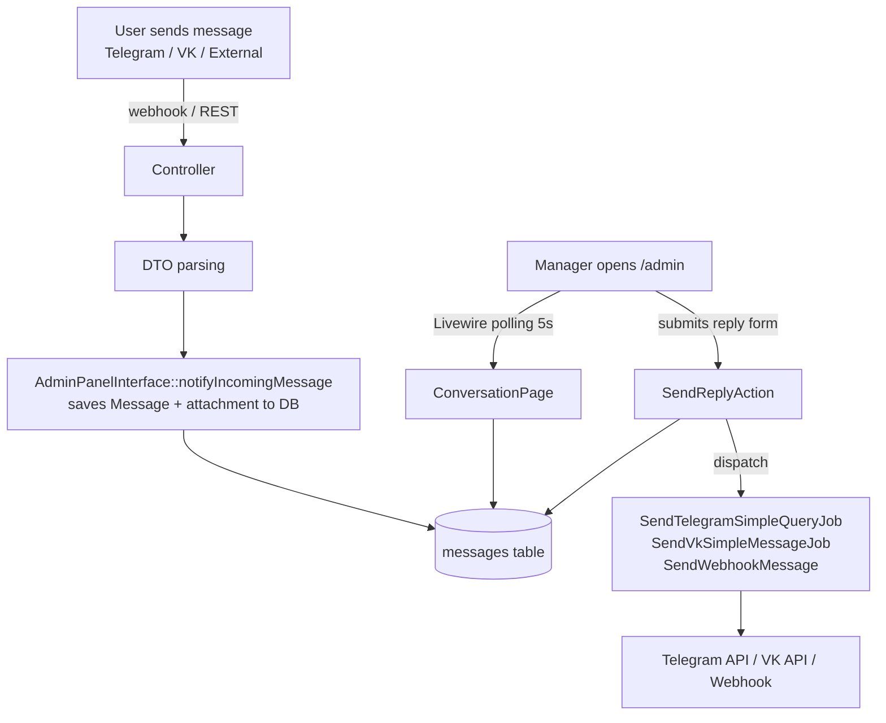

# Admin Panel Domain

> **Purpose:** Define business rules, key concepts, and invariants for the Admin module (`app/Modules/Admin/`). This module implements the `admin_panel` mode of the `ManagerInterfaceContract`.
> **Context:** Read this file before modifying anything inside `app/Modules/Admin/`, Filament resources, Livewire pages, or the `SendReplyAction`.
> **Version:** 1.5

---

## 1. What is this domain?

The Admin Panel domain provides an alternative manager interface for the support team. Instead of working through a Telegram supergroup with forum topics, managers can use the `/admin` web panel (built with Filament 3) to view conversations and send replies.

**This domain owns:** `App\Livewire\Chat\ConversationPage` (standalone Livewire chat workspace, chrome-free, at `/admin/chats`), `GeneralSettingsPage` (custom Livewire full-page at `/admin/settings/general`), `IntegrationsListPage` (custom Livewire full-page at `/admin/settings/integrations`), `IntegrationChannelPage` (custom Livewire full-page at `/admin/settings/integrations/{channel}`), `AiAssistantPage` (custom Livewire full-page at `/admin/settings/ai`), `AiProviderAccessPage` (custom Livewire full-page at `/admin/settings/ai/{provider}`), `ApiWebhooksPage` (custom Livewire full-page at `/admin/settings/api-webhooks` — source card list), `ApiWebhookSourcePage` (custom Livewire full-page at `/admin/settings/api-webhooks/{source}` — per-source edit page), the Filament panel + navigation (`AdminPanelProvider`), the admin design system (`resources/views/components/admin/`, `resources/views/layouts/admin-settings.blade.php`, `resources/views/layouts/admin-chat.blade.php`), `SendReplyAction`, `AdminPanelInterface`, `ChannelStatusService`, `WebhookRegistrationService`.

> **Redesign note:** The legacy Filament resources (Conversations, Bot Users, External Sources, Feedback, Users) have been **removed**. The admin now consists of fully custom Livewire/Blade screens — the chat workspace (`/admin/chats`) and the Settings section (`/admin/settings/*`) — built on the admin design system, outside Filament's default chrome. The Filament panel is retained only for authentication (the `/admin/login` page) — it registers no resources, pages, widgets or dashboard. The panel root `/admin` redirects to the chat workspace, and login lands there too (`Filament::getUrl()` resolves to the first navigation item, «Диалоги»). Navigation to the custom screens is registered via `AdminPanelProvider::navigationItems()`. The underlying models, services, flows and artisan commands (bot users, external sources, feedback, users) are unchanged — only their Filament admin UI was removed (their redesigned screens are pending).

**This domain does not own:** message routing logic (see `domain/messaging.md`), user banning (see `domain/bot-users.md`), external source registration (see `domain/external-sources.md`).

---

## 2. Key Concepts

| Concept | Description |
|---|---|
| `ManagerInterfaceContract` | Interface that decouples manager UI from business logic. Implementations: `TelegramGroupInterface`, `AdminPanelInterface` |
| `AdminPanelInterface` | Implementation of `ManagerInterfaceContract` for `admin_panel` mode. Both methods are no-ops — messages arrive via DB, UI updates via Livewire polling |
| `App\Livewire\Chat\ConversationPage` | **Primary manager workspace** — standalone full-page Livewire component at `GET /admin/chats`. Full-screen, chrome-free (no Filament top-nav/sidebar). Uses `layouts.admin-chat` layout. 3-column layout: left sidebar 360px dark (header + search + pill-filter tabs + dialog list), center chat area (header + message thread + input bar with quick-reply chips + optional file attachment for telegram/vk), right user info panel (profile + Блок/Закрыть buttons + ИНФОРМАЦИЯ rows — incl. a conditional «Ссылка на профиль» from `ConversationPage::profileUrl()`: `https://vk.com/id{chat_id}` for VK only (Telegram has no working link from a numeric id — needs a `@username` we don't store), hidden for other platforms / non-numeric ids — + МЕДИАФАЙЛЫ grid + «Удалить чат») — a **Telegram-style centered modal** (narrow `w-[300px]` `max-w-[90vw]`, `max-h-[85vh]`, scale+fade in, over the chat on a darkened `bg-black/40` backdrop that flex-centers it), **opened by clicking the chat name/avatar in the header OR the «Показать профиль» item in the header ⋮ menu**, and closed by clicking the backdrop, the × button, or `Escape` (the panel itself uses `x-on:click.stop`) — all via the Alpine `infoPanelOpen` flag (client-side only, no Livewire round-trip). The chat header also has a **⋮ more-actions dropdown** (Alpine `menuOpen`, click-outside/Escape to close) with: «Показать профиль» (→ `infoPanelOpen`), «Очистить историю» (→ `clearHistory()` / `ClearBotUserHistory` — deletes the thread's messages + attachments + AI messages, keeps the BotUser), and «Удалить чат» (last, red text → `deleteChat()` / `DeleteBotUser` — removes the BotUser and everything). Self-contained — no `botUserId` route param. Dialog selection via `selectChat(int $botUserId)`. Protected by `Filament\Http\Middleware\Authenticate` |
| Filament navigation | The Filament panel keeps no resources, pages, widgets or dashboard — it serves only login. Links to the custom screens are registered in `AdminPanelProvider::navigationItems()`: «Диалоги» → `route('admin.chats')` (sort 1) and «Настройки» → `route('admin.settings.general')` (sort 2). `->homeUrl()` and the first nav item both point at `/admin/chats`, so `/admin` and post-login both land on «Диалоги» |
| Dialog list ordering | `ConversationPage::loadDialogList()` uses a raw correlated subquery to order by `MAX(messages.created_at) DESC` because `BotUser::messages()` has swapped FK args. Do not switch to `withMax()` without fixing the model relation |
| Quick replies | Static list from `config('chat.quick_replies')` — clicking a chip calls `insertQuickReply($text)` which sets `$replyText`. No DB table |
| Unread badge heuristic | First iteration: a dialog is flagged unread if `lastMessage->message_type === 'incoming'`. No DB counter — a proper unread field is deferred |
| `chat-item` component | `resources/views/components/chat-item.blade.php` — anonymous Blade component for the dialog list card. Avatar: 44×44 circle, initials, deterministic color from `crc32(chat_id) % 8` (8 hex colours). Platform badge: small pill with platform hex colour. Unread: accent pill when `hasUnread`. Matches design node `WyN0x` |
| Media gallery | Right panel shows image/sticker `MessageAttachment`s for the active dialog via `ConversationPage::getImageAttachments()`. Reuses the Alpine.js lightbox |
| `SendReplyAction` | Static action that dispatches the correct queue job (Telegram, VK, or Webhook) based on `botUser->platform` |
| Livewire Polling | `ConversationPage` refreshes every 5 seconds via `getPollingInterval(): '5s'` |
| `MANAGER_INTERFACE` | Config key. Values: `telegram_group` (default) or `admin_panel`. Readable from `.env` OR from the `settings` DB table via `SettingsService` (DB row overrides env) |
| `GeneralSettingsPage` | Custom Livewire full-page component at `/admin/settings/general` — edits only the Telegram topic-name template (`telegram.template_topic_name`). Bot name, description, and `MANAGER_INTERFACE` were removed from this screen. Requires authenticated user (Filament `Authenticate` middleware redirects guests to `/admin/login`). Saves via `SettingsService` |
| Admin Design System | Tailwind v4 tokens in `resources/css/app.css @theme` (accent, sidebar, input, text colours; Inter font). Shared Blade components: `<x-admin.sidebar>`, `<x-admin.nav-item>`, `<x-admin.card>`, `<x-admin.form-field>`, `<x-admin.button-primary>`, `<x-admin.button-secondary>`, `<x-admin.toggle>` |
| `admin-settings` layout | Full-page layout at `resources/views/layouts/admin-settings.blade.php` — dark sidebar (280px) + main content area. Used by all custom Livewire settings screens |
| Logout control | «Выйти» posts to `route('filament.admin.auth.logout')` (`POST /admin/logout`, Filament). Rendered in two spots: a row at the bottom of `<x-admin.sidebar>` (settings screens) and an icon button next to the settings gear in the `ConversationPage` left panel header (chat workspace). Both are `<form method="POST">` with `@csrf` |
| `IntegrationsListPage` | Custom Livewire full-page component at `/admin/settings/integrations`. Shows Telegram/VK/MAX channel cards with connection status badges. Reads statuses via `ChannelStatusService`. «Виджет для сайта» shown as disabled «Скоро» placeholder |
| `IntegrationChannelPage` | Custom Livewire full-page component at `/admin/settings/integrations/{channel}` (channel ∈ telegram\|telegram_ai\|vk\|max). Per-channel config form (read/write via `SettingsService`). Primary action button is **«Сохранить»** — runs a **verify-before-save** flow: (1) field validation, (2) token verification via `WebhookRegistrationService::verifyX($token)` (entered value or stored fallback), (3) persist settings only on verification success, (4) register webhook (telegram\|vk\|max) or show success notice (telegram_ai — no webhook registration via UI; uses `php artisan ai-bot:set-webhook`) |
| `ChannelStatusService` | `app/Modules/Admin/Services/ChannelStatusService.php`. Computes `connected/label` per channel based on whether required `SettingsService` keys are non-empty. Shared by list and per-channel pages |
| `WebhookRegistrationService` | `app/Modules/Admin/Services/WebhookRegistrationService.php`. Provides **verify** methods (`verifyTelegram`, `verifyVk`, `verifyMax`) that accept an explicit token and call the platform API to confirm validity before any data is persisted (returns `{success: bool, message: string}`), and **register** methods (`registerTelegram`, `registerVk`, `registerMax`) that read tokens from `SettingsService` and perform the actual webhook registration. Never logs tokens |

---

## 3. Business Rules

**BR-001** — The `/admin` panel is accessible only to authenticated users from the `users` table (Laravel Filament auth). Unauthenticated requests are redirected to `/admin/login`.
_Enforced in:_ `app/Modules/Admin/AdminPanelProvider.php`

**BR-002** — The reply form in `ConversationPage` is shown in **both** modes (`telegram_group` and `admin_panel`). `SendReplyAction` routes the reply by `BotUser.platform` and does not depend on `MANAGER_INTERFACE`, so a manager can reply directly from the `/admin/chats` workspace regardless of the active interface mode.
_Enforced in:_ `App\Livewire\Chat\ConversationPage::shouldShowReplyForm()` — returns `true`

**BR-003** — `SendReplyAction::execute(BotUser, string $text, ?UploadedFile $file = null)` must determine the user's platform from `botUser->platform` and dispatch the correct job via queue. Never send synchronously.
- `telegram` → `SendTelegramSimpleQueryJob` (text) / `SendAdminDocumentJob` (with file)
- `vk` → `SendVkSimpleMessageJob` (file uploaded via `docs.getMessagesUploadServer` → `docs.save`, attached as `doc{owner}_{id}`)
- other (external/max) → `SendWebhookMessage` (text only, only if `webhook_url` is set — **files are not delivered**)

_Enforced in:_ `app/Modules/Admin/Actions/SendReplyAction.php`

**BR-003a** — The reply form supports an optional file attachment via `ConversationPage::$attachment` (Livewire `WithFileUploads`, `max:20480` KB). Text is required only when no file is attached (file-only messages are allowed). The attach control is shown — and the file passed to `SendReplyAction` — only when `supportsAttachments()` is true (platform ∈ `telegram|vk|max`); for external sources the attachment is ignored so files are never silently dropped into a text-only webhook. MAX file delivery: `SendReplyAction::sendMaxReply()` uploads the file to MAX's CDN via `UploadFileMax::uploadContents()` (MIME→type: image/audio/file) to get an attachment token, then dispatches `SendMaxSimpleMessageJob` with `sendImage`/`sendAudio`/`sendFile` (with `attachment.not.ready` retry); on upload failure the text is still delivered. MAX **text** replies also go through `sendMaxReply()` (`sendMessage`) — MAX is no longer routed to the external-webhook path.
_Enforced in:_ `App\Livewire\Chat\ConversationPage::sendReply()` / `supportsAttachments()` / `removeAttachment()`

**BR-003b** — The right-panel «Закрыть» button runs the canonical close flow `App\Modules\Telegram\Actions\CloseTopic::execute()` (notify user, close the Telegram forum topic when present, set `is_closed`/`closed_at`, trigger the feedback form). It is a no-op when there is no active dialog or it is already closed, and is disabled in the UI once the dialog is closed.
_Enforced in:_ `App\Livewire\Chat\ConversationPage::closeDialog()`

**BR-003c** — The right-panel ban control is a **toggle**: when the user is not banned it shows «Блок» and runs `App\Modules\Admin\Actions\BanBotUser::execute()` (marks `is_banned`/`banned_at` and terminal `is_closed`/`closed_at`, closes the Telegram forum topic when present; **no feedback form** unlike close). When the user is banned it shows «Разблокировать» and runs `App\Modules\Admin\Actions\UnbanBotUser::execute()` (clears `is_banned`/`banned_at`; **does not** change `is_closed` — the conversation stays closed until a reply re-opens it per BR-003d). Both are no-ops in the wrong state. Banned users' incoming messages are rejected by the platform webhook controllers via `BotUser::isBanned()`. In the dialog list a banned conversation shows a «Заблокирован» badge (takes priority over the «Закрыт» badge).
_Enforced in:_ `App\Livewire\Chat\ConversationPage::banUser()` / `unbanUser()`, `App\Modules\Admin\Actions\BanBotUser` / `UnbanBotUser`, `resources/views/components/chat-item.blade.php`

**BR-003d** — Sending a reply via `SendReplyAction::execute()` **re-opens** a closed conversation: if `is_closed` is true it is reset to false and `closed_at` to null before the message is persisted. This applies to replies sent from the chat workspace (any platform). The feedback-rating message (written directly by `HandleFeedbackRating`, not via `SendReplyAction`) does **not** re-open the conversation.
_Enforced in:_ `App\Modules\Admin\Actions\SendReplyAction::execute()`

**BR-003e** — The dialog-list "new message" indicator (`hasUnread`) is shown only when the **last** message is incoming (`lastMessage->message_type === 'incoming'`) AND the conversation is open (not `is_closed`, not `is_banned`) AND it is not the currently active dialog (`activeBotUserId`) AND the last message arrived **after** `bot_users.manager_last_read_at`. Opening a dialog (`selectChat()`) stamps `manager_last_read_at = now()`, so the cleared indicator **persists across page reloads** (it is not just in-memory session state). A later incoming message (newer than the read stamp) re-flags the dialog. This is conversation-level read tracking — there is still no per-message read state.
_Enforced in:_ `App\Livewire\Chat\ConversationPage::hasUnread()` / `selectChat()`, column `bot_users.manager_last_read_at`

**BR-004** — Livewire polling interval is 5 seconds. The poll target is `pollUpdates()` (`wire:poll.5s`), which refreshes the dialog list and — when a dialog is open — reloads the active message thread, so incoming messages appear in the centre pane without a manual refresh. It scrolls to the bottom (and bumps `manager_last_read_at`) only when the message count grew, so a manager scrolled up reading history is not yanked down each tick. `loadMessages()` is a pure loader; callers (`selectChat`, `sendReply`, `pollUpdates`) emit the `messages-updated` browser event when a scroll is wanted. Do not change the interval without load analysis — each open browser tab generates DB queries every 5 seconds.
_Enforced in:_ `App\Livewire\Chat\ConversationPage::getPollingInterval()`

**BR-005** — Every reply sent via `SendReplyAction` must be persisted to the `messages` table as `message_type = 'outgoing'` before dispatching the queue job.
_Enforced in:_ `SendReplyAction::execute()` — `Message::create([..., 'message_type' => 'outgoing', ...])`

**BR-006** — In `admin_panel` mode, `AdminPanelInterface::notifyIncomingMessage()` saves the incoming message (and optional attachment) directly to the `messages` table. No Telegram group forwarding is performed. Livewire polling picks up new messages automatically.
_Enforced in:_ `AdminPanelInterface::notifyIncomingMessage()` — creates `Message` + `MessageAttachment` records

**BR-007** — In `admin_panel` mode, `AdminPanelInterface::createConversation()` is a no-op. No Telegram forum topic is created. The conversation appears automatically in the chat workspace (`/admin/chats`) once the `BotUser` record exists.
_Enforced in:_ `AdminPanelInterface::createConversation()` — empty body

**BR-008** — The General Settings screen (`/admin/settings/general`, `app/Livewire/Settings/GeneralSettingsPage.php`) requires an authenticated user. Unauthenticated visitors are redirected to `/admin/login` by Filament's `Authenticate` middleware applied in `AdminServiceProvider::boot()`. The route does not add a separate admin-role guard at the middleware layer — access is open to any authenticated user; role enforcement can be added to `mount()` if needed in future.
_Enforced in:_ `AdminServiceProvider::boot()` — `Route::middleware(['web', Authenticate::class])->prefix('admin/settings')...`

**BR-009** — The only setting editable from the General Settings screen is `telegram.template_topic_name`, persisted via `SettingsService::set()` to the `settings` DB table. On read, DB rows take priority over `.env`/`config()` defaults. (Bot name, description, and `app.manager_interface` were removed from this screen.)
_Enforced in:_ `GeneralSettingsPage::save()` — calls `SettingsService::set('telegram.template_topic_name', …)`; `GeneralSettingsPage::mount()` — loads via `SettingsService::get()`

**BR-010** — `MANAGER_INTERFACE` is **no longer editable from the admin panel**. It is switched only via the `.env` file (`MANAGER_INTERFACE=…`) followed by `docker compose restart app`, because the `ManagerInterfaceContract` DI binding in `AppServiceProvider::register()` is resolved from `config('app.manager_interface')` at container boot time. (The previous General-Settings radio + restart notice were removed.)

**BR-011** — Admin Design System tokens are declared in `resources/css/app.css @theme` (Tailwind v4). All custom admin screens MUST use the token variables (`bg-sidebar`, `text-accent`, `bg-bg-input`, etc.) — never hardcode hex values in Blade. Blade components under `resources/views/components/admin/` are the single source for reusable UI primitives.
_Enforced by:_ design review; tokens defined at `resources/css/app.css:@theme`

**BR-012** — Custom Livewire routes MUST NOT collide with Filament's route set. The chat workspace is registered as `GET /admin/chats` (name `admin.chats`) — this path is not claimed by Filament's panel. Settings pages are registered under `admin/settings/` prefix. All custom routes use `Filament\Http\Middleware\Authenticate` so unauthenticated visitors are redirected to `/admin/login`.
_Enforced in:_ `AdminServiceProvider::boot()` — verified against `php artisan route:list` output

**BR-013** — Integration config for Telegram/Telegram AI/VK/MAX is read and written exclusively via `SettingsService` using the registry keys `telegram.*`, `telegram_ai.*`, `vk.*`, `max.*`. Secrets (tokens, secret keys, confirm codes) are stored encrypted (`is_secret = true` in `SettingKeyRegistry`). Never log tokens or secrets (see `rules/process/security.md`). The `telegram.bot_id` key was removed — it is unused at runtime.
_Enforced in:_ `IntegrationChannelPage::saveTelegram/TelegramAi/Vk/Max()` — calls `SettingsService::set()`; `WebhookRegistrationService` — reads tokens via `SettingsService`, logs only non-sensitive data

**BR-014** — The primary «Сохранить» action in `IntegrationChannelPage` follows a **verify-before-save** sequence: (1) validate form fields; (2) resolve the token (form value if non-empty, otherwise stored fallback — so re-entering the secret is not required on edit); (3) call `WebhookRegistrationService::verifyX($token)` — if verification fails, set `$webhookMessage` / `$webhookSuccess = false` and **return without saving** any settings; (4) on success, persist via `saveX()`, then register the webhook (telegram|vk|max) or show a success notice (telegram_ai). The webhook registration and verification methods in `WebhookRegistrationService` never log tokens.
_Enforced in:_ `IntegrationChannelPage::connect()` → `resolveVerificationToken()` + `validateFields()` + `WebhookRegistrationService::verifyX/registerX()`

**BR-014a** — On the «Бот AI помощника» channel (`channel=telegram_ai`) the two inputs `telegram_ai.token` and `telegram_ai.secret` are **both required**: `validateFields()` sets a per-field error and aborts «Сохранить» (`connect()`) before verification when either is blank (fields are pre-filled from settings, so an existing config already passes). There is **no manual username field** — the bot's `telegram_ai.id` and `telegram_ai.username` are captured automatically from the `getMe` response during verification (`WebhookRegistrationService::verifyTelegram()` returns `botId`/`botUsername`) and persisted in `connect()`. Both are informational (not compared at runtime). Required labels render a red asterisk via the `required` prop on `<x-admin.form-field>`.
_Enforced in:_ `IntegrationChannelPage::validateFields()` + `connect()` (telegram_ai branch); `WebhookRegistrationService::verifyTelegram()`; `app/Services/Settings/SettingKeyRegistry.php @ telegram_ai.id`; `resources/views/livewire/settings/integration-channel-page.blade.php`

**BR-014b** — On the «Подключить Telegram» channel (`channel=telegram`) **all three fields are required**: `telegram.group_id`, `telegram.token`, `telegram.secret_key`. `validateFields()` sets a per-field error and aborts «Сохранить» (`connect()`) before verification when any is blank (group_id also keeps the ≤50-char check). Fields are pre-filled from settings, so editing an existing config already passes; the stored-token fallback (BR-014 step 2) is therefore not reached for telegram/telegram_ai (it remains effective for vk/max). Required labels render a red asterisk via the `required` prop on `<x-admin.form-field>`.
_Enforced in:_ `IntegrationChannelPage::validateFields()` (telegram branch); `resources/views/livewire/settings/integration-channel-page.blade.php`

**BR-014c** — On the «Подключить ВКонтакте» channel (`channel=vk`) **all three fields are required**: `vk.token`, `vk.secret_key`, `vk.confirm_code`. `validateFields()` sets a per-field error and aborts «Сохранить» (`connect()`) before VK verification when any is blank. Fields are pre-filled from settings, so editing an existing config already passes. Required labels render a red asterisk via the `required` prop on `<x-admin.form-field>`.
_Enforced in:_ `IntegrationChannelPage::validateFields()` (vk branch); `resources/views/livewire/settings/integration-channel-page.blade.php`

**BR-014d** — On the «Подключить MAX» channel (`channel=max`) **both fields are required**: `max.token`, `max.secret_key`. `validateFields()` sets a per-field error and aborts «Сохранить» (`connect()`) before MAX verification when either is blank. Fields are pre-filled from settings, so editing an existing config already passes. Required labels render a red asterisk via the `required` prop on `<x-admin.form-field>`. (All four channels now enforce required fields; the BR-014 stored-token fallback is consequently only reachable when a pre-filled secret field is manually cleared — which validation then rejects.)
_Enforced in:_ `IntegrationChannelPage::validateFields()` (max branch); `resources/views/livewire/settings/integration-channel-page.blade.php`

**BR-015** — Saving a secret field (token, key) with an empty string does NOT overwrite the existing secret in the DB. This prevents accidentally blanking credentials when only non-secret fields are edited.
_Enforced in:_ `IntegrationChannelPage::saveTelegram/Vk/Max()` — `if ($field !== '') { $settings->set(...) }`

**BR-016** — The «Виджет для сайта» card on the Integrations list is a disabled placeholder («Скоро»). It must not be a clickable link and must not have a route. It is rendered as a `<div>` with `cursor-not-allowed opacity-50`.
_Enforced in:_ `resources/views/livewire/settings/integrations-list-page.blade.php`

**BR-017** — AI assistant settings (master toggle, provider, auto-reply, context limit, system prompt) are managed at `/admin/settings/ai` via `AiAssistantPage`. Values are persisted via `SettingsService`. The `ИИ-ассистент` sidebar item must link to `admin.settings.ai` and be marked active on both `admin.settings.ai` and `admin.settings.ai.provider` routes.
_Enforced in:_ `resources/views/layouts/admin-settings.blade.php @ nav-item ИИ-ассистент`; `AdminServiceProvider::boot()` route `admin.settings.ai`

**BR-018** — AI provider credentials (API keys, client IDs/secrets, base URLs, models, max tokens, temperature) are managed at `/admin/settings/ai/{provider}` via `AiProviderAccessPage`. Route constraint: `provider` ∈ `openai|deepseek|gigachat`. Secrets are encrypted in the `settings` DB table and never pre-filled in the UI form. Blank secret submission does NOT overwrite the existing stored secret. The **GigaChat CA certificate** is a file upload (not a text path): the uploaded `.crt`/`.pem` is written to `storage/certs/russian_trusted_root_ca_pem.crt` (always that fixed name), and `ai.gigachat_path_cert` stores the storage-relative path `certs/russian_trusted_root_ca_pem.crt` (consumed by `GigaChatProvider` via `storage_path()`). When no new file is uploaded, the existing certificate is kept.
_Enforced in:_ `AiProviderAccessPage::saveOpenAi/DeepSeek/GigaChat()` — blank-secret guard identical to `IntegrationChannelPage` (BR-015)

**BR-019** — Enabling auto-reply from `AiAssistantPage` requires an explicit user confirmation. The toggle triggers a yellow warning dialog; the user must call `confirmAutoReply()` before the setting is applied. Dismissing the dialog (`cancelAutoReply()`) leaves auto-reply disabled.
_Enforced in:_ `AiAssistantPage::updatedAutoReply()`, `confirmAutoReply()`, `cancelAutoReply()`

**BR-020** — The Filament panel registers no resources; navigation to the custom screens is declared in `AdminPanelProvider::navigationItems()`. The "Диалоги" item (icon `heroicon-o-chat-bubble-left-right`, sort `1`) links to `route('admin.chats')`; the "Настройки" item (icon `heroicon-o-cog-6-tooth`, sort `2`) links to `route('admin.settings.general')`. The real workspace (`App\Livewire\Chat\ConversationPage`) mounts with an empty dialog list and populates on `selectChat()`.
_Enforced in:_ `AdminPanelProvider::panel()` → `->navigationItems([...])`

**BR-023** — The "API и вебхуки" section consists of two pages, both restricted to admin-role users only. Non-admin authenticated users are redirected to `admin.settings.general` in `mount()` via `Auth::user()->isAdmin()`.
- **List page** (`/admin/settings/api-webhooks`, `ApiWebhooksPage`): shows External Source cards with token/webhook status; "Добавить источник" creates a source and redirects to the edit page.
- **Edit page** (`/admin/settings/api-webhooks/{source}`, `ApiWebhookSourcePage`): per-source configuration — bearer token regeneration (one-time reveal, 64 chars, never logged), webhook URL editing, and an **allowed-IPs allowlist** (`external_sources.allowed_ips`). The previous secret-key and events design placeholders were removed.
Token values are never logged or displayed in full — only a one-time reveal banner shown immediately after regeneration, stored in `$newToken` and cleared on dismiss.
_Enforced in:_ `ApiWebhooksPage::mount()` and `ApiWebhookSourcePage::mount()` — `isAdmin()` check; `ApiWebhookSourcePage::regenerateToken()` — stores raw token in `$newToken` only, never logged

**BR-024** — Bearer token active/inactive state is stored in `external_source_access_tokens.active`. A token with `active = false` fails `ApiQuery` middleware authentication and is treated as if it does not exist for API access purposes. The flag can be flipped via `ExternalSourceTokensService::setTokenActive()`. Note: the «API и вебхуки» screen does not currently surface an active toggle (it follows the design mockup, which has none) — the service method remains available for programmatic/future use.
_Enforced in:_ `App\Modules\External\Middleware\ApiQuery` — checks `active = true`; `ExternalSourceTokensService::setTokenActive()`

**BR-025** — Token generation uses `Str::random(64)` (64-character alphanumeric string). This matches the `external_source_access_tokens.token` column `varchar(64)` defined in the migration. The prior value `Str::random(60)` has been corrected to 64.
_Enforced in:_ `ExternalSourceTokensService::generateToken()`

**BR-021** — The dialog list in `ConversationPage` is ordered by the most recent message date descending. Because `BotUser::messages()` has swapped FK args (`hasMany(Message::class, 'id', 'bot_user_id')`), `withMax()` produces a wrong query. Use a raw correlated subquery: `COALESCE((SELECT MAX(m.created_at) FROM messages m WHERE m.bot_user_id = bot_users.id), '1970-01-01') DESC`. Do not use `withMax('messages', 'created_at')` until the model relation is corrected.
_Enforced in:_ `ConversationPage::loadDialogList()`

**BR-022** — Quick replies are a static list from `config('chat.quick_replies', [])` (`config/chat.php`). Clicking a chip calls `insertQuickReply(string $text)` which sets `$replyText` — it does NOT auto-submit. No DB table for quick replies.
_Enforced in:_ `ConversationPage::insertQuickReply()`; `config/chat.php`

**BR-026** — The «Команда» screen (`TeamPage`, `/admin/settings/team`) is restricted to admin-role users only. Non-admin authenticated users are redirected to `admin.settings.general` in `mount()` via `Auth::user()->isAdmin()`. Guests are blocked by the Filament `Authenticate` route middleware.
_Enforced in:_ `TeamPage::mount()`

**BR-027** — Inviting a new operator creates a `User` record immediately (no invite-token flow, **no email is sent**). `InviteOperator::execute(email, role)` generates a 16-character secure password (`Str::password(16)`), creates the user (password is stored hashed via the model's `hashed` cast), and returns `['user' => User, 'password' => string]`. `TeamPage::invite()` then reveals the generated plain-text password to the admin once (green notice with copy/dismiss) so it can be handed to the operator manually. The plain-text password MUST NOT be logged at any point.
_Enforced in:_ `App\Modules\Admin\Actions\InviteOperator::execute()`; `App\Livewire\Settings\TeamPage::invite()` (sets `invitedPassword`)

**BR-028** — An admin cannot delete their own account from the Team screen (self-lockout protection). `deleteMember()` checks `Auth::id() === $confirmDeleteId` before calling `delete()`. If the check fails, a user-visible error is set and the action is aborted. The delete button for the current user's own row is hidden in the view (not rendered) as an additional UX guard. The delete requires a two-step confirmation: `confirmDelete(userId)` sets `$confirmDeleteId`, and only then `deleteMember()` executes the deletion.
_Enforced in:_ `TeamPage::deleteMember()`

---

## 4. Architecture Flow (admin_panel mode)



---

## 5. DI Binding

`AppServiceProvider` binds `ManagerInterfaceContract` based on `config('app.manager_interface')`:

```php
$this->app->bind(
    ManagerInterfaceContract::class,
    config('app.manager_interface') === 'admin_panel'
        ? AdminPanelInterface::class
        : TelegramGroupInterface::class,
);
```

The binding is resolved at container boot time from `config()`. The binding does **not** read from `SettingsService` — this is intentional to avoid DB dependency at boot time and to prevent disrupting message delivery if the DB setting changes mid-request. A container restart is required for the DI binding to pick up a changed value.

---

## 6. Mode Switching Rules

- Switching mode does **not** require `php artisan migrate`
- Switching mode does **not** modify any DB records
- `BotUser.topic_id` is preserved after switching to `admin_panel` — it is simply ignored in this mode
- History in `/admin` is available in both modes (all messages in `messages` table)
- **Via `.env` only**: change `MANAGER_INTERFACE` in `.env`, then `docker compose restart app`. (The admin-panel switch was removed — `MANAGER_INTERFACE` is no longer editable from the General Settings screen.)

---

## 6a. General Settings Screen (custom Livewire, `/admin/settings/general`)

`app/Livewire/Settings/GeneralSettingsPage.php` — full-page Livewire component (not a Filament page).

**Layout**: `resources/views/layouts/admin-settings.blade.php` — two-column layout with a dark sidebar (280px) + right content area (`bg-bg-secondary`).

**Sidebar navigation**: 7 items. «Основные», «Интеграции», «ИИ-ассистент», «API и вебхуки», and «Команда» are active/linked; «Уведомления» and «Автоответы» remain disabled placeholders (`disabled` prop on `<x-admin.nav-item>`). They become real links as their respective tasks are implemented.

**Form fields** (persisted via `SettingsService`):
| Field | Setting key | Validation |
|---|---|---|
| Шаблон названия топика | `telegram.template_topic_name` | nullable, string, max:255 |

(Bot name `app.bot_name`, description `app.bot_description`, and the manager-interface radio `app.manager_interface` were removed from this screen.)

**Notifications & sound card** (browser-level preferences, **not** DB/`SettingsService`): a second card «Оповещения о новых сообщениях» provides two controls handled entirely client-side (Alpine + `localStorage` + the Web Notifications / Web Audio APIs), with no server round-trip:
- **Уведомления в браузере** — requests `Notification.requestPermission()`; shows status (Включены / Заблокированы / Включить / Не поддерживается).
- **Звуковой сигнал** — a toggle persisted in `localStorage['tg-support-sound']` (`'1'`/`'0'`, default on) plus a «Проверить» test button.

These are only *preference setters*. The actual desktop notification + sound playback fire on the chat workspace (`ConversationPage`), which polls every 5 s via **`wire:poll.5s.keep-alive`** (the `.keep-alive` modifier is required — a plain `wire:poll` pauses while the tab is in the background, which would suppress all background notifications): its `pollUpdates()` emits a `new-incoming-messages` browser event for incoming messages in non-active, non-banned dialogs (watermarked by `lastSeenMessageId`, so each notifies once), and the page's Alpine `showNotification()` (gated on `!document.hasFocus()`) / `playSound()` (gated on the `localStorage` flag) respond. There are no notification controls in the chat header anymore — they live only here.

The chat workspace also **badges its favicon** while the tab is in the background: on `new-incoming-messages` with `document.hidden`, Alpine redraws the favicon on a `<canvas>` (the original icon + a red count badge, accumulated in `pendingCount`) and swaps the `<link rel="icon">` href to the data URL; on `visibilitychange`→visible / window `focus` it restores the original favicon. No notification permission is required for the favicon badge.

### Admin PWA (installable app)

The admin is an installable **PWA** scoped to `/admin/`. `App\Modules\Admin\Controllers\PwaController` serves, **without auth** (the browser fetches them outside the session), two routes registered in `AdminServiceProvider::boot()`:
- `GET /admin/manifest.webmanifest` (`admin.pwa.manifest`) — web app manifest: `start_url=/admin/chats`, `scope=/admin/`, `display=standalone`, `theme_color=#1B1F2E`, `background_color=#FFFFFF`, icons 192/512 (`public/icons/`).
- `GET /admin/sw.js` (`admin.pwa.sw`) — the service worker, served with `Service-Worker-Allowed: /admin/`. Its `CACHE` name embeds a build version (`md5` of `public/build/manifest.json`), so a new asset build auto-invalidates the old cache.

SW strategy: HTML **navigations** are network-first with the precached `public/offline.html` shell as fallback — **authenticated HTML is never written to the cache** (security); static assets (`/build/`, `/icons/`, manifest) are cache-first; Livewire/AJAX/POST and cross-origin requests pass straight through (so 5 s polling, Web Notifications, Web Audio and the favicon badge are unaffected online). Registration lives in `resources/js/app.js` and runs only on `/admin/*` pages in a secure context (HTTPS/localhost). Both admin layouts (`admin-chat`, `admin-settings`) carry the `<link rel="manifest">`, `theme-color`, and apple-touch-icon `<head>` tags. Install uses the browser's native prompt (no custom in-app button). Deploy note: `resources/js/app.js` is bundled, so an asset rebuild (`npm run build`) is required for the SW registration to ship. Tests: `tests/Feature/Admin/PwaTest.php`.

**Component property naming**: uses `$formErrors` (not `$errors`) to avoid shadowing Blade's global `$errors` bag.

**Route**: `GET /admin/settings/general` → name `admin.settings.general`; registered in `AdminServiceProvider::boot()` under `['web', Filament\Http\Middleware\Authenticate::class]`.

**Tests**:
- `tests/Feature/Settings/GeneralSettingsPageTest.php` — Livewire-level integration: access control, mount, save, cancel, route registration
- `tests/Unit/Livewire/Settings/GeneralSettingsPageTest.php` — unit tests using mocked SettingsService

---

## 6b. Integrations Screens (custom Livewire, `/admin/settings/integrations`)

### IntegrationsListPage (`GET /admin/settings/integrations`)

`app/Livewire/Settings/IntegrationsListPage.php` — shows Telegram, VK, MAX, and Widget (disabled) channel cards with connection status.

**Channel status**: computed by `ChannelStatusService::all()` on `mount()`. A channel is «Подключён» when all required keys are non-empty; otherwise «Не настроен».

**Required keys by channel**:
| Channel | Required for "connected" |
|---|---|
| Telegram | `telegram.token`, `telegram.secret_key`, `telegram.group_id` |
| Telegram AI bot | `telegram_ai.token` |
| VK | `vk.token`, `vk.secret_key`, `vk.confirm_code` |
| MAX | `max.token`, `max.secret_key` |

**Tests**: `tests/Feature/Settings/IntegrationsListPageTest.php`

### IntegrationChannelPage (`GET /admin/settings/integrations/{channel}`)

`app/Livewire/Settings/IntegrationChannelPage.php` — per-channel configuration form. Route constraint: `channel` ∈ `telegram|telegram_ai|vk|max`.

**Form fields**:
| Channel | Fields |
|---|---|
| Telegram | `telegram.token`(secret), `telegram.secret_key`(secret), `telegram.group_id` |
| Telegram AI bot | `telegram_ai.token`(secret), `telegram_ai.secret`(secret); `telegram_ai.id`(int) + `telegram_ai.username`(string) auto-captured from getMe |
| VK | `vk.token`(secret), `vk.secret_key`(secret), `vk.confirm_code`(secret) |
| MAX | `max.token`(secret), `max.secret_key`(secret) |

**Channel set**: `telegram` (main Telegram bot), `telegram_ai` (AI assistant bot — separate bot account), `vk`, `max`. The `telegram_ai` channel saves settings only; webhook registration for the AI bot is done via artisan: `php artisan ai-bot:set-webhook`.

**Secret fields** rendered as `type="password"` inputs with `autocomplete="new-password"`. Blank submission does not overwrite existing stored value (BR-015).

**Primary action** («Сохранить» button, `wire:submit="connect"`): runs the verify-before-save flow (BR-014). Loading state shows «Проверка...». Result surfaced via `$webhookMessage` / `$webhookSuccess` (green banner on success, red on failure).

**Standalone webhook registration** (`wire:click="registerWebhook"`): calls `WebhookRegistrationService::registerX()` directly (no verify step) — kept for backward compatibility.

**Tests**: `tests/Feature/Settings/IntegrationChannelPageTest.php`
- Unit tests: `tests/Unit/Modules/Admin/Services/ChannelStatusServiceTest.php`, `tests/Unit/Modules/Admin/Services/WebhookRegistrationServiceTest.php`

---

## 6c. AI Assistant Screens (custom Livewire, `/admin/settings/ai`)

### AiAssistantPage (`GET /admin/settings/ai`)

`app/Livewire/Settings/AiAssistantPage.php` — main AI settings screen.

**Form fields** (all persisted via `SettingsService`):
| Field | Setting key | Validation |
|---|---|---|
| ИИ-ассистент (master toggle) | `ai.enabled` | bool |
| Провайдер по умолчанию | `ai.default_provider` | required, in:openai,deepseek,gigachat |
| Автоответ (toggle) | `ai.auto_reply` | bool, confirm dialog required |
| Лимит контекста | `ai.max_context_tokens` | int > 0 |
| Системный промпт | `ai.system_prompt` | string (stored in `settings` table, not Blade file) |

**Auto-reply confirmation**: enabling auto-reply shows a yellow warning banner with «Включить автоответ» / «Отмена» buttons. The toggle reverts to `false` until `confirmAutoReply()` is called.

**Routes**: `GET /admin/settings/ai` → name `admin.settings.ai`; `GET /admin/settings/ai/{provider}` → name `admin.settings.ai.provider` (provider ∈ openai|deepseek|gigachat). Registered in `AdminServiceProvider::boot()`.

**Tests**:
- `tests/Unit/Livewire/Settings/AiAssistantPageTest.php` — unit (12 cases)
- `tests/Unit/Livewire/Settings/AiProviderAccessPageTest.php` — unit (17 cases)
- `tests/Feature/Settings/AiAssistantPageTest.php` — integration (13 cases)
- `tests/Feature/Settings/AiProviderAccessPageTest.php` — integration (14 cases)

**Runtime application status**: fully wired to the DB. `AiAssistantPage` and `AiProviderAccessPage` persist values to the `settings` table, and the AI runtime (`ShouldAiReply`, `AiAssistantService`, `BaseAiProvider`, AI jobs/actions) reads them **live from `SettingsService`** — there is no `config('ai.*')` fallback (`config => null`). The same applies to all channel access credentials (`telegram.*`, `telegram_ai.*`, `vk.*`, `max.*`), which are read from `SettingsService` everywhere (Api classes, jobs, webhook middlewares, `routes.php`). Accesses must be populated via `/admin/settings/*` after deploy — there is no `.env`/`config()` fallback.

---

---

## 6d. API and Webhooks Screens (custom Livewire, `/admin/settings/api-webhooks`)

The API и вебхуки section follows the same two-page pattern as Integrations: a list page shows cards, each card links to a per-source edit page.

### ApiWebhooksPage (`GET /admin/settings/api-webhooks`)

`app/Livewire/Settings/ApiWebhooksPage.php` — admin-only list screen for External Sources.

**Access**: admin-role only (`user->isAdmin()` check in `mount()`). Non-admins are redirected to `admin.settings.general`.

**Layout**: common settings-screen design (`p-6 lg:p-8` wrapper, `text-2xl font-bold` title + subtitle), with a primary «+ Добавить источник» action on the right.

**Source cards**: vertical stack of link cards mirroring the Integrations list channel cards — each is a `<a>` with icon tile, source name, token status line ("Токен активен" green-dot / "Нет токена"), webhook status line ("Вебхук настроен" / "Вебхук не задан"), and a right chevron. Clicking navigates to the per-source edit page.

**Add source**: «+ Добавить источник» opens an inline form (name only). Submitting calls `ExternalSourceService::create()` (persists the `ExternalSource` + auto-issues initial token) then **redirects** to the per-source edit page (`admin.settings.api-webhooks.source`) where the one-time token reveal is shown. Name is required, ≤255 chars, unique.

**Routes**: `GET /admin/settings/api-webhooks` → name `admin.settings.api-webhooks`; registered in `AdminServiceProvider::boot()`.

**Tests**: `tests/Unit/Livewire/Settings/ApiWebhooksPageTest.php`

---

### ApiWebhookSourcePage (`GET /admin/settings/api-webhooks/{source}`)

`app/Livewire/Settings/ApiWebhookSourcePage.php` — admin-only per-source edit page, mirroring `IntegrationChannelPage` UX exactly.

**Access**: admin-role only. Missing source redirects to the list.

**Layout**: `#[Layout('layouts.admin-settings')]`. Two-column body (`lg:grid-cols-[1fr_320px]`):
- **Left form card**: source name header + Bearer token block (masked display, one-time reveal on regenerate, Скопировать + Сгенерировать новый) + URL вебхука field + «Разрешённые IP-адреса» textarea (one IP per line) + Отмена / Сохранить actions.
- **Right panel**: "REST API" header + base URL + endpoint list for this source ID + auth note + Swagger UI link.

**Top breadcrumb bar**: back arrow + "API и вебхуки" link + chevron + source name.

**Token**: `regenerateToken(ExternalSourceTokensService)` calls `setAccessToken()`, stores raw result in `$newToken` (one-time reveal only, never logged). `dismissNewToken()` clears it.

**Webhook URL + allowed IPs**: `saveWebhookUrl()` saves both — empty URL clears, non-empty must pass `FILTER_VALIDATE_URL`; the «Разрешённые IP-адреса» textarea (one entry per line, comma also accepted) is parsed and deduplicated, every entry must pass `FILTER_VALIDATE_IP` or `$allowedIpsError` is set and nothing is saved. An empty allowlist persists as `NULL` (no restriction). `cancel()` reloads both from DB.

**IP allowlist enforcement**: `ExternalSource::isIpAllowed($ip)` returns true when the list is empty, else requires an exact match. `ApiQuery` middleware rejects (403) requests whose `$request->ip()` is not allowed.

**Route**: `GET /admin/settings/api-webhooks/{source}` → name `admin.settings.api-webhooks.source`; constraint `source` ∈ `[0-9]+`; registered in `AdminServiceProvider::boot()`.

**Token rules** (see BR-023, BR-024, BR-025):
- Token length: 64 characters (`Str::random(64)`).
- `external_source_access_tokens.active` gates `ApiQuery` and can be flipped via `ExternalSourceTokensService::setTokenActive()`, but the toggle is not surfaced in the UI.

**Tests**: `tests/Unit/Livewire/Settings/ApiWebhookSourcePageTest.php` — access (admin/non-admin/guest), missing source redirect, render (source name, breadcrumb, field labels incl. allowed IPs, removed secret-key/events, REST API panel, Swagger), token regeneration, dismissNewToken, saveWebhookUrl (valid/empty/invalid URL, saved flag, allowed-IPs persist/dedupe/invalid/clear); `tests/Unit/Models/ExternalSourceTest.php` (isIpAllowed); `tests/Feature/Middleware/ApiQueryAllowedIpsTest.php` (middleware enforcement).

---

## 6e. Team Screen (custom Livewire, `/admin/settings/team`)

`app/Livewire/Settings/TeamPage.php` — admin-only screen for managing operators and their roles.

**Access**: admin-role only (BR-026). Non-admins redirected to `admin.settings.general` in `mount()`.

**Layout**: `#[Layout('layouts.admin-settings')]` — same shared settings layout as all other settings pages.

**Two sections**:

1. **«Пригласить оператора» card** — inline form: Email (`inviteEmail`) + Role select (`inviteRole`, populated from `UserRole::options()`). Submitting calls `InviteOperator::execute()` (BR-027). On success: `$inviteSuccess` notice, form fields reset, member list refreshes on next render. On validation error: Livewire validation messages shown inline.

2. **«Участники команды» table** — lists all users ordered by role (admin first) then name. Columns:
   - **Участник**: deterministic avatar initials circle (color from `avatarColor(User)`, initials from `avatarInitials(User)`) + name + email.
   - **Роль**: role label from `UserRole::label()`.
   - **Статус**: v1 stub — renders a muted «—» placeholder badge. No `last_seen_at` column, no real online tracking yet. The placeholder is consistent with `ApiWebhookSourcePage`'s design-stub pattern.
   - **Действия**: delete button (hidden for the current user's own row). Two-step: `confirmDelete(userId)` shows inline confirm/cancel; `deleteMember()` executes deletion (BR-028 self-lockout guard).

**Avatar initials logic** (`avatarInitials(User)`):
- Two-word name → first letter of each word uppercased.
- Single-word name → first two letters uppercased.
- Empty name → first two characters of email local-part uppercased.

**Avatar color** (`avatarColor(User)`): deterministic, derived from `crc32($user->email) % 8`; 8-color palette matching the chat-item component.

**Invite action** (`App\Modules\Admin\Actions\InviteOperator`): static `execute(string $email, UserRole $role): array{user: User, password: string}`. Generates a 16-char password, creates the user (password hashed on store), and returns the user together with the plain-text password for one-time reveal. **No email is sent.** Never logs the plain-text password (BR-027).

**Route**: `GET /admin/settings/team` → name `admin.settings.team`; registered in `AdminServiceProvider::boot()`.

**Tests**:
- `tests/Unit/Livewire/Settings/TeamPageTest.php` — access (admin/manager/guest), heading, members display, invite happy path + password reveal/dismiss + validation, delete happy path, self-lockout, avatar helpers.
- `tests/Unit/Modules/Admin/Actions/InviteOperatorTest.php` — user creation, role assignment, password hashing, returned plain password (length + matches stored hash), persisted user.

---

## 7. Forbidden Behaviors

- ❌ Calling `SendReplyAction::execute()` synchronously from a Livewire component without `Queue::fake()` in tests
- ❌ Sending messages directly from Livewire components — must go through `SendReplyAction`
- ❌ Changing the Livewire polling interval without load analysis
- ❌ Saving manager replies without recording them to the `messages` table first
- ❌ Making `AdminPanelInterface` dispatch `TopicCreateJob` — this is `telegram_group` mode only
- ❌ Reading the DI-bound `ManagerInterfaceContract` implementation at runtime to check the current mode — use `SettingsService::get('app.manager_interface')` or `config('app.manager_interface')` instead
- ❌ Routing the `ManagerInterfaceContract` DI binding through `SettingsService` at boot — this would add a DB dependency to the container boot cycle, breaking environments where the DB is not yet available
- ❌ Using `ConversationPage` with a `botUserId` route param — the workspace is self-contained; dialog selection is done via `selectChat(int $botUserId)`
- ❌ Using `withMax('messages', 'created_at')` on `BotUser` for ordering — the `messages()` relation has swapped FK args; use raw correlated subquery per BR-021
- ❌ Re-introducing Filament resources for conversations/bot users/feedback/external sources — these were removed; navigation lives in `AdminPanelProvider::navigationItems()` and screens are custom Livewire pages

---

## Checklist

- [ ] `BR-001` through `BR-028` read and understood
- [ ] `shouldShowReplyForm()` returns `true` in both modes (reply form always available)
- [ ] `SendReplyAction` uses queue jobs, not synchronous API calls
- [ ] New Filament resources have feature tests in `tests/Feature/Admin/`
- [ ] Polling interval not changed without load analysis
- [ ] DI binding tested in `tests/Feature/Admin/ManagerInterfaceCompatibilityTest.php`
- [ ] New custom settings Livewire page has feature test in `tests/Feature/Settings/` and unit test in `tests/Unit/Livewire/Settings/` (or `tests/Unit/Modules/Admin/Services/` for service classes)
- [ ] When adding form fields to GeneralSettingsPage or IntegrationChannelPage, add the key to `SettingKeyRegistry` first
- [ ] New custom Livewire routes registered in `AdminServiceProvider::boot()` under `admin/settings/` prefix
- [ ] Admin UI uses design system token variables, not hardcoded hex values
- [ ] New admin Blade components go under `resources/views/components/admin/`
- [ ] Secret channel fields use `type="password"` and blank-submission guard (BR-015)
- [ ] `WebhookRegistrationService` reads tokens from `SettingsService`, never from `config()` directly
- [ ] Team screen `InviteOperator` action: never log plain-text password; reveal it once to the admin (no email sent) (BR-027)
- [ ] Team screen delete: self-lockout guard present in `deleteMember()` and delete button hidden for own row (BR-028)
