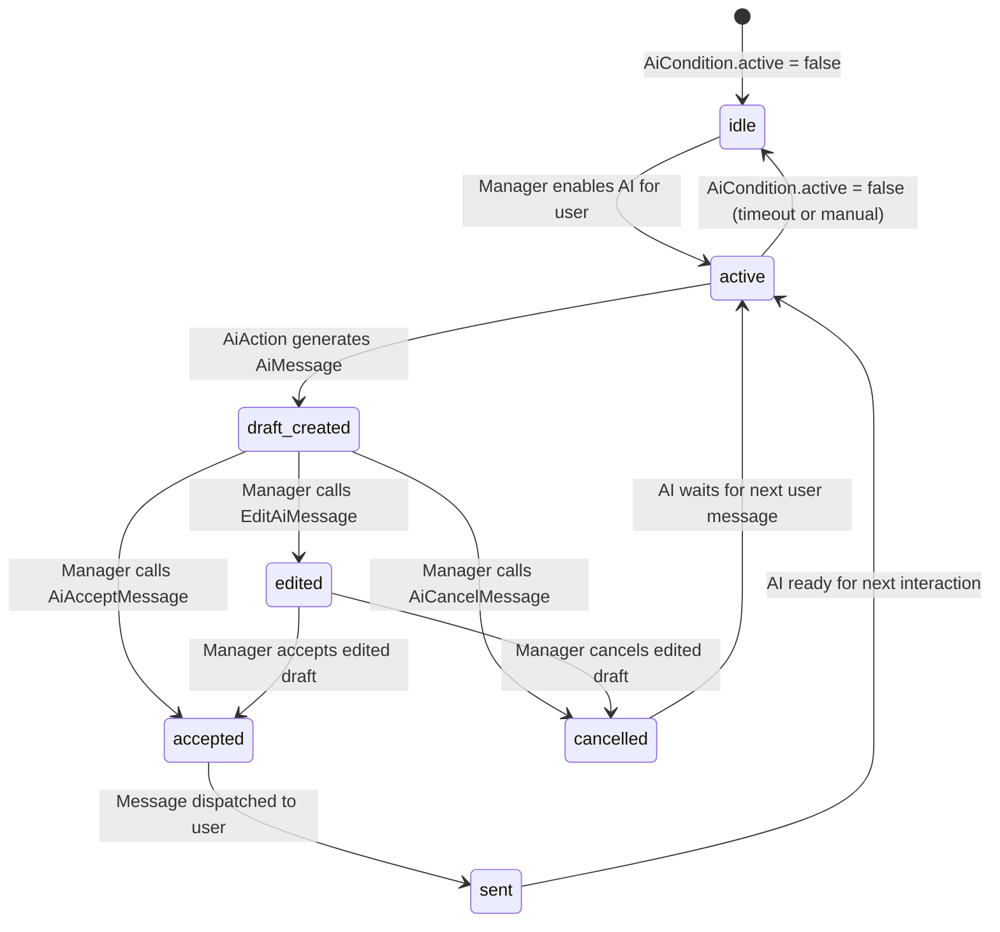

# AI Assistant Domain

> **Purpose:** This file defines business rules, state machines, and invariants for the AI assistant integration domain — draft generation, manager review, acceptance, and cancellation of AI responses.
> **Context:** Read this file before modifying anything related to `AiCondition`, `AiMessage`, AI providers, AI actions, AI bot webhook, or AI bot controllers.
> **Version:** 1.2

---

## 1. What is this domain?

The AI Assistant domain manages an optional AI layer that can generate draft responses to users. The AI bot can operate in two modes:

- **Draft mode** (`AI_AUTO_REPLY=false`, default): AI publishes a draft in the supergroup topic with inline "Accept / Cancel" buttons. A manager reviews and approves or rejects before the message reaches the user.
- **Auto-reply mode** (`AI_AUTO_REPLY=true`): AI posts the reply directly to the topic. The message triggers `SendReplyAction` and is delivered to the end user immediately — no manager review.

The AI bot uses a **separate Telegram bot account** (`TELEGRAM_AI_BOT_TOKEN`) to post messages in the supergroup. This separates the AI voice from the manager voice and provides independent rate limits.

This domain owns: AI condition management, AI message drafts, provider selection, manager review workflow, AI bot webhook reception.

This domain does not own: actual message sending to the end user (see `domain/messaging.md`), user banning (see `domain/bot-users.md`), external source registration (see `domain/external-sources.md`).

---

## 2. Key Concepts

| Concept | Description |
|---|---|
| AiCondition | Record indicating whether AI is active for a specific `BotUser` |
| AiMessage | A draft response generated by AI, pending manager review |
| Provider | AI service used to generate responses: OpenAI, DeepSeek, or GigaChat |
| Auto-reply | Mode where AI replies are sent automatically without manager review (disabled by default) |
| AI bot | Separate Telegram bot (`TELEGRAM_AI_BOT_TOKEN`) that posts AI messages in the supergroup |
| text_manager | Manager's instruction or context provided to the AI |
| text_ai | AI-generated draft response text |
| Accept | Manager approves and sends the AI draft to the user |
| Cancel | Manager rejects and discards the AI draft |
| Edit | Manager modifies the AI draft before accepting |
| ShouldAiReply | Service that evaluates filtering rules before the AI bot responds |

---

## 3. Business Rules

**BR-001** — The AI assistant is globally disabled by default. The `ai.enabled` flag is stored in the DB `settings` table and read at runtime via `SettingsService` (no `config()`/`.env` fallback). It is toggled in the admin panel (`/admin/settings/ai`). `ShouldAiReply` reads `ai.enabled` live from `SettingsService`, so a change takes effect on the next request — no container restart needed.
_Enforced in:_ `app/Modules/Ai/Services/ShouldAiReply.php` (reads `SettingsService`); `app/Livewire/Settings/AiAssistantPage.php`; `app/Services/Settings/SettingKeyRegistry.php @ ai.enabled` (`config => null`)

**BR-002** — Auto-reply mode (`AI_AUTO_REPLY=true`) must not be enabled in production unless explicitly approved. In auto-reply mode, AI drafts are sent to users without manager review. The admin panel (`/admin/settings/ai`) shows a confirmation warning before enabling auto-reply; the user must explicitly confirm.
_Enforced in:_ `config/ai.php @ auto_reply`; `AiAssistantPage::updatedAutoReply()` — reverts toggle and shows confirmation dialog; `AiAssistantPage::confirmAutoReply()` / `cancelAutoReply()`

**BR-003** — An AI draft (`AiMessage`) must be created before any response is sent from the AI path. The draft must include both `text_ai` and optionally `text_manager`.
_Enforced in:_ `app/Actions/Ai/AiAction.php`

**BR-004** — The AI provider used for a request is determined by the `ai.default_provider` setting (DB, via `SettingsService`). Supported values: `openai`, `deepseek`, `gigachat`. It is changed in the admin panel (`/admin/settings/ai`) and read live at runtime — `AiServiceProvider`/`AiAssistantService` resolve the active provider from `SettingsService`, and `BaseAiProvider` builds each provider's credentials from the `ai.{provider}_*` settings.
_Enforced in:_ `app/Modules/Ai/AiServiceProvider.php`; `app/Modules/Ai/Services/AiAssistantService.php`; `app/Modules/Ai/Services/BaseAiProvider.php`; `app/Services/Settings/SettingKeyRegistry.php @ ai.default_provider`

**BR-004a** — A provider whose access credentials are not configured cannot be selected as `ai.default_provider`. In the AI assistant screen its card shows a «Доступы не указаны» flag instead of the «Выбрать» button, and `AiAssistantPage::save()` rejects it with «У выбранного провайдера не указаны доступы.» when AI is enabled. A provider counts as configured when its primary credential is present: `ai.openai_api_key` (OpenAI), `ai.deepseek_client_secret` (DeepSeek), `ai.gigachat_client_secret` (GigaChat). The guard runs only when `ai.enabled` is true.

An unconfigured provider must also never appear **pre-selected**: on load (`loadFields()`) the active card is the stored `ai.default_provider` only when it is configured; otherwise it falls back to the first configured provider (card order: openai → deepseek → gigachat), or to no selection at all (`''`) when nothing is set up. There is no hard-coded OpenAI default.
_Enforced in:_ `app/Livewire/Settings/AiAssistantPage.php` (`providerHasAccess()`, `firstConfiguredProvider()`, `save()`, `loadFields()` → `providerConfigured` / `default_provider`); `resources/views/livewire/settings/ai-assistant-page.blade.php` (provider cards)

**BR-005** — An `AiCondition` record must exist and have `active = true` for a given `BotUser` before AI processing starts.
_Enforced in:_ `app/Actions/Ai/AiAction.php`

**BR-006** — A manager must be able to Accept, Cancel, or Edit any AI draft. These are the only three valid actions on a draft.
_Enforced in:_ `app/Actions/Ai/AiAcceptMessage.php`, `app/Actions/Ai/AiCancelMessage.php`, `app/Actions/Ai/EditAiMessage.php`

**BR-007** — The AI session for a user automatically deactivates after the timeout defined in `config/ai.php @ disable_timeout` (default: 7200s = 2 hours) of inactivity. The `ai.disable_timeout` DB setting key has been removed; the value is read only from config.
_Enforced in:_ `config/ai.php @ disable_timeout` (timeout applied in AiAction flow)

**BR-008** — AI responses must never exceed the token limits defined per provider in config.
_Enforced in:_ `config/ai.php @ providers.*.max_tokens`

**BR-009** — The AI conversation context is sourced from the `messages` table by `bot_user_id` (incoming → `role: user` excluding slash-commands; any outgoing → `role: assistant`). The window is bounded by `max_context_tokens` (token budget) using a `mb_strlen / 4` heuristic with a sliding window from the newest entries; older entries that would exceed the budget are dropped. Redis-backed context (`ai_context_*`) is no longer used. The `max_context_tokens` limit is read live at runtime by `AiChatHistoryService` via `SettingsService` (no `config()` fallback) and defaults to 3000 — it is **not** exposed in the admin panel UI (removed from the AI assistant screen).
_Enforced in:_ `app/Modules/Ai/Services/AiChatHistoryService.php`; `config/ai.php @ max_context_tokens` (default: 3000); `app/Services/Settings/SettingKeyRegistry.php @ ai.max_context_tokens`

**BR-010** — If AI confidence is below `confidence_threshold`, the message must be escalated to a human manager.
_Enforced in:_ `config/ai.php @ confidence_threshold` (default: 0.8)

**BR-011** — The AI bot must not respond to its own messages, to manager messages, or to messages from outside a supergroup forum topic. This prevents infinite reply loops.
_Enforced in:_ `app/Modules/Ai/Services/ShouldAiReply.php`

**BR-012** — The AI bot webhook path (`POST /api/ai-bot/webhook`) is always active. The `MANAGER_INTERFACE` concept has been removed; AI always generates without mode gating. `AiBotWebhookJob` processes all valid incoming AI bot updates regardless of whether the Telegram supergroup channel is configured.
_Enforced in:_ `app/Modules/Ai/Jobs/AiBotWebhookJob.php`

**BR-013** — `ShouldAiReply` gates AI generation on: AI enabled (`ai.enabled`), the update originated from a private chat (`typeSource === 'private'`), update type is `message`, text is non-empty and not a slash-command, and the bot user is active (not banned/closed). There is NO manager-interface check. The AI bot's identity is identified by its own webhook path (`POST /api/ai-bot/webhook`), not by comparing sender IDs.
_Enforced in:_ `app/Modules/Ai/Services/ShouldAiReply.php::shouldGenerateForUserMessage()`

**BR-014** — `generateReply()` and `processMessage()` share the same DB-backed history pipeline through `AiChatHistoryService::buildForBotUser($userId, $userMessage)`. The current incoming user message is passed as `$excludeLastUserText` so it is dropped from the assembled history when `SendTelegramMessageJob` has already inserted it (race-safe in both directions: when the row exists the duplicate is dropped, when it does not nothing happens).
_Enforced in:_ `app/Modules/Ai/Services/AiAssistantService.php`, `app/Modules/Ai/Services/AiChatHistoryService.php`

**BR-015** — The AI system prompt is stored **only in the DB** (`ai.system_prompt` via `SettingsService`), used **verbatim** — no templating or variable substitution. There is no prompt file and no default: when unset the prompt is empty (an empty value sends no system message). The loader (`AiSystemPromptLoader`, singleton) exposes `render()` — it reads the DB value (memoized for the request) and providers send it as the `system` message.
_Enforced in:_ `app/Modules/Ai/Services/AiSystemPromptLoader.php`; `app/Modules/Ai/AiServiceProvider.php` (singleton binding)

**BR-016** — Only messages that were actually delivered to the user may appear in the AI's assistant-history. The invariant: AI drafts (`SendAiDraftJob`, `SendAiReplyJob`) write **only** to `ai_messages`, never to `messages`. A row in `messages` (regardless of `message_type=outgoing` reason — Accept, manual manager reply, etc.) appears only when `AbstractSendMessageJob::handle()` actually sends the message. Cancel never creates a `messages` row. Any future AI-flow change that violates this is a regression.
_Enforced in:_ `app/Modules/Ai/Jobs/SendAiDraftJob.php`, `app/Modules/Ai/Jobs/SendAiReplyJob.php`, `app/Jobs/SendMessage/AbstractSendMessageJob.php`

**BR-017** — AI runs across all supported user platforms (`telegram`, `vk`, `max`). The trigger for incoming user messages is platform-specific (TG: `TelegramBotController::maybeDispatchAi()`; VK: `VkMessageService::maybeDispatchAi()`; Max: `MaxMessageService::maybeDispatchAi()`), but the gating logic shares `ShouldAiReply` (both the TG-DTO variant `shouldGenerateForUserMessage()` and the platform-agnostic variant `shouldGenerateForBotUserText()` enforce: AI-enabled, private-chat source, replyable text, user active — no manager-interface check). Triggering is text-only — attachments do not start AI.
_Enforced in:_ `app/Modules/Ai/Services/ShouldAiReply.php`, `app/Modules/Telegram/Controllers/TelegramBotController.php`, `app/Modules/Vk/Services/VkMessageService.php`, `app/Modules/Max/Services/MaxMessageService.php`

**BR-018** — Final delivery of an AI answer to the end user (both after manager Accept and in auto-reply mode) is routed by `BotUser.platform` through `App\Modules\Ai\Actions\DeliverAiAnswerToUser`: `telegram → SendTelegramSimpleQueryJob`, `vk → SendVkSimpleMessageJob`, `max → SendMaxSimpleMessageJob`. The editing/deletion of the AI bot draft inside the supergroup topic (Accept callback) stays on `SendTelegramMessageJob` with the AI bot token regardless of user platform — that side is always Telegram. For any other platform, delivery is delegated to a `PlatformChannel` registered in `App\Platform\PlatformChannelRegistry` by a pluggable module (e.g. the paid Avito package) — the core needs no edits to support it. Only when no channel is registered does it log `ai_deliver_unsupported_platform` and skip delivery.
_Enforced in:_ `app/Modules/Ai/Actions/DeliverAiAnswerToUser.php`, `app/Modules/Ai/Actions/AiAcceptMessage.php`, `app/Modules/Ai/Jobs/SendAiReplyJob.php`, `app/Platform/PlatformChannelRegistry.php`, `app/Contracts/PlatformChannel.php`

**BR-018a** — `DeliverAiAnswerToUser::execute()` ALWAYS persists an outgoing `messages` row directly (before the platform send job is dispatched) for built-in platforms (telegram/vk/max). This guarantees the AI answer is visible in the admin chat thread at `/admin/chats` regardless of whether the platform send ultimately succeeds (wrong/placeholder token, user blocked bot, etc.). The "simple" (non-saving) send jobs are used so there is exactly ONE `messages` row — no duplicate. For Telegram the AI answer is sent as PLAIN text with `parse_mode` explicitly disabled (`null`, omitted from the request) and `messages.text` stores the same HTML-stripped plain text: AI output is untrusted and frequently not valid Telegram HTML (stray `<`, `&`, code), which Telegram would reject with 400 "can't parse entities" so the answer would never reach the user. Cancel (`AiCancelMessage`) never creates a `messages` row. Pluggable platform channels (the `default` branch / `PlatformChannelRegistry`) own their own persistence.
_Enforced in:_ `app/Modules/Ai/Actions/DeliverAiAnswerToUser.php`

**BR-019** — `SendAiDraftJob` and `SendAiReplyJob` post the AI marker into the supergroup forum topic of the `BotUser`. The `BotUser.topic_id` may still be in flight when the AI job runs (VK/Max users hit `TopicCreateJob` asynchronously on their first message). In that case the AI job releases itself back to the queue with a short delay instead of posting into `message_thread_id=null`. The job retries (`$tries = 3`) until the topic exists, then proceeds.
_Enforced in:_ `app/Modules/Ai/Jobs/SendAiDraftJob.php`, `app/Modules/Ai/Jobs/SendAiReplyJob.php`

---

## 4. AI Settings Admin UI (`/admin/settings/ai`)

The AI assistant settings are managed via custom Livewire/Blade pages at `/admin/settings/ai`.

### Page: AiAssistantPage (`GET /admin/settings/ai`)

`app/Livewire/Settings/AiAssistantPage.php` — main AI settings screen.

**Fields**:

| Field | Storage | Type | Validation |
|---|---|---|---|
| ИИ-ассистент (master toggle) | `ai.enabled` (SettingsService) | bool | — (persists instantly, no save) |
| Провайдер по умолчанию | `ai.default_provider` (SettingsService) | string | in:openai,deepseek,gigachat |
| Автоответ (toggle) | `ai.auto_reply` (SettingsService) | bool | confirm dialog required |
| Системный промпт | `ai.system_prompt` (SettingsService / DB) | string | stored as-is; blank → no system prompt |

The «Запросов в минуту» (`ai.rate_limit.requests_per_minute`), «Запросов в час» (`ai.rate_limit.requests_per_hour`), and «Таймаут отключения» (`ai.disable_timeout`) fields have been **removed** — from the UI, from `SettingKeyRegistry`, and from the internal rate-limit logic in `BaseAiProvider` (`checkRateLimit`/`getRateLimitStatus`). Provider throttling is now left entirely to the external provider's own 429 responses.

The screen intentionally does NOT expose `ai.max_context_tokens`, `ai.confidence_threshold`, `ai.auto_escalation` or `ai.enable_logging`. These keys still exist in `SettingKeyRegistry`: `max_context_tokens` (default 3000) and `confidence_threshold` (default 0.8) are read live at runtime on their defaults; `auto_escalation`/`enable_logging` are vestigial (not read anywhere) — AI logging is always on.

**Master toggle (instant persist)**: the «Включить AI помощника» switch (`ai_enabled`, `wire:model.live`) is written to `ai.enabled` immediately via `updatedAiEnabled()` — it does NOT wait for «Сохранить». All other fields still persist only on `save()`.

**Master toggle — always allowed**: AI can be enabled regardless of whether the «Бот AI помощника» integration (`telegram_ai.token`) is configured. The AI bot connection status is shown informational-only (`aiBotConnected`) — when not connected, AI drafts are persisted to `ai_messages` with `message_id=null` and reviewed exclusively via the `/admin/chats` workspace. There is no blocking gate, no yellow warning notice, and the toggle is never disabled. Both enabling and disabling are always allowed.
_Enforced in:_ `app/Livewire/Settings/AiAssistantPage.php` (`updatedAiEnabled()`); `resources/views/livewire/settings/ai-assistant-page.blade.php` (gate condition removed)

**Auto-reply guard**: enabling auto-reply via the toggle triggers `updatedAutoReply(true)`, which reverts the toggle to `false` and shows a yellow confirmation dialog. The user must call `confirmAutoReply()` to accept, or `cancelAutoReply()` to dismiss.

**Provider cards**: provider selection rendered as 3 clickable cards (OpenAI / DeepSeek / GigaChat). Each card has a «Настроить доступ» link to the corresponding provider access page. A provider with no configured credentials shows a yellow «Доступы не указаны» flag instead of the «Выбрать» button and cannot be selected (see BR-004a).

**Runtime application**: `ShouldAiReply`, `AiAssistantService`, `AiChatHistoryService`, `BaseAiProvider` and the AI jobs/actions read all AI settings and provider credentials **live from `SettingsService`** (DB `settings` table) — there is no `config('ai.*')` fallback (`config => null` in `SettingKeyRegistry`). Saved values take effect on the next request; no container restart needed.

### Pages: AiProviderAccessPage (`GET /admin/settings/ai/{provider}`)

`app/Livewire/Settings/AiProviderAccessPage.php` — per-provider credentials screen. Route constraint: `provider` ∈ `openai|deepseek|gigachat`.

**Fields by provider** (all persisted via `SettingsService`):

| Provider | Fields |
|---|---|
| OpenAI | `ai.openai_api_key`(secret), `ai.openai_base_url`, `ai.openai_model`, `ai.openai_max_tokens`, `ai.openai_temperature` |
| DeepSeek | `ai.deepseek_client_id`, `ai.deepseek_client_secret`(secret), `ai.deepseek_base_url`, `ai.deepseek_model`, `ai.deepseek_max_tokens`, `ai.deepseek_temperature` |
| GigaChat | `ai.gigachat_client_id`, `ai.gigachat_client_secret`(secret), `ai.gigachat_base_url`, `ai.gigachat_model`, `ai.gigachat_max_tokens`, `ai.gigachat_temperature`, `ai.gigachat_path_cert` |

**Secret fields**: rendered as `type="password"` inputs. Secret fields are never pre-filled (always `null`). Saving an empty secret field does NOT overwrite the existing stored secret (blank-secret guard, mirrors BR-015 from admin-panel.md).

**Verify-before-save**: the primary «Проверить и сохранить» button calls `connect()`, which mirrors the channel-integration flow (admin-panel.md BR-013): (1) validate fields; (2) resolve the secret to verify — entered value, else the stored one (blank-secret guard); (3) call `App\Modules\Ai\Services\AiProviderVerificationService::verifyOpenai/verifyDeepseek/verifyGigachat()` — on failure show the error notice (`$verifyError`) and persist **nothing**; (4) on success persist via the settings-only `save()` path. Verification probes the real provider API: OpenAI/DeepSeek do a minimal chat-completion (`max_tokens=1`) against `{base_url}`; GigaChat performs the OAuth token request (Basic secret + the uploaded/stored trusted-root certificate). All calls use a 10 s timeout, never log secrets, and convert transport errors into a failed result. `save()` (settings-only, no probe) is retained for programmatic/test use.

**System prompt storage**: the system prompt is stored **only in the DB** under `ai.system_prompt` (registry key, `config => null`, non-secret) via `SettingsService`. There is no prompt file and no default. The «Системный промпт» field on `/admin/settings/ai` is loaded from that key and «Сохранить» persists it with `SettingsService::set('ai.system_prompt', …)`. Because nothing is written to disk, there is **no filesystem-permission failure mode**. The prompt save is **independent of provider validation**: in `AiAssistantPage::save()` the prompt is persisted first and unconditionally, so an unconfigured AI provider (which blocks persisting the toggle/provider settings) never prevents saving the prompt text. A blank field stores `''` — providers then receive an empty system prompt.

**Routes**: registered in `AdminServiceProvider::boot()` under `admin/settings/` prefix, names `admin.settings.ai` and `admin.settings.ai.provider`. Middleware: `['web', 'auth', EnsureSettingsAccess::class]`.

**Sidebar**: `ИИ-ассистент` nav item in `resources/views/layouts/admin-settings.blade.php` is active/linked to `admin.settings.ai`; marked active on both `admin.settings.ai` and `admin.settings.ai.provider` routes.

**Tests**:
- `tests/Unit/Livewire/Settings/AiAssistantPageTest.php` — unit tests with mocked SettingsService
- `tests/Unit/Livewire/Settings/AiProviderAccessPageTest.php` — unit tests with mocked SettingsService (incl. `connect()` verify-before-save)
- `tests/Unit/Modules/Ai/Services/AiProviderVerificationServiceTest.php` — unit tests for the verify service (Http::fake)
- `tests/Feature/Settings/AiAssistantPageTest.php` — integration: access control, mount, save, auto-reply confirm flow, cancel
- `tests/Feature/Settings/AiProviderAccessPageTest.php` — integration: access control, mount, save per provider, blank-secret guard

---

## 5. AI Response State Machine (was §4)



---

## 6. Provider Configuration (was §5)

Provider credentials live in the DB `settings` table (via `SettingsService`), edited at `/admin/settings/ai/{provider}`. Each provider's fields use the `ai.{provider}_*` keys:

| Provider | Settings keys (`ai.*`) | Default Model |
|---|---|---|
| OpenAI | `ai.openai_api_key`, `ai.openai_base_url`, `ai.openai_model`, `ai.openai_max_tokens`, `ai.openai_temperature` | `gpt-4.1` |
| DeepSeek | `ai.deepseek_client_id`, `ai.deepseek_client_secret`, `ai.deepseek_base_url`, `ai.deepseek_model`, … | `deepseek-chat` |
| GigaChat | `ai.gigachat_client_id`, `ai.gigachat_client_secret`, `ai.gigachat_base_url`, `ai.gigachat_model`, `ai.gigachat_path_cert`, … | `GigaChat-2-Max` |

`BaseAiProvider::buildProviderConfig()` assembles these from `SettingsService`. There is no `config('ai.providers.*')` — that config block was removed.

```php
// ✅ Correct — read AI provider from the DB settings layer
$provider = app(\App\Services\Settings\SettingsService::class)->get('ai.default_provider');
```

```php
// ❌ Incorrect — hardcoding provider
$provider = 'openai';
```

---

## 7. AI Bot Webhook Flow (was §6)

### AI Bot Controllers

| Controller | Path | Purpose |
|---|---|---|
| `TelegramBotController` | `POST /api/telegram/bot` | Handles regular Telegram messages from users |
| `AiTelegramBotController` | `POST /api/telegram/ai/bot` | Handles AI callback queries (Accept/Cancel/Edit buttons) from managers |
| `AiBotController` | `POST /api/ai-bot/webhook` | Receives AI bot webhook events; dispatches `AiBotWebhookJob` |

### Scenario 1: Draft mode (`AI_AUTO_REPLY=false`)

```
User message → main bot → forwarded to topic
→ AI bot webhook → AiBotController → AiBotWebhookJob
→ ShouldAiReply filter (pass)
→ SendAiDraftJob → AiAssistantService::processMessage() → draft text
→ AI bot posts draft with "Accept / Cancel" inline buttons
→ Manager clicks "Accept" → AiAcceptMessage → SendReplyAction → user
```

### Scenario 2: Auto-reply mode (`AI_AUTO_REPLY=true`)

```
User message → main bot → forwarded to topic
→ AI bot webhook → AiBotController → AiBotWebhookJob
→ ShouldAiReply filter (pass)
→ SendAiReplyJob → AiAssistantService::generateReply() → reply text
→ AI bot posts reply directly to topic
→ Main bot sees message → SendReplyAction → user
```

### Filtering rules (`ShouldAiReply`)

The AI bot replies **only** when all of the following are true:
1. `AI_ENABLED=true`
2. Message is in a supergroup forum topic (`chat.type=supergroup`, `message_thread_id` present)
3. Sender `from.id` equals `TELEGRAM_BOT_ID` (forwarded user message, not manager or AI itself)
4. `BotUser` exists, is not banned, is not closed

---

## 8. Responsible Classes (was §7)

| Class | Responsibility |
|---|---|
| `app/Actions/Ai/AiAction.php` | Main AI flow — calls provider, creates AiMessage |
| `app/Actions/Ai/AiAcceptMessage.php` | Sends AI draft to user |
| `app/Actions/Ai/AiCancelMessage.php` | Discards AI draft |
| `app/Actions/Ai/EditAiMessage.php` | Allows manager to edit AI draft text |
| `app/Modules/Telegram/Jobs/SendAiTelegramMessageJob.php` | Posts AI draft to Telegram group (manager-triggered flow) |
| `app/Modules/Telegram/Jobs/SendAiResponseMessageJob.php` | Sends accepted AI response to user |
| `app/Contracts/Ai/AiProviderInterface.php` | Interface all AI providers must implement |
| `app/Helpers/AiHelper.php` | Utility functions for AI response preparation |
| `app/Modules/Ai/Controllers/AiBotController.php` | Receives AI bot webhook; dispatches `AiBotWebhookJob` |
| `app/Modules/Ai/Middleware/AiBotQuery.php` | Validates `X-Telegram-Bot-Api-Secret-Token` for AI bot webhook |
| `app/Modules/Ai/Jobs/AiBotWebhookJob.php` | Main webhook processing: filtering + route selection (draft vs auto-reply) |
| `app/Modules/Ai/Jobs/SendAiDraftJob.php` | Generates draft via AI, posts to topic as AI bot with inline buttons |
| `app/Modules/Ai/Jobs/SendAiReplyJob.php` | Posts AI reply directly to topic as AI bot (auto-reply mode) |
| `app/Modules/Ai/Services/ShouldAiReply.php` | Filtering logic — decides if AI bot should reply to a given update |
| `app/Modules/Ai/Services/AiBotApi.php` | Telegram API wrapper using the AI bot token |
| `app/Services/Ai/AiAssistantService.php` | Provider orchestration; `processMessage()` for drafts, `generateReply()` for auto-reply |

---

## 9. Forbidden Behaviors (was §8)

- ❌ Sending AI-generated text directly to users without manager review (when auto-reply is disabled)
- ❌ Hardcoding AI provider names outside of config
- ❌ Inventing or modifying security/auth mechanisms for AI providers
- ❌ Creating `AiMessage` without corresponding `AiCondition`
- ❌ Enabling `AI_AUTO_REPLY` without explicit configuration
- ❌ Storing AI provider API keys in code, `.env` or `config()` (they live in the DB `settings` table via `SettingsService`, encrypted)
- ❌ Reading any AI setting/credential via `config('ai.*')` or `env()` at runtime (use `SettingsService`)
- ❌ Skipping the `confidence_threshold` check

---

## Checklist

- [ ] Overview written
- [ ] Key concepts defined
- [ ] All business rules documented and numbered
- [ ] Enforcement locations listed
- [ ] State machine documented
- [ ] Provider configuration table present
- [ ] Responsible classes listed
- [ ] No forbidden behaviors

---

## 10. Always-Both Surfaces (added 2026-06-16, replaces MANAGER_INTERFACE)

The `MANAGER_INTERFACE` mode concept has been **removed**. The admin panel (`/admin/chats`) and Telegram supergroup now work SIMULTANEOUSLY. All AI rules reflect the always-both model.

**BR-020** — `ShouldAiReply` no longer checks `config('app.manager_interface')`. AI generation triggers whenever `ai.enabled` is true, the source is a private chat, text is non-empty and not a slash-command, and the user is active. The deleted methods `isSupportedManagerInterface()` and `isTelegramGroupInterface()` are removed.
_Enforced in:_ `app/Modules/Ai/Services/ShouldAiReply.php`

**BR-021** — The **Telegram AI bot** (`telegram_ai.token`) is OPTIONAL. The master AI toggle (`ai.enabled`) can always be enabled regardless of whether the AI bot is configured. When the AI bot is not configured, drafts are stored in `ai_messages` with `message_id=null` and reviewed only via the `/admin/chats` workspace. When configured, drafts are also posted to the supergroup forum topic.
_Enforced in:_ `app/Livewire/Settings/AiAssistantPage.php::updatedAiEnabled()`; `resources/views/livewire/settings/ai-assistant-page.blade.php`

**BR-022** — The draft review surface is determined dynamically per-job by whether the AI bot is configured (`telegram_ai.token` non-empty AND `ChannelStatusService::telegram()['connected']` AND `telegram.group_id` non-empty):
- **AI bot configured**: `SendAiDraftJob` posts to the Telegram supergroup via `AiBotApi`, stores `AiMessage` with `message_id` (Telegram msg id) and `status='pending'`. Manager reviews via inline buttons in supergroup topic AND via the `/admin/chats` workspace.
- **AI bot not configured**: `SendAiDraftJob` stores `AiMessage` with `message_id=null`, `status='pending'`. Manager reviews only via the `/admin/chats` workspace.
_Enforced in:_ `app/Modules/Ai/Jobs/SendAiDraftJob.php`

**BR-023** — The `ai_messages.status` column tracks lifecycle: `pending` (awaiting review) → `accepted` (sent to user) or `cancelled` (discarded). Default: `pending`.
_Enforced in:_ `app/Models/AiMessage.php` (constants `STATUS_PENDING`, `STATUS_ACCEPTED`, `STATUS_CANCELLED`)

**BR-024** — The workspace `/admin/chats` (`ConversationPage`) always loads pending AI drafts when a dialog is selected (`loadPendingAiDrafts()`). There is no mode gate. Three actions are available: «Принять» (`acceptAiDraft`) delivers to user + marks `accepted`; «Изменить» (`editAiDraft`) copies `text_ai` into the reply input + marks `cancelled`; «Отмена» (`cancelAiDraft`) marks `cancelled`. Drafts refresh on each 5-second `pollUpdates()` tick.
_Enforced in:_ `app/Livewire/Chat/ConversationPage.php`; `resources/views/livewire/chat/conversation-page.blade.php`

**BR-025** — `AiAcceptMessage::executeForDraft(AiMessage)` and `AiCancelMessage::executeForDraft(AiMessage)` are callable from both the Telegram webhook path and the Livewire workspace. The supergroup **delete** (not edit) is CONDITIONAL on `$aiMessage->message_id !== null` — both methods work safely whether or not a Telegram draft message exists.
_Enforced in:_ `app/Modules/Ai/Actions/AiAcceptMessage.php`; `app/Modules/Ai/Actions/AiCancelMessage.php`

**BR-026** — `SendAiReplyJob` (auto-reply mode) posts to the supergroup when the AI bot is configured, then delivers to the user via `DeliverAiAnswerToUser`. When AI bot is not configured, it skips the supergroup post and delivers directly. In both cases `AiMessage` is created with `status='accepted'`.
_Enforced in:_ `app/Modules/Ai/Jobs/SendAiReplyJob.php`

**BR-027** — On Accept (both Telegram callback and admin panel `executeForDraft`), the supergroup draft message is **deleted** (not edited to plain text). `AiAcceptMessage::execute()` dispatches `SendTelegramMessageJob` with `deleteMessage` when `message_id` is present. `AiAcceptMessage::executeForDraft()` also dispatches delete when `message_id` is set. This cleans up the draft bubble from the supergroup topic after the manager accepts.
_Enforced in:_ `app/Modules/Ai/Actions/AiAcceptMessage.php`

**BR-028** — On Cancel (`AiCancelMessage::executeForDraft()`), the supergroup draft message is also deleted when `message_id` is present. Mirrors BR-027 behavior so cancelled drafts don't linger in the supergroup topic.
_Enforced in:_ `app/Modules/Ai/Actions/AiCancelMessage.php`

**Review surface summary:**

| AI bot configured? | Draft review location |
|---|---|
| Yes | Telegram supergroup (inline buttons) + `/admin/chats` workspace |
| No | `/admin/chats` workspace only |
