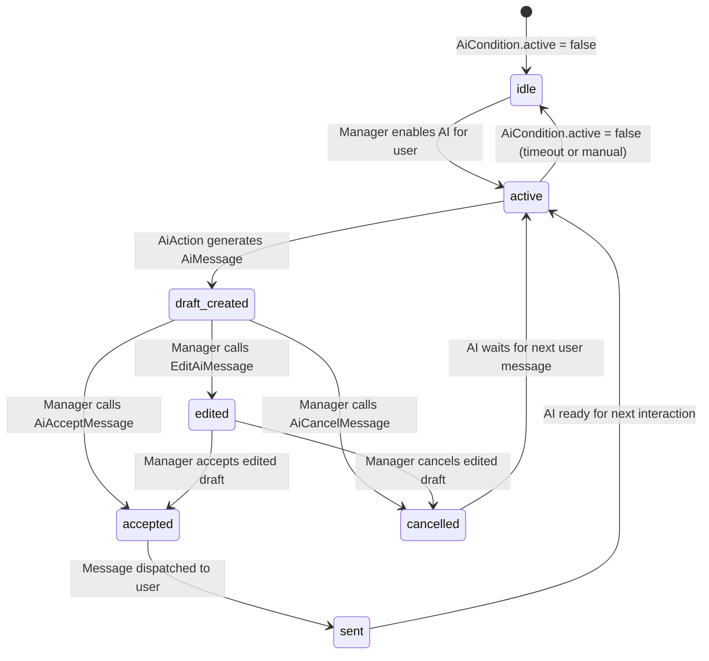

# AI Assistant Domain

> **Purpose:** This file defines business rules, state machines, and invariants for the AI assistant integration domain — draft generation, manager review, acceptance, and cancellation of AI responses.
> **Context:** Read this file before modifying anything related to `AiCondition`, `AiMessage`, AI providers, AI actions, AI bot webhook, or AI bot controllers.
> **Version:** 1.1

---

## 1. What is this domain?

The AI Assistant domain manages an optional AI layer that can generate draft responses to users. The AI bot can operate in two modes:

- **Draft mode** (`AI_AUTO_REPLY=false`, default): AI publishes a draft in the supergroup topic with inline "Accept / Cancel" buttons. A manager reviews and approves or rejects before the message reaches the user.
- **Auto-reply mode** (`AI_AUTO_REPLY=true`): AI posts the reply directly to the topic. The message triggers `SendReplyAction` and is delivered to the end user immediately — no manager review.

The AI bot uses a **separate Telegram bot account** (`TELEGRAM_AI_BOT_TOKEN`) to post messages in the supergroup. This separates the AI voice from the manager voice and provides independent rate limits.

This domain owns: AI condition management, AI message drafts, provider selection, manager review workflow, AI bot webhook reception.

This domain does not own: actual message sending to the end user (see `domain/messaging.md`), user banning (see `domain/bot-users.md`), external source registration (see `domain/external-sources.md`).

---

## 2. Key Concepts

| Concept | Description |
|---|---|
| AiCondition | Record indicating whether AI is active for a specific `BotUser` |
| AiMessage | A draft response generated by AI, pending manager review |
| Provider | AI service used to generate responses: OpenAI, DeepSeek, or GigaChat |
| Auto-reply | Mode where AI replies are sent automatically without manager review (disabled by default) |
| AI bot | Separate Telegram bot (`TELEGRAM_AI_BOT_TOKEN`) that posts AI messages in the supergroup |
| text_manager | Manager's instruction or context provided to the AI |
| text_ai | AI-generated draft response text |
| Accept | Manager approves and sends the AI draft to the user |
| Cancel | Manager rejects and discards the AI draft |
| Edit | Manager modifies the AI draft before accepting |
| ShouldAiReply | Service that evaluates filtering rules before the AI bot responds |

---

## 3. Business Rules

**BR-001** — The AI assistant is globally disabled by default. The `ai.enabled` flag is stored in the DB `settings` table and read at runtime via `SettingsService` (no `config()`/`.env` fallback). It is toggled in the admin panel (`/admin/settings/ai`). `ShouldAiReply` reads `ai.enabled` live from `SettingsService`, so a change takes effect on the next request — no container restart needed.
_Enforced in:_ `app/Modules/Ai/Services/ShouldAiReply.php` (reads `SettingsService`); `app/Livewire/Settings/AiAssistantPage.php`; `app/Services/Settings/SettingKeyRegistry.php @ ai.enabled` (`config => null`)

**BR-002** — Auto-reply mode (`AI_AUTO_REPLY=true`) must not be enabled in production unless explicitly approved. In auto-reply mode, AI drafts are sent to users without manager review. The admin panel (`/admin/settings/ai`) shows a confirmation warning before enabling auto-reply; the user must explicitly confirm.
_Enforced in:_ `config/ai.php @ auto_reply`; `AiAssistantPage::updatedAutoReply()` — reverts toggle and shows confirmation dialog; `AiAssistantPage::confirmAutoReply()` / `cancelAutoReply()`

**BR-003** — An AI draft (`AiMessage`) must be created before any response is sent from the AI path. The draft must include both `text_ai` and optionally `text_manager`.
_Enforced in:_ `app/Actions/Ai/AiAction.php`

**BR-004** — The AI provider used for a request is determined by the `ai.default_provider` setting (DB, via `SettingsService`). Supported values: `openai`, `deepseek`, `gigachat`. It is changed in the admin panel (`/admin/settings/ai`) and read live at runtime — `AiServiceProvider`/`AiAssistantService` resolve the active provider from `SettingsService`, and `BaseAiProvider` builds each provider's credentials from the `ai.{provider}_*` settings.
_Enforced in:_ `app/Modules/Ai/AiServiceProvider.php`; `app/Modules/Ai/Services/AiAssistantService.php`; `app/Modules/Ai/Services/BaseAiProvider.php`; `app/Services/Settings/SettingKeyRegistry.php @ ai.default_provider`

**BR-005** — An `AiCondition` record must exist and have `active = true` for a given `BotUser` before AI processing starts.
_Enforced in:_ `app/Actions/Ai/AiAction.php`

**BR-006** — A manager must be able to Accept, Cancel, or Edit any AI draft. These are the only three valid actions on a draft.
_Enforced in:_ `app/Actions/Ai/AiAcceptMessage.php`, `app/Actions/Ai/AiCancelMessage.php`, `app/Actions/Ai/EditAiMessage.php`

**BR-007** — The AI session for a user automatically deactivates after `AI_DISABLE_TIMEOUT` seconds (default: 7200s = 2 hours) of inactivity.
_Enforced in:_ `config/ai.php @ disable_timeout` (timeout applied in AiAction flow)

**BR-008** — AI responses must never exceed the token limits defined per provider in config.
_Enforced in:_ `config/ai.php @ providers.*.max_tokens`

**BR-009** — The AI conversation context is sourced from the `messages` table by `bot_user_id` (incoming → `role: user` excluding slash-commands; any outgoing → `role: assistant`). The window is bounded by `max_context_tokens` (token budget) using a `mb_strlen / 4` heuristic with a sliding window from the newest entries; older entries that would exceed the budget are dropped. Redis-backed context (`ai_context_*`) is no longer used. The `max_context_tokens` limit is editable from the admin panel (`/admin/settings/ai`) and read live at runtime by `AiChatHistoryService` via `SettingsService` (no `config()` fallback).
_Enforced in:_ `app/Modules/Ai/Services/AiChatHistoryService.php`; `config/ai.php @ max_context_tokens` (default: 3000); `app/Services/Settings/SettingKeyRegistry.php @ ai.max_context_tokens`

**BR-010** — If AI confidence is below `confidence_threshold`, the message must be escalated to a human manager.
_Enforced in:_ `config/ai.php @ confidence_threshold` (default: 0.8)

**BR-011** — The AI bot must not respond to its own messages, to manager messages, or to messages from outside a supergroup forum topic. This prevents infinite reply loops.
_Enforced in:_ `app/Modules/Ai/Services/ShouldAiReply.php`

**BR-012** — The AI bot webhook path (`POST /api/ai-bot/webhook`) is active only when `MANAGER_INTERFACE=telegram_group`. When `MANAGER_INTERFACE=admin_panel`, `AiBotWebhookJob` exits early without dispatching any send jobs.
_Enforced in:_ `app/Modules/Ai/Jobs/AiBotWebhookJob.php`

**BR-013** — To identify forwarded user messages, the AI bot checks that the sender's `from.id` equals the `telegram.bot_id` setting (the main bot's numeric Telegram ID), read via `SettingsService`. This value is configured in the admin panel (Telegram integration screen), not in `.env`.
_Enforced in:_ `app/Modules/Ai/Services/ShouldAiReply.php @ isFromMainBot()`

**BR-014** — `generateReply()` and `processMessage()` share the same DB-backed history pipeline through `AiChatHistoryService::buildForBotUser($userId, $userMessage)`. The current incoming user message is passed as `$excludeLastUserText` so it is dropped from the assembled history when `SendTelegramMessageJob` has already inserted it (race-safe in both directions: when the row exists the duplicate is dropped, when it does not nothing happens).
_Enforced in:_ `app/Modules/Ai/Services/AiAssistantService.php`, `app/Modules/Ai/Services/AiChatHistoryService.php`

**BR-015** — The AI system prompt is rendered from the Blade template at `resources/ai/system-prompt.blade.php` with variables `botName`, `platform`, `today`. The template MUST NOT contain Blade logic directives (`@if`, `@foreach`, `@include`, `@php`) — only variable substitutions. Path is configurable via `config('ai.system_prompt_path')`. The loader (`AiSystemPromptLoader`) is bound as a singleton and memoizes rendered output for the request lifetime.
_Enforced in:_ `app/Modules/Ai/Services/AiSystemPromptLoader.php`; `app/Modules/Ai/AiServiceProvider.php` (singleton binding); `resources/ai/system-prompt.blade.php`

**BR-016** — Only messages that were actually delivered to the user may appear in the AI's assistant-history. The invariant: AI drafts (`SendAiDraftJob`, `SendAiReplyJob`) write **only** to `ai_messages`, never to `messages`. A row in `messages` (regardless of `message_type=outgoing` reason — Accept, manual manager reply, etc.) appears only when `AbstractSendMessageJob::handle()` actually sends the message. Cancel never creates a `messages` row. Any future AI-flow change that violates this is a regression.
_Enforced in:_ `app/Modules/Ai/Jobs/SendAiDraftJob.php`, `app/Modules/Ai/Jobs/SendAiReplyJob.php`, `app/Jobs/SendMessage/AbstractSendMessageJob.php`

**BR-017** — AI runs across all supported user platforms (`telegram`, `vk`, `max`). The trigger for incoming user messages is platform-specific (TG: `TelegramBotController::maybeDispatchAi()`; VK: `VkMessageService::maybeDispatchAi()`; Max: `MaxMessageService::maybeDispatchAi()`), but the gating logic shares `ShouldAiReply` (the TG-DTO variant `shouldGenerateForUserMessage()` and the platform-agnostic variant `shouldGenerateForBotUserText()` enforce the same AI-enabled / manager-interface-telegram-group / replyable-text / user-active checks). Triggering is text-only — attachments do not start AI.
_Enforced in:_ `app/Modules/Ai/Services/ShouldAiReply.php`, `app/Modules/Telegram/Controllers/TelegramBotController.php`, `app/Modules/Vk/Services/VkMessageService.php`, `app/Modules/Max/Services/MaxMessageService.php`

**BR-018** — Final delivery of an AI answer to the end user (both after manager Accept and in auto-reply mode) is routed by `BotUser.platform` through `App\Modules\Ai\Actions\DeliverAiAnswerToUser`: `telegram → SendTelegramMessageJob`, `vk → SendVkMessageJob`, `max → SendMaxMessageJob`. The editing of the AI bot draft inside the supergroup topic (Accept callback) stays on `SendTelegramMessageJob` with the AI bot token regardless of user platform — that side is always Telegram. For any other platform, delivery is delegated to a `PlatformChannel` registered in `App\Platform\PlatformChannelRegistry` by a pluggable module (e.g. the paid Avito package) — the core needs no edits to support it. Only when no channel is registered does it log `ai_deliver_unsupported_platform` and skip delivery.
_Enforced in:_ `app/Modules/Ai/Actions/DeliverAiAnswerToUser.php`, `app/Modules/Ai/Actions/AiAcceptMessage.php`, `app/Modules/Ai/Jobs/SendAiReplyJob.php`, `app/Platform/PlatformChannelRegistry.php`, `app/Contracts/PlatformChannel.php`

**BR-019** — `SendAiDraftJob` and `SendAiReplyJob` post the AI marker into the supergroup forum topic of the `BotUser`. The `BotUser.topic_id` may still be in flight when the AI job runs (VK/Max users hit `TopicCreateJob` asynchronously on their first message). In that case the AI job releases itself back to the queue with a short delay instead of posting into `message_thread_id=null`. The job retries (`$tries = 3`) until the topic exists, then proceeds.
_Enforced in:_ `app/Modules/Ai/Jobs/SendAiDraftJob.php`, `app/Modules/Ai/Jobs/SendAiReplyJob.php`

---

## 4. AI Settings Admin UI (`/admin/settings/ai`)

The AI assistant settings are managed via custom Livewire/Blade pages at `/admin/settings/ai`.

### Page: AiAssistantPage (`GET /admin/settings/ai`)

`app/Livewire/Settings/AiAssistantPage.php` — main AI settings screen.

**Fields** (all persisted via `SettingsService`):
| Field | Setting key | Type | Validation |
|---|---|---|---|
| ИИ-ассистент (master toggle) | `ai.enabled` | bool | — |
| Провайдер по умолчанию | `ai.default_provider` | string | in:openai,deepseek,gigachat |
| Автоответ (toggle) | `ai.auto_reply` | bool | confirm dialog required |
| Лимит контекста | `ai.max_context_tokens` | int | > 0 |
| Системный промпт | `ai.system_prompt` | string | — |

**Auto-reply guard**: enabling auto-reply via the toggle triggers `updatedAutoReply(true)`, which reverts the toggle to `false` and shows a yellow confirmation dialog. The user must call `confirmAutoReply()` to accept, or `cancelAutoReply()` to dismiss.

**Provider cards**: provider selection rendered as 3 clickable cards (OpenAI / DeepSeek / GigaChat). Each card has a «Настроить доступ» link to the corresponding provider access page.

**Runtime application**: `ShouldAiReply`, `AiAssistantService`, `AiChatHistoryService`, `BaseAiProvider` and the AI jobs/actions read all AI settings and provider credentials **live from `SettingsService`** (DB `settings` table) — there is no `config('ai.*')` fallback (`config => null` in `SettingKeyRegistry`). Saved values take effect on the next request; no container restart needed.

### Pages: AiProviderAccessPage (`GET /admin/settings/ai/{provider}`)

`app/Livewire/Settings/AiProviderAccessPage.php` — per-provider credentials screen. Route constraint: `provider` ∈ `openai|deepseek|gigachat`.

**Fields by provider** (all persisted via `SettingsService`):
| Provider | Fields |
|---|---|
| OpenAI | `ai.openai_api_key`(secret), `ai.openai_base_url`, `ai.openai_model`, `ai.openai_max_tokens`, `ai.openai_temperature` |
| DeepSeek | `ai.deepseek_client_id`, `ai.deepseek_client_secret`(secret), `ai.deepseek_base_url`, `ai.deepseek_model`, `ai.deepseek_max_tokens`, `ai.deepseek_temperature` |
| GigaChat | `ai.gigachat_client_id`, `ai.gigachat_client_secret`(secret), `ai.gigachat_base_url`, `ai.gigachat_model`, `ai.gigachat_max_tokens`, `ai.gigachat_temperature`, `ai.gigachat_path_cert` |

**Secret fields**: rendered as `type="password"` inputs. Secret fields are never pre-filled (always `null`). Saving an empty secret field does NOT overwrite the existing stored secret (blank-secret guard, mirrors BR-015 from admin-panel.md).

**System prompt storage**: the system prompt is stored in `SettingsService` under key `ai.system_prompt` (non-secret, plain text). The Blade template `resources/ai/system-prompt.blade.php` is NOT overwritten — that file is the production fallback.

**Routes**: registered in `AdminServiceProvider::boot()` under `admin/settings/` prefix, names `admin.settings.ai` and `admin.settings.ai.provider`. Middleware: `['web', Filament\Http\Middleware\Authenticate::class]`.

**Sidebar**: `ИИ-ассистент` nav item in `resources/views/layouts/admin-settings.blade.php` is active/linked to `admin.settings.ai`; marked active on both `admin.settings.ai` and `admin.settings.ai.provider` routes.

**Tests**:
- `tests/Unit/Livewire/Settings/AiAssistantPageTest.php` — unit tests with mocked SettingsService
- `tests/Unit/Livewire/Settings/AiProviderAccessPageTest.php` — unit tests with mocked SettingsService
- `tests/Feature/Settings/AiAssistantPageTest.php` — integration: access control, mount, save, auto-reply confirm flow, cancel
- `tests/Feature/Settings/AiProviderAccessPageTest.php` — integration: access control, mount, save per provider, blank-secret guard

---

## 5. AI Response State Machine (was §4)



---

## 6. Provider Configuration (was §5)

Provider credentials live in the DB `settings` table (via `SettingsService`), edited at `/admin/settings/ai/{provider}`. Each provider's fields use the `ai.{provider}_*` keys:

| Provider | Settings keys (`ai.*`) | Default Model |
|---|---|---|
| OpenAI | `ai.openai_api_key`, `ai.openai_base_url`, `ai.openai_model`, `ai.openai_max_tokens`, `ai.openai_temperature` | `gpt-4.1` |
| DeepSeek | `ai.deepseek_client_id`, `ai.deepseek_client_secret`, `ai.deepseek_base_url`, `ai.deepseek_model`, … | `deepseek-chat` |
| GigaChat | `ai.gigachat_client_id`, `ai.gigachat_client_secret`, `ai.gigachat_base_url`, `ai.gigachat_model`, `ai.gigachat_path_cert`, … | `GigaChat-2-Max` |

`BaseAiProvider::buildProviderConfig()` assembles these from `SettingsService`. There is no `config('ai.providers.*')` — that config block was removed.

```php
// ✅ Correct — read AI provider from the DB settings layer
$provider = app(\App\Services\Settings\SettingsService::class)->get('ai.default_provider');
```

```php
// ❌ Incorrect — hardcoding provider
$provider = 'openai';
```

---

## 7. AI Bot Webhook Flow (was §6)

### AI Bot Controllers

| Controller | Path | Purpose |
|---|---|---|
| `TelegramBotController` | `POST /api/telegram/bot` | Handles regular Telegram messages from users |
| `AiTelegramBotController` | `POST /api/telegram/ai/bot` | Handles AI callback queries (Accept/Cancel/Edit buttons) from managers |
| `AiBotController` | `POST /api/ai-bot/webhook` | Receives AI bot webhook events; dispatches `AiBotWebhookJob` |

### Scenario 1: Draft mode (`AI_AUTO_REPLY=false`)

```
User message → main bot → forwarded to topic
→ AI bot webhook → AiBotController → AiBotWebhookJob
→ ShouldAiReply filter (pass)
→ SendAiDraftJob → AiAssistantService::processMessage() → draft text
→ AI bot posts draft with "Accept / Cancel" inline buttons
→ Manager clicks "Accept" → AiAcceptMessage → SendReplyAction → user
```

### Scenario 2: Auto-reply mode (`AI_AUTO_REPLY=true`)

```
User message → main bot → forwarded to topic
→ AI bot webhook → AiBotController → AiBotWebhookJob
→ ShouldAiReply filter (pass)
→ SendAiReplyJob → AiAssistantService::generateReply() → reply text
→ AI bot posts reply directly to topic
→ Main bot sees message → SendReplyAction → user
```

### Filtering rules (`ShouldAiReply`)

The AI bot replies **only** when all of the following are true:
1. `AI_ENABLED=true`
2. Message is in a supergroup forum topic (`chat.type=supergroup`, `message_thread_id` present)
3. Sender `from.id` equals `TELEGRAM_BOT_ID` (forwarded user message, not manager or AI itself)
4. `BotUser` exists, is not banned, is not closed

---

## 8. Responsible Classes (was §7)

| Class | Responsibility |
|---|---|
| `app/Actions/Ai/AiAction.php` | Main AI flow — calls provider, creates AiMessage |
| `app/Actions/Ai/AiAcceptMessage.php` | Sends AI draft to user |
| `app/Actions/Ai/AiCancelMessage.php` | Discards AI draft |
| `app/Actions/Ai/EditAiMessage.php` | Allows manager to edit AI draft text |
| `app/Modules/Telegram/Jobs/SendAiTelegramMessageJob.php` | Posts AI draft to Telegram group (manager-triggered flow) |
| `app/Modules/Telegram/Jobs/SendAiResponseMessageJob.php` | Sends accepted AI response to user |
| `app/Contracts/Ai/AiProviderInterface.php` | Interface all AI providers must implement |
| `app/Helpers/AiHelper.php` | Utility functions for AI response preparation |
| `app/Modules/Ai/Controllers/AiBotController.php` | Receives AI bot webhook; dispatches `AiBotWebhookJob` |
| `app/Modules/Ai/Middleware/AiBotQuery.php` | Validates `X-Telegram-Bot-Api-Secret-Token` for AI bot webhook |
| `app/Modules/Ai/Jobs/AiBotWebhookJob.php` | Main webhook processing: filtering + route selection (draft vs auto-reply) |
| `app/Modules/Ai/Jobs/SendAiDraftJob.php` | Generates draft via AI, posts to topic as AI bot with inline buttons |
| `app/Modules/Ai/Jobs/SendAiReplyJob.php` | Posts AI reply directly to topic as AI bot (auto-reply mode) |
| `app/Modules/Ai/Services/ShouldAiReply.php` | Filtering logic — decides if AI bot should reply to a given update |
| `app/Modules/Ai/Services/AiBotApi.php` | Telegram API wrapper using the AI bot token |
| `app/Services/Ai/AiAssistantService.php` | Provider orchestration; `processMessage()` for drafts, `generateReply()` for auto-reply |

---

## 9. Forbidden Behaviors (was §8)

- ❌ Sending AI-generated text directly to users without manager review (when auto-reply is disabled)
- ❌ Hardcoding AI provider names outside of config
- ❌ Inventing or modifying security/auth mechanisms for AI providers
- ❌ Creating `AiMessage` without corresponding `AiCondition`
- ❌ Enabling `AI_AUTO_REPLY` without explicit configuration
- ❌ Storing AI provider API keys in code, `.env` or `config()` (they live in the DB `settings` table via `SettingsService`, encrypted)
- ❌ Reading any AI setting/credential via `config('ai.*')` or `env()` at runtime (use `SettingsService`)
- ❌ Skipping the `confidence_threshold` check

---

## Checklist

- [ ] Overview written
- [ ] Key concepts defined
- [ ] All business rules documented and numbered
- [ ] Enforcement locations listed
- [ ] State machine documented
- [ ] Provider configuration table present
- [ ] Responsible classes listed
- [ ] No forbidden behaviors
