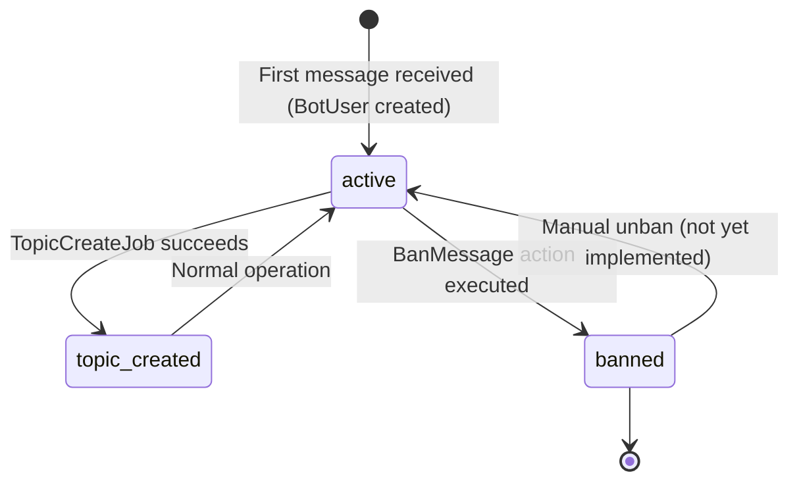

# Bot Users Domain

> **Purpose:** This file defines business rules, state machines, and invariants for the Bot User management domain — creation, identification, banning, and platform association of users.
> **Context:** Read this file before modifying anything related to `BotUser` model, user creation, banning, topic management, or platform identification.
> **Version:** 1.0

---

## 1. What is this domain?

The Bot Users domain is responsible for identifying, creating, and managing users across all supported platforms (Telegram, VK, External Sources). Every user that interacts with any bot always corresponds to exactly one `BotUser` record.

This domain owns: bot user creation, user identification, user banning, forum topic association, platform detection.

This domain does not own: message content (see `domain/messaging.md`), AI assistant state (see `domain/ai-assistant.md`), external source registration (see `domain/external-sources.md`).

---

## 2. Key Concepts

| Concept | Description |
|---|---|
| BotUser | A unified user record across all platforms, stored in `bot_users` table |
| chat_id | Platform-specific user identifier (Telegram user_id, VK user_id, or external_id) |
| topic_id | Telegram forum topic ID — the thread where this user's conversation lives |
| platform | Source platform: `telegram`, `vk`, or `external_source` |
| Ban | Restriction that prevents the user from receiving replies (soft ban via `is_banned` flag) |
| ExternalUser | Sub-record storing the mapping of `external_id` + `source` to a `BotUser` |

---

## 3. Business Rules

**BR-001** — Every incoming interaction must be associated with a `BotUser`. If none exists, one must be created.
_Enforced in:_ `app/Models/BotUser.php @ getOrCreateByTelegramUpdate()`, `getOrCreateExternalBotUser()`

**BR-002** — A `BotUser` is uniquely identified by the combination of `chat_id` + `platform`. Two users on different platforms may share the same `chat_id` value.
_Enforced in:_ `app/Models/BotUser.php @ getUserByChatId()`

**BR-003** — The `topic_id` field must be set only after a Telegram forum topic is successfully created via `TopicCreateJob`.
_Enforced in:_ `app/Jobs/TopicCreateJob.php`, `app/Models/BotUser.php`

**BR-004** — A banned user (`is_banned = true`) must receive a banned notification message instead of a regular reply.
_Enforced in:_ `app/Actions/Telegram/SendBannedMessage.php`, `app/Actions/Vk/SendBannedMessageVk.php`

**BR-005** — Banning a user must set both `is_banned = true` and `banned_at` timestamp.
_Enforced in:_ `app/Actions/Telegram/BanMessage.php`

**BR-006** — A banned user's `topic_id` in Telegram must be closed (via `CloseTopic` action) when they are banned.
_Enforced in:_ `app/Actions/Telegram/BanMessage.php`

**BR-007** — The platform of a `BotUser` must be determined from the incoming request and never changed after creation.
_Enforced in:_ `app/Models/BotUser.php @ getOrCreateByTelegramUpdate()`

**BR-008** — For `external_source` platform users, an `ExternalUser` sub-record must be created or found by `external_id` + `source`.
_Enforced in:_ `app/Models/BotUser.php @ getOrCreateExternalBotUser()`

**BR-020** — When `CloseTopic::execute()` successfully closes a conversation (`is_closed = true`), a `Feedback` record with `status = 'awaiting_rating'` must be created and a rating form must be sent to the user on their platform. Every close event creates a new feedback record — history accumulates.
_Enforced in:_ `app/Modules/Telegram/Actions/CloseTopic.php`, `app/Modules/Feedback/Actions/SendFeedbackForm.php`

**BR-021** — When a user submits a feedback rating (`callback_data` prefix `feedback_rate_{botUserId}_{feedbackId}_{score}`), the `Feedback` record must be updated with `rating = score` (1..5) and `status = 'completed_no_comment'`. The original form message must be edited to a thank-you text. No comment capture is triggered — `comment` remains nullable.
_Enforced in:_ `app/Modules/Feedback/Actions/HandleFeedbackRating.php`, `TelegramBotController::checkBotQuery()`, `VkBotController::bot_query()`, `MaxBotController::bot_query()`

**BR-021a** — On rating submission, the rating must also be surfaced in the conversation: `HandleFeedbackRating` writes an incoming `messages` row (`text = "Оценка обращения: ⭐… (N/5)"`) so the rating appears in the admin chat workspace history, and — in telegram_group mode (`telegram` platform with a `topic_id` and configured `telegram.group_id`) — posts the same text into the user's forum topic so managers in the supergroup see it too.
_Enforced in:_ `App\Modules\Feedback\Actions\HandleFeedbackRating::postRatingToChat()`

---

## 4. User State Machine

---

## 5. Identification Logic

The agent must use these methods to look up or create `BotUser`:

| Scenario | Method | Location |
|---|---|---|
| Telegram incoming message | `BotUser::getOrCreateByTelegramUpdate($dto)` | `app/Models/BotUser.php` |
| Telegram reply from manager (by topic) | `BotUser::getByTopicId($messageThreadId)` | `app/Models/BotUser.php` |
| Any platform by chat_id | `BotUser::getUserByChatId($chatId, $platform)` | `app/Models/BotUser.php` |
| Determine platform from chat_id | `BotUser::getPlatformByChatId($chatId)` | `app/Models/BotUser.php` |
| Determine platform from topic_id | `BotUser::getPlatformByTopicId($messageThreadId)` | `app/Models/BotUser.php` |
| External source user | `BotUser->getOrCreateExternalBotUser($dto)` | `app/Models/BotUser.php` |

---

## 6. Forum Topic Rules

- Each `BotUser` has at most one active Telegram forum topic (`topic_id`)
- The topic is created by `TopicCreateJob` using the template from config: `TEMPLATE_TOPIC_NAME="{first_name} {last_name} {platform}"`
- If `topic_id` is NULL, the topic must be created before sending the first reply
- When a user is banned, the topic must be closed via `CloseTopic` action
- When a banned topic is needed again, it must be reopened (not recreated)

---

## 7. Platform Values

| Value | Description |
|---|---|
| `telegram` | User interacts via Telegram |
| `vk` | User interacts via VK |
| `external_source` | User interacts via External REST API |

---

## 8. Relations (Eloquent)

| Relation | Type | Target |
|---|---|---|
| `externalUser()` | `HasOne` | `ExternalUser` |
| `aiCondition()` | `HasOne` | `AiCondition` |
| `messages()` | `HasMany` | `Message` |
| `lastMessage()` | `HasOne` | `Message` (latest) |
| `lastMessageManager()` | `HasOne` | `Message` (latest outgoing) |
| `feedbacks()` | `HasMany` | `Feedback` |

---

## 9. Forbidden Behaviors

- ❌ Creating a `BotUser` with an invalid or missing `platform` value
- ❌ Setting `topic_id` directly without going through `TopicCreateJob`
- ❌ Banning a user without setting `banned_at`
- ❌ Sending a regular reply to a `BotUser` where `isBanned()` returns true
- ❌ Changing `platform` of an existing `BotUser`
- ❌ Identifying a user by `chat_id` alone without specifying `platform`

---

## Checklist

- [ ] Overview written
- [ ] Key concepts defined
- [ ] All business rules documented and numbered
- [ ] Enforcement locations listed
- [ ] State machine documented
- [ ] Identification logic table present
- [ ] Forum topic rules documented
- [ ] No forbidden behaviors
