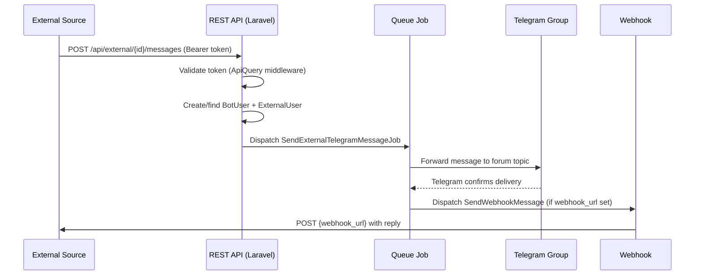

# External Sources Domain

> **Purpose:** This file defines business rules, state machines, and invariants for the External Sources integration domain — registration of external systems, token authentication, REST API message exchange, and webhook delivery.
> **Context:** Read this file before modifying anything related to `ExternalSource`, `ExternalSourceAccessTokens`, `ExternalTrafficController`, `ExternalTrafficService`, or external API routes.
> **Version:** 1.0

---

## 1. What is this domain?

The External Sources domain manages integrations with third-party systems that communicate with the support bot via REST API. External sources send user messages to the bot, and the bot forwards support team replies back via webhooks.

This domain owns: external source registration, token management, incoming message reception, webhook dispatch.

This domain does not own: message routing to Telegram (see `domain/messaging.md`), bot user creation (see `domain/bot-users.md`), AI assistant (see `domain/ai-assistant.md`).

---

## 2. Key Concepts

| Concept | Description |
|---|---|
| External Source | A registered third-party system that integrates with the support bot via REST API |
| Access Token | A bearer token (64 chars) that authenticates requests from an External Source |
| external_id | The user's ID within the external system (not the same as Telegram/VK chat_id) |
| source | The name of the External Source (matches `external_sources.name`) |
| webhook_url | URL called when the support team sends a reply to an external user |
| ExternalMessage | Additional message metadata (text, file info, delivery status) stored per message |

---

## 3. Business Rules

**BR-001** — Every request from an External Source must be authenticated with a valid, active bearer token from `external_source_access_tokens`.
_Enforced in:_ `app/Http/Middleware/ApiQuery.php`

**BR-001a** — An External Source may restrict which IP addresses are allowed to call the API via `external_sources.allowed_ips` (a JSON list of IPs, managed from `/admin/settings/api-webhooks/{source}`). When the list is non-empty, `ApiQuery` rejects (403) any request whose IP is not an exact match; an empty/NULL list means no restriction.
_Enforced in:_ `App\Modules\External\Middleware\ApiQuery` (calls `ExternalSource::isIpAllowed($request->ip())`)

**BR-002** — An External Source must be registered in `external_sources` before it can send or receive messages.
_Enforced in:_ `app/Models/ExternalSource.php`, `app/Services/External/ExternalTrafficService.php`

**BR-003** — Each External Source may have multiple access tokens, but only `active = true` tokens are valid for authentication.
_Enforced in:_ `app/Models/ExternalSourceAccessTokens.php`

**BR-004** — The `external_id` and `source` combination uniquely identifies a user in an external system. A `BotUser` with `platform = external_source` must have a corresponding `ExternalUser` record.
_Enforced in:_ `app/Models/BotUser.php @ getOrCreateExternalBotUser()`

**BR-005** — When the support team replies to an external user, a webhook notification must be sent to the source's `webhook_url` (if set).
_Enforced in:_ `app/Jobs/SendMessage/SendWebhookMessage.php`, `app/Services/Webhook/WebhookService.php`

**BR-006** — File uploads from External Sources must be accepted via `POST /api/external/{external_id}/files` and stored locally before forwarding to Telegram.
_Enforced in:_ `app/Http/Controllers/ExternalTrafficController.php @ sendFile()`

**BR-007** — Messages from External Sources must be stored in both the `messages` table and the `external_messages` table.
_Enforced in:_ `app/Jobs/SendMessage/AbstractSendMessageJob.php @ saveMessage()`

**BR-008** — The `send_status` field in `external_messages` must be updated after delivery: `true` (delivered), `false` (failed), `NULL` (unknown/pending).
_Enforced in:_ `app/Services/External/ExternalTrafficService.php`

---

## 4. Integration Flow



---

## 5. REST API Endpoints

| Method | Path | Purpose |
|---|---|---|
| `GET` | `/api/external/{external_id}/messages` | List messages for a user |
| `GET` | `/api/external/{external_id}/messages/{id}` | Get a single message |
| `POST` | `/api/external/{external_id}/messages` | Send a new message from external user |
| `PUT` | `/api/external/{external_id}/messages` | Edit a message |
| `DELETE` | `/api/external/{external_id}/messages` | Delete a message |
| `POST` | `/api/external/{external_id}/files` | Upload a file |

All endpoints require `Authorization: Bearer {token}` header.

---

## 6. Token Rules

```php
// ✅ Correct — token is 64 characters, unique, stored in external_source_access_tokens
$token = Str::random(64);
ExternalSourceAccessTokens::create([
    'external_source_id' => $source->id,
    'token' => $token,
    'active' => true,
]);
```

```php
// ❌ Incorrect — hardcoded token
$token = 'my-secret-token-123';
```

- Tokens must be 64 characters long
- Tokens must be unique (enforced by UNIQUE index)
- Tokens can be deactivated (`active = false`) without deletion
- Never log token values

---

## 7. Webhook Delivery Rules

- Webhook is only dispatched if `external_sources.webhook_url` is not NULL
- Webhook failures must be logged but must not block the Telegram message delivery
- The webhook payload format must match what the External Source expects (documented per integration)

---

## 8. Forbidden Behaviors

- ❌ Accepting requests without a valid active bearer token
- ❌ Creating `ExternalUser` without corresponding `BotUser`
- ❌ Skipping webhook dispatch when `webhook_url` is set
- ❌ Logging token values in any log output
- ❌ Using the same token for multiple External Sources
- ❌ Allowing `active = false` tokens to authenticate

---

## Checklist

- [ ] Overview written
- [ ] Key concepts defined
- [ ] All business rules documented and numbered
- [ ] Enforcement locations listed
- [ ] Integration flow diagram present
- [ ] REST API endpoint table present
- [ ] Token rules documented
- [ ] Webhook delivery rules documented
- [ ] No forbidden behaviors
