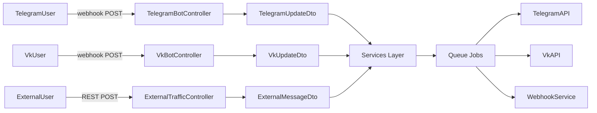
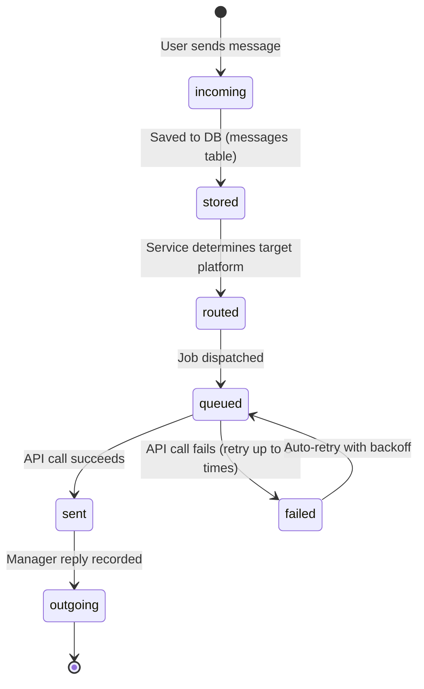

# Messaging Domain

> **Purpose:** This file defines business rules, state machines, and invariants for the core messaging domain — the routing of messages between users (Telegram, VK, External) and the support team.
> **Context:** Read this file before modifying anything related to message sending, editing, routing, or platform integrations.
> **Version:** 1.1

---

## 1. What is this domain?

The Messaging domain is responsible for receiving, routing, storing, and forwarding messages between end users (on Telegram, VK, or External platforms) and the support team (working in a Telegram supergroup with forum topics).

This domain owns: message creation, message routing, platform-specific sending logic, file handling, keyboard construction.

This domain does not own: user banning (see `domain/bot-users.md`), AI response generation (see `domain/ai-assistant.md`), external source registration (see `domain/external-sources.md`).

---

## 2. Key Concepts

| Concept | Description |
|---|---|
| Forum Topic | A dedicated thread in a Telegram supergroup for each user's conversation |
| Incoming Message | A message sent by the user to the bot |
| Outgoing Message | A message sent by the support team to the user |
| Platform | Source of a message: `telegram`, `vk`, `external_source` |
| Job | Asynchronous queue task that performs the actual API send |
| Webhook | HTTP callback sent to an External Source when the team replies |
| Button | Interactive element attached to a message (callback, URL, phone, text) |

---

## 3. Architecture Flow



---

## 4. Business Rules

**BR-001** — A message from a user must always be associated with a `BotUser` record.
_Enforced in:_ `app/Models/BotUser.php @ getOrCreateByTelegramUpdate()`, `getOrCreateExternalBotUser()`

**BR-002** — Every sent message must be recorded in the `messages` table with `bot_user_id`, `platform`, `message_type`, `from_id`, `to_id`.
_Enforced in:_ `app/Jobs/SendMessage/AbstractSendMessageJob.php @ saveMessage()`

**BR-002a** — When persisting a Telegram message, `messages.text` must capture the **caption** for media messages (photo/document), since Telegram puts that text in `caption`, not `text`. `SendTelegramMessageJob::saveMessage()` resolves text as `text ?? caption` for both directions, so a photo-with-caption stores both the caption text and the attachment (otherwise the admin chat workspace would show only the image).
_Enforced in:_ `app/Modules/Telegram/Jobs/SendTelegramMessageJob.php @ saveMessage()`

**BR-003** — A user with `is_banned = true` must not receive replies and must receive a banned notification instead.
_Enforced in:_ `app/Actions/Telegram/SendBannedMessage.php`, `app/Actions/Vk/SendBannedMessageVk.php`

**BR-004** — All message sending to external APIs must go through queue Jobs, never synchronously from Controllers.
_Enforced in:_ `app/Http/Controllers/TelegramBotController.php`, all controllers dispatch Jobs

**BR-005** — The support team works via two SIMULTANEOUS surfaces: the Telegram supergroup with forum topics (when configured) AND the `/admin/chats` workspace (always available). There is no exclusive mode; both surfaces reflect all messages from the shared `messages` DB table. The supergroup is optional — it is active when `ChannelStatusService::telegram()['connected']` is `true` (i.e. `telegram.token` + `telegram.secret_key` are set in the `settings` DB table). When the supergroup is not configured, the admin workspace is the only management surface.
_Enforced in:_ `app/Modules/Telegram/Controllers/TelegramBotController.php @ notifyIncomingMessage()`, `app/Modules/Admin/Services/ChannelStatusService.php`

**BR-005b** — Incoming user messages MUST always be persisted to the `messages` table regardless of whether the Telegram supergroup is enabled. The `messages` table is the single source of truth for the admin workspace at `/admin/chats`. The supergroup forward is an additional, optional step on top of persistence — not a prerequisite for it.
- **Telegram incoming (group ON):** `notifyIncomingMessage()` → `TgMessageService::handleUpdate()` → `SendTelegramMessageJob` → `saveMessage()` persists the row using the group-send response (`from_id = update->messageId`, `to_id = group message_id`).
- **Telegram incoming (group OFF):** `notifyIncomingMessage()` → `persistIncomingTelegramMessage()` persists the row directly (`from_id = update->messageId`, `to_id = 0`). The same `from_id` semantics are preserved so reply threading works correctly if the group is enabled later.
- **VK incoming (group ON):** `VkMessageService::handleUpdate()` → `SendVkTelegramMessageJob` → `saveMessage()` persists after the group send.
- **VK incoming (group OFF):** `VkMessageService::handleUpdate()` → `persistIncomingVkMessage()` persists directly.
- **Max incoming (group ON):** `MaxMessageService::handleUpdate()` → `SendMaxTelegramMessageJob` → `saveMessage()` persists after the group send.
- **Max incoming (group OFF):** `MaxMessageService::handleUpdate()` → `persistIncomingMaxMessage()` persists directly.
- **External incoming:** `TgExternalMessageService::handleUpdate()` → inline `saveMessage()` — always persists regardless of group state (the group is only used for `editForumTopic` icon update, not for the message row).
_Enforced in:_ `app/Modules/Telegram/Controllers/TelegramBotController.php @ persistIncomingTelegramMessage()`, `app/Modules/Vk/Services/VkMessageService.php @ persistIncomingVkMessage()`, `app/Modules/Max/Services/MaxMessageService.php @ persistIncomingMaxMessage()`

**BR-005a** — Each user has at most one Telegram forum topic (`BotUser.topic_id`). The topic is created lazily: when the supergroup is configured and a message arrives for a user without a topic, `TopicCreateJob` is dispatched.
_Enforced in:_ `app/Modules/Telegram/Jobs/TopicCreateJob.php`, `app/Models/BotUser.php @ topic_id`

**BR-006** — If a forum topic does not exist when forwarding a message to the supergroup, `TopicCreateJob` must be dispatched before the message send job to ensure the topic is ready.
_Enforced in:_ `app/Modules/Telegram/Jobs/TopicCreateJob.php`

**BR-007** — File messages must be proxied through the app's own storage. Direct Telegram file URLs must not be sent to external systems.
_Enforced in:_ `app/Services/File/FileService.php`

**BR-008** — Message editing must be routed to the correct platform using the original message's platform field.
_Enforced in:_ Services `TgEditService`, `TgExternalEditService`, `TgVkEditService`, `VkEditService`

**BR-009** — Buttons attached to messages must be parsed from text and constructed into platform-specific keyboard formats.
_Enforced in:_ `app/Services/Button/KeyboardBuilder.php`, `app/Services/Button/ButtonParser.php`

**BR-010** — External source messages delivered via REST API must trigger a webhook notification to the source's `webhook_url` when the team replies.
_Enforced in:_ `app/Jobs/SendMessage/SendWebhookMessage.php`, `app/Services/Webhook/WebhookService.php`

**BR-011** — Outgoing messages sent from the admin-panel chat workspace record the authenticated operator as a name snapshot (`messages.sender_name`) and a FK (`messages.sender_user_id`). If the operator is later deleted, `sender_user_id` is nulled by the DB constraint but `sender_name` is preserved. The chat workspace displays the operator avatar/initials when available; falls back to the generic headset glyph when `sender_name` is null (historical messages, AI auto-replies, telegram-group replies).
_Enforced in:_ `app/Modules/Admin/Actions/SendReplyAction.php @ execute()`, `app/Livewire/Chat/ConversationPage.php @ sendReply()`

**BR-012** — Admin-panel replies are MIRRORED to the Telegram supergroup when the supergroup is configured (`ChannelStatusService::telegram()['connected']`). `SendReplyAction::execute()` calls `maybeMirrorToGroup()` at the end: if connected, dispatches `MirrorAdminReplyToGroupJob` with the prefix «Ответ из админки: ». The mirror job NEVER creates a `messages` row and NEVER re-delivers to the user — it is purely an informational copy for managers in the supergroup. If the user's `topic_id` is not yet available, `TopicCreateJob` is dispatched first and `MirrorAdminReplyToGroupJob` retries until the topic exists (5 tries, backoff [5, 10, 20, 30, 60]s).
_Enforced in:_ `app/Modules/Admin/Actions/SendReplyAction.php @ maybeMirrorToGroup()`, `app/Modules/Admin/Jobs/MirrorAdminReplyToGroupJob.php`

**BR-013** — Group replies (messages sent by managers in the Telegram supergroup topic) are delivered directly to the user via the existing `TgMessageService` path. They are NOT re-posted to the supergroup (they are already there). They are saved to `messages` as `message_type='outgoing'` by the job. This ensures the admin panel sees them via polling. Group replies are never re-mirrored.
_Enforced in:_ `app/Modules/Telegram/Services/Tg/TgMessageService.php`

**BR-014 (DEFERRED, issue #172)** — AI Accept-callback operator attribution (`DeliverAiAnswerToUser`, `TelegramBotController` Accept handler) — AI paths continue to pass `null` as the author until a dedicated task implements it.

---

## 5. Message Type State Machine



---

## 6. Platform-Specific Routing

| Inbound Platform | Reply Platform | Service | Job |
|---|---|---|---|
| `telegram` | Telegram | `TgMessageService` | `SendTelegramMessageJob` |
| `vk` | VK + Telegram mirror | `TgVkMessageService`, `VkMessageService` | `SendVkMessageJob`, `SendVkTelegramMessageJob` |
| `external_source` | Telegram + Webhook | `TgExternalMessageService` | `SendExternalTelegramMessageJob`, `SendWebhookMessage` |

---

## 7. Job Retry Rules

| Job | Max Tries | Timeout | Backoff |
|---|---|---|---|
| `SendTelegramMessageJob` | 5 | 20s | — |
| `TopicCreateJob` | 3 | — | [60, 180, 300]s |
| `SendVkMessageJob` | default | — | — |
| `SendWebhookMessage` | default | — | — |

- Jobs must handle `TelegramError::TOO_MANY_REQUESTS` by respecting `retry_after` from the API response.
- Jobs must handle `TelegramError::TOPIC_NOT_FOUND` by recreating the topic.

---

## 8. File Handling Rules

- Files are downloaded from Telegram and stored locally in `storage/app/`
- Files are served via `FilesController` (`GET /api/files/{file_id}`)
- File metadata (file_id, file_type, file_name) is stored in `external_messages` table
- Supported file types: photo, document, audio, video, voice

---

## 9. Button Rules

```php
// ✅ Correct — use ButtonParser to extract buttons from text
$parsed = ButtonParser::parse($text);

// ✅ Correct — use KeyboardBuilder to build platform keyboards
$keyboard = KeyboardBuilder::build($buttons, $platform);
```

```php
// ❌ Incorrect — manually constructing raw keyboard arrays in controller
$keyboard = ['inline_keyboard' => [[['text' => 'Yes', 'callback_data' => 'yes']]]];
```

**ButtonType enum values:**
- `callback` — inline button, triggers callback_query
- `url` — inline button, opens URL
- `phone` — reply keyboard, requests phone number
- `text` — reply keyboard, sends text

---

## 10. Forbidden Behaviors

- ❌ Sending messages synchronously from Controllers
- ❌ Calling Telegram/VK API directly from Controllers or Services (must go via `TelegramMethods` / `VkMethods`)
- ❌ Saving messages without `bot_user_id`
- ❌ Sending messages to banned users without the banned notification flow
- ❌ Creating a new forum topic without checking if one already exists
- ❌ Modifying `messages` table without updating related `external_messages` record

---

## Checklist

- [ ] Overview written
- [ ] Key concepts defined
- [ ] All business rules documented and numbered
- [ ] Enforcement locations listed
- [ ] State machine documented
- [ ] Platform routing table present
- [ ] File handling rules documented
- [ ] Button rules documented
- [ ] No forbidden behaviors
