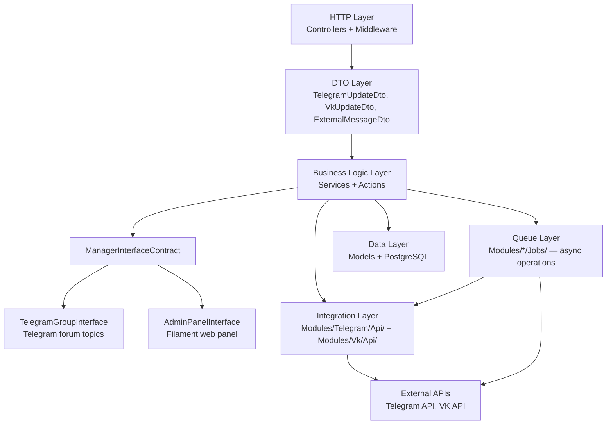

# Architecture Design Rules

> **Purpose:** Ensure every change starts with explicit design. Force the agent to think structurally before generating code.
> **Context:** Read this file before implementing any feature, refactor, schema change, or new module.
> **Version:** 1.0

---

## 1. Core Principle

Design first. Code second.

- Never start with implementation
- Always define structure before details
- Always document boundaries
- Always minimize complexity

If design is missing → stop and design.

---

## 2. Application Architecture

### Layer Diagram



The `ManagerInterfaceContract` decouples the business logic layer from the manager UI. Switch between implementations by changing `MANAGER_INTERFACE` in `.env` and restarting the `app` container.

### Layer Responsibilities

| Layer | Directory | Responsibility |
|---|---|---|
| HTTP | `app/Http/Controllers/`, `app/Modules/*/Controllers/` | Receive requests, validate with middleware, return responses |
| DTO | `app/DTOs/`, `app/Modules/*/DTOs/` | Parse and type incoming data, pass between layers |
| Business Logic | `app/Services/`, `app/Modules/*/Services/`, `app/Modules/*/Actions/` | Business rules, routing, state management |
| Manager Interface | `app/Modules/Telegram/Services/TelegramGroupInterface.php`, `app/Modules/Admin/Services/AdminPanelInterface.php` | Notify managers of incoming messages; create conversations |
| Admin UI | `app/Modules/Admin/Filament/` | Filament resources, Livewire pages, reply form |
| Integration | `app/Modules/Telegram/Api/`, `app/Modules/Vk/Api/` | Direct API calls to Telegram and VK |
| Queue | `app/Modules/*/Jobs/` | Async message sending, retries, webhook dispatch |
| Data | `app/Models/` | Eloquent ORM, database queries only |

---

## 3. Mandatory Pre-Implementation Steps

Before writing any code, the agent must complete all steps below.

**Step 1 — Read context**
- Read `rules/README.md`
- Read relevant `domain/*.md` files
- Read related source files in the codebase
- Identify existing patterns to reuse

**Step 2 — Define the problem**
- State the goal in 1–3 sentences
- List non-goals explicitly
- Define success criteria
- Identify constraints (performance, security, backward compatibility)

**Step 3 — Propose a design**

Must include:
- Affected layers (which directories)
- New/modified files list
- Public method signatures
- Data model changes (if any)
- Queue jobs needed (if any)
- Risks and trade-offs

Do not write implementation yet.

**Step 4 — Validate the design**
- Check against layer rules below
- Check against existing conventions
- Check for duplication with existing code
- Check for simpler alternatives
- Prefer extending existing modules over creating new ones

Only after validation → implementation allowed.

---

## 4. Layer Boundary Rules

### Controllers

```php
// ✅ Correct — controller dispatches job
class TelegramBotController
{
    public function bot_query(): void
    {
        $dto = TelegramUpdateDto::fromRequest(request());
        SendTelegramMessageJob::dispatch($dto);
    }
}
```

```php
// ❌ Incorrect — business logic inside controller
class TelegramBotController
{
    public function bot_query(): void
    {
        $user = BotUser::where('chat_id', $request->input('message.from.id'))->first();
        if ($user->is_banned) {
            Http::post('https://api.telegram.org/...', [...]);
        }
    }
}
```

### Services

```php
// ✅ Correct — service contains reusable business logic
class TgMessageService
{
    public function send(TelegramUpdateDto $dto, BotUser $botUser): void
    {
        // routing, message construction, job dispatch
    }
}
```

```php
// ❌ Incorrect — service contains HTTP response logic
class TgMessageService
{
    public function send(): JsonResponse
    {
        return response()->json(['status' => 'ok']);
    }
}
```

### Actions

```php
// ✅ Correct — action is a single isolated operation
class SendBannedMessage
{
    public static function execute(BotUser $botUser): void
    {
        // send banned notification via Telegram API
    }
}
```

```php
// ❌ Incorrect — action does multiple things
class SendBannedMessage
{
    public static function execute(BotUser $botUser): void
    {
        $botUser->update(['is_banned' => true]);  // banning logic — not this action's job
        // send banned notification
        // log to analytics  — unrelated concern
    }
}
```

### Models

```php
// ✅ Correct — model only has data operations
class BotUser extends Model
{
    public static function getByTopicId(?int $topicId): ?self
    {
        return self::where('topic_id', $topicId)->first();
    }
}
```

```php
// ❌ Incorrect — model contains business logic
class BotUser extends Model
{
    public function ban(): void
    {
        $this->update(['is_banned' => true]);
        Http::post('https://api.telegram.org/...', [...]);  // API call in model
    }
}
```

---

## 5. Required Design Artifacts

Depending on change type, create these artifacts before coding.

**For new feature:**
- Component diagram (Mermaid flowchart)
- Data model updates (if schema changes)
- API contract updates (if endpoints change)
- Test strategy (which tests will cover it)

**For schema change:**
- ERD update in `rules/database/schema.md`
- Migration plan (add/modify columns, indexes)
- Backward compatibility notes
- Rollback strategy

**For refactor:**
- Before/after structure
- Risk assessment
- Explicit statement: "No behavior changes"

**For cross-cutting concerns (logging, auth, middleware):**
- Layer impact analysis
- List of all files affected

---

## 6. Complexity Control Rules

Prefer simplicity aggressively.

- Prefer modifying existing modules over creating new ones
- Avoid new abstractions without clear, immediate need
- Avoid premature generalization
- Avoid speculative flexibility ("this might be useful later")
- Do not introduce patterns "just in case"

Rule of thumb: if a solution needs more than 3 new files, reconsider the design.

---

## 7. Naming Consistency Rules

New code must look like existing code.

```php
// ✅ Correct — matches existing Action pattern
class SendAiAnswerMessage
{
    public static function execute(BotUser $botUser, AiMessage $aiMessage): void {}
}
```

```php
// ❌ Incorrect — inconsistent naming
class AiAnswerMessageSender
{
    public function handle(): void {}
}
```

| Component | Convention | Example |
|---|---|---|
| Actions | `PascalCase`, static `execute()` | `SendBannedMessage::execute()` |
| Services | `PascalCase`, injected | `TgMessageService` |
| Jobs | `PascalCaseJob`, `handle()` | `SendTelegramMessageJob` |
| DTOs | `PascalCaseDto`, static `fromRequest()` | `TelegramUpdateDto::fromRequest()` |
| Models | `PascalCase`, Eloquent conventions | `BotUser`, `AiMessage` |
| Livewire full-page components | `PascalCase[Page]`, `#[Layout(...)]` | `GeneralSettingsPage`, `App\Livewire\Chat\ConversationPage` |
| Contracts | `PascalCaseContract` or `PascalCaseInterface` | `ManagerInterfaceContract` |

---

## 8. AI Generation Limits

To reduce hallucination risk:

- Never generate an entire feature in one step
- Generate skeletons first, then fill in implementation
- Implement one module at a time
- Stop if output exceeds manageable size (300–500 lines per step)
- Review after each step before continuing

Large monolithic generations are forbidden.

---

## 9. Settings Access Pattern

Any code that needs to read an editable application setting must use `SettingsService`, not `config()` directly.

### Rule

```php
// ✅ Correct — reads via settings layer (DB → config fallback)
$managerInterface = app(\App\Services\Settings\SettingsService::class)->get('app.manager_interface');

// ❌ Incorrect in new settings-aware code — bypasses DB override layer
$managerInterface = config('app.manager_interface');
```

### How it works

```
get($key)
    │
    ├─ Cache hit? ──────────────────────────────── return cached value (type-coerced)
    │
    ├─ DB row exists? ──── decrypt if secret ───── cache + return (type-coerced)
    │
    └─ No DB row ────────── config($key.path) ───── cache sentinel + return fallback
                         └─ caller default
                         └─ null
```

### Files

| File | Role |
|---|---|
| `app/Services/Settings/SettingsService.php` | `get()` / `set()` / `has()` / `forget()` — single access point |
| `app/Services/Settings/SettingKeyRegistry.php` | Registry of known keys: type, config fallback path, is_secret flag |
| `app/Models/Setting.php` | Eloquent model for the `settings` table |
| `database/migrations/2026_05_29_000001_create_settings_table.php` | Migration |

### Adding a new setting key

1. Add the key to `SettingKeyRegistry::$keys` with its `type`, `config` fallback, and `is_secret` flag.
2. If a new `.env` variable is needed, add it to the appropriate `config/` file.
3. No other file changes are required.

### Secret handling

Keys with `is_secret=true` in the registry are encrypted with `Crypt::encrypt()` before storage and decrypted transparently in `get()`. Do NOT read the `settings.value` column directly for secret keys.

### Cache behaviour

- Values are cached in the default cache store (Redis) under `settings.{key}` forever.
- Cache is invalidated when `set()` or `forget()` is called.
- A sentinel (`__settings_null__`) is cached when there is no DB row, preventing repeated DB misses.

### Scope

The Settings layer is a **backend foundation only**. Dependent tasks #144/#145/#146 add the Filament admin UI. Wiring `ManagerInterfaceContract` and platform module tokens to read from DB is also deferred to those tasks.

---

## 10. Forbidden Behaviors

- ❌ Coding before design
- ❌ Generating speculative architecture
- ❌ Introducing new frameworks without explicit justification
- ❌ Mixing layers (business logic in controllers, API calls in models)
- ❌ Hidden schema changes (must update `rules/database/schema.md`)
- ❌ Large "big bang" rewrites
- ❌ Copying patterns from unrelated projects

---

## 11. Checklist

- [ ] Context files read
- [ ] Problem defined in 1–3 sentences
- [ ] Non-goals listed
- [ ] Design proposed with affected layers and files
- [ ] Diagrams created (if non-trivial)
- [ ] Layers respected
- [ ] Complexity minimized
- [ ] No speculative abstractions
- [ ] Incremental implementation plan prepared
- [ ] Documentation will be updated after implementation
